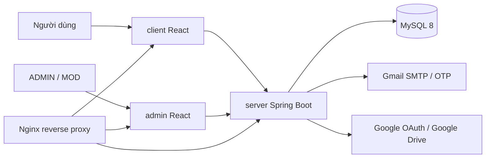

# Quiz VNUA

Quiz VNUA là hệ thống luyện tập và thi trắc nghiệm dành cho sinh viên, gồm 3 ứng dụng chính:

- `client`: giao diện người dùng cuối.
- `admin`: giao diện quản trị dành cho ADMIN/MOD.
- `server`: REST API Spring Boot xử lý nghiệp vụ, xác thực, phân quyền và lưu trữ dữ liệu.

Hệ thống hỗ trợ quản lý danh mục/khoa, môn học, chương, ngân hàng câu hỏi, đề thi, lịch sử làm bài, thống kê, thông báo, phân quyền moderator, xác thực JWT và đăng nhập Google.

## Mục lục

- [Kiến trúc tổng quan](#kiến-trúc-tổng-quan)
- [Công nghệ sử dụng](#công-nghệ-sử-dụng)
- [Tính năng chính](#tính-năng-chính)
- [Cấu trúc thư mục](#cấu-trúc-thư-mục)
- [Yêu cầu môi trường](#yêu-cầu-môi-trường)
- [Cấu hình môi trường](#cấu-hình-môi-trường)
- [Chạy local](#chạy-local)
- [Chạy bằng Docker Compose](#chạy-bằng-docker-compose)
- [API chính](#api-chính)
- [Xác thực và phân quyền](#xác-thực-và-phân-quyền)
- [Build production](#build-production)
- [Tài liệu liên quan](#tài-liệu-liên-quan)

## Kiến trúc tổng quan



Luồng chính:

1. Người dùng hoặc quản trị viên thao tác trên frontend React.
2. Frontend gọi REST API qua Axios, base URL mặc định là `http://localhost:8080/api/v1/`.
3. Backend Spring Boot xác thực JWT/refresh token, kiểm tra quyền và xử lý nghiệp vụ.
4. Dữ liệu được lưu trong MySQL; email OTP gửi qua SMTP; ảnh/các tài nguyên upload có thể lưu local hoặc Google Drive tùy cấu hình.

## Công nghệ sử dụng

### Backend `server`

- Java 17
- Spring Boot 3.4.0
- Spring Web
- Spring Security
- Spring Data JPA/JDBC
- Spring Validation
- MySQL Connector/J
- JWT `jjwt`
- OAuth2 Client / Resource Server
- Google API Client, Google OAuth Client, Google Drive API
- Spring Mail
- Apache POI để import Excel
- Springdoc OpenAPI / Swagger UI
- Lombok
- ModelMapper

### Frontend người dùng `client`

- React 18, Create React App
- React Router DOM 6
- Axios
- Ant Design
- Chakra UI
- Tailwind CSS
- styled-components
- React Hook Form
- React Toastify
- React OAuth Google
- i18next
- Recharts

### Frontend quản trị `admin`

- React 18, Create React App
- React Router DOM 7
- Axios
- Ant Design
- React Icons
- Moment
- Recharts

### Hạ tầng

- MySQL 8.0
- Docker / Docker Compose
- Nginx Alpine

## Tính năng chính

### Người dùng

- Đăng ký, đăng nhập, đăng xuất.
- Đăng nhập bằng Google ID Token.
- Làm mới access token bằng refresh token/cookie.
- Quên mật khẩu bằng OTP email.
- Xem danh mục/khoa, môn học, chương và câu hỏi.
- Làm bài thi, nộp bài, xem kết quả.
- Xem lịch sử làm bài, thống kê điểm và bảng xếp hạng.
- Quản lý môn học yêu thích.
- Cập nhật hồ sơ, đổi mật khẩu, upload/lấy avatar.
- Nhận thông báo, đánh dấu đã đọc hoặc đọc tất cả.

### Quản trị / Moderator

- Dashboard thống kê tổng quan.
- Quản lý người dùng.
- Quản lý danh mục/khoa, môn học, chương.
- Quản lý câu hỏi, đáp án, ảnh minh họa.
- Import ngân hàng câu hỏi từ Excel.
- Quản lý đề thi.
- Xem lịch sử làm bài của người dùng.
- Gửi thông báo toàn hệ thống, cá nhân, theo môn học hoặc theo danh sách người dùng.
- Xem lịch sử chiến dịch thông báo, danh sách người nhận và thu hồi chiến dịch.
- Phân quyền MOD theo môn học/quyền thao tác.

## Cấu trúc thư mục

```text
quiz/
├── admin/                         # React app quản trị
│   ├── public/
│   └── src/
│       ├── api/                   # Axios config, interceptor auth/refresh
│       ├── components/            # Component dùng chung, modal
│       ├── context/               # AuthProvider, ProtectedRoute, ThemeContext
│       ├── layouts/               # Layout quản trị
│       └── pages/                 # Trang quản trị
├── client/                        # React app người dùng
│   ├── public/
│   └── src/
│       ├── api/                   # Axios config, interceptor auth/refresh
│       ├── components/            # Component UI/nghiệp vụ
│       ├── context/               # Auth, favorite, theme, language
│       ├── languages/             # i18n
│       └── routes/                # Route frontend
├── server/                        # Spring Boot backend
│   ├── src/main/java/com/fita/vnua/quiz/
│   │   ├── controller/            # REST API controllers
│   │   ├── exception/             # Exception/global handler
│   │   ├── model/                 # Entity, DTO, request, response
│   │   ├── repository/            # Spring Data repositories
│   │   ├── security/              # JWT, SecurityConfig, filter, handler
│   │   └── service/               # Business services
│   └── src/main/resources/        # application*.properties, keys/resources
├── docker-compose.yml
├── Quiz.postman_collection.json
├── SYSTEM_GRAPH.md
└── README.md
```

## Yêu cầu môi trường

Chạy local:

- Java JDK 17+
- Maven 3.6+ hoặc Maven Wrapper trong `server/`
- Node.js 16+/18+
- npm
- MySQL 8.0+

Chạy container:

- Docker
- Docker Compose

## Cấu hình môi trường

### Backend

File cấu hình chính:

```text
server/src/main/resources/application.properties
```

Các cấu hình thường cần kiểm tra:

```properties
server.port=8080
spring.datasource.url=jdbc:mysql://localhost/quiz
spring.datasource.username=root
spring.datasource.password=root
spring.jpa.hibernate.ddl-auto=update

jwt.secret=${JWT_SECRET:<your-secret>}
jwt.access-token-expiration=900000
jwt.refresh-token-expiration=604800000

spring.mail.host=smtp.gmail.com
spring.mail.port=587
spring.mail.username=<gmail-address>
spring.mail.password=${MAIL_PASSWORD:<gmail-app-password>}

google.client.id=${GOOGLE_CLIENT_ID:<google-client-id>}

gdrive.saKeyPath=classpath:keys/sa.json
gdrive.folderId=<google-drive-folder-id>
gdrive.makePublic=true

avatar.upload-dir=uploads/avatars
question.upload-dir=uploads/questions
```

> Lưu ý: không commit secret thật như JWT secret, Gmail app password, mật khẩu database production hoặc Google service account key. Nên truyền qua biến môi trường khi deploy.

### Client

File env:

```text
client/.env
client/.env.production
```

Ví dụ local:

```env
REACT_APP_API_URL=http://localhost:8080/api/v1/
REACT_APP_AVATAR_URL=http://localhost:8080
REACT_APP_GOOGLE_CLIENT_ID=<google-client-id>
```

### Admin

File env:

```text
admin/.env
admin/.env.production
```

Ví dụ local:

```env
REACT_APP_API_URL=http://localhost:8080/api/v1/
```

## Chạy local

### 1. Tạo database MySQL

```sql
CREATE DATABASE quiz CHARACTER SET utf8mb4 COLLATE utf8mb4_unicode_ci;
```

Kiểm tra lại thông tin kết nối trong `server/src/main/resources/application.properties`.

### 2. Chạy backend

Windows:

```bat
cd server
mvnw.cmd spring-boot:run
```

Linux/macOS/Git Bash:

```bash
cd server
./mvnw spring-boot:run
```

Backend chạy tại:

```text
http://localhost:8080
```

Swagger UI:

```text
http://localhost:8080/swagger-ui
```

OpenAPI JSON:

```text
http://localhost:8080/v3/api-docs
```

### 3. Chạy client người dùng

```bash
cd client
npm install
npm start
```

Mặc định chạy tại:

```text
http://localhost:3000
```

### 4. Chạy admin

Nếu client đang dùng port `3000`, nên chạy admin ở port `3001`.

Windows CMD:

```bat
cd admin
npm install
set PORT=3001 && npm start
```

PowerShell:

```powershell
cd admin
npm install
$env:PORT=3001; npm start
```

Linux/macOS/Git Bash:

```bash
cd admin
npm install
PORT=3001 npm start
```

Admin chạy tại:

```text
http://localhost:3001
```

## Chạy bằng Docker Compose

`docker-compose.yml` định nghĩa các service:

| Service | Mô tả |
|---|---|
| `backend` | Build từ `./server`, expose port nội bộ `8080` |
| `user` | Build từ `./client`, expose port nội bộ `3001` |
| `admin` | Build từ `./admin`, expose port nội bộ `3000` |
| `db` | MySQL 8.0, database `quiz`, root password mặc định `root` |
| `nginx` | Reverse proxy, publish port `80` và `443` |

Chạy và build lại image:

```bash
docker compose up --build
```

Chạy nền:

```bash
docker compose up -d --build
```

Dừng container:

```bash
docker compose down
```

Xóa kèm volume database:

```bash
docker compose down -v
```

> Khi deploy production cần đảm bảo cấu hình Nginx, domain, SSL certificate và biến môi trường đã sẵn sàng.

## API chính

Base URL local:

```text
http://localhost:8080/api/v1/
```

Một số nhóm endpoint chính:

| Nhóm | Endpoint | Mô tả |
|---|---|---|
| Auth | `POST /sessions` | Đăng nhập |
| Auth | `DELETE /sessions/current` | Đăng xuất phiên hiện tại |
| Auth | `POST /tokens/access` | Làm mới access token |
| Auth | `POST /users` | Đăng ký tài khoản |
| Auth | `POST /oauth/google/sessions` | Đăng nhập bằng Google ID Token |
| Password reset | `POST /password-reset-otp-requests` | Gửi OTP quên mật khẩu |
| Password reset | `POST /password-reset-otp-verifications` | Xác thực OTP |
| Password reset | `PATCH /password-reset-requests` | Đặt lại mật khẩu |
| Public | `GET /public/categories` | Danh sách danh mục/khoa |
| Public | `GET /public/subjects` | Danh sách môn học |
| Public | `GET /public/subjects/{subjectId}` | Chi tiết môn học |
| Public | `GET /public/subjects/category/{categoryId}` | Môn học theo danh mục |
| Public | `GET /public/chapters` | Danh sách chương |
| Public | `GET /public/chapters/{chapterId}` | Chi tiết chương |
| Public | `GET /public/chapters/subject/{subjectId}` | Chương theo môn học |
| Public | `GET /public/questions/chapter/{chapterId}` | Câu hỏi theo chương |
| Public | `GET /public/exams/{examId}` | Chi tiết đề thi |
| Public | `GET /public/exams/subject/{subjectId}` | Đề thi theo môn học |
| Public | `GET /public/summaries` | Thống kê/tổng hợp điểm |
| User | `GET /user/{userId}` | Thông tin người dùng |
| User | `PATCH /update/users/{userId}` | Cập nhật thông tin người dùng |
| User | `POST /user/change-password/{userId}` | Đổi mật khẩu |
| User | `/user/favorites` | Quản lý môn học yêu thích |
| User | `/user/userexams` | Tạo bài làm, lịch sử và kết quả |
| User | `/notifications` | Thông báo người dùng |
| Admin | `/admin/users` | Quản lý người dùng |
| Admin | `/admin/categories` | Quản lý danh mục/khoa |
| Admin | `/admin/subjects` | Quản lý môn học |
| Admin | `/admin/chapters` | Quản lý chương |
| Admin | `/admin/questions` | Quản lý câu hỏi |
| Admin | `POST /admin/question-imports` | Import câu hỏi từ Excel |
| Admin | `POST /admin/question-images` | Upload ảnh minh họa câu hỏi |
| Admin | `/admin/exams` | Quản lý đề thi |
| Admin | `/admin/userexams` | Xem lịch sử bài thi |
| Admin | `/admin/statistics` | Thống kê dashboard |
| Admin | `/admin/global-notification-campaigns` | Gửi thông báo toàn hệ thống |
| Admin | `/admin/personal-notification-campaigns` | Gửi thông báo cá nhân |
| Admin | `/admin/subject-notification-campaigns` | Gửi thông báo theo môn học |
| Admin | `/admin/batch-notification-campaigns` | Gửi thông báo theo danh sách user |
| Admin | `/admin/notification-campaigns` | Quản lý/lấy lịch sử chiến dịch thông báo |
| Admin | `/admin/permissions/*` | Phân quyền MOD |

Có thể import collection sau vào Postman:

```text
Quiz.postman_collection.json
```

## Xác thực và phân quyền

Hệ thống dùng Spring Security, JWT và refresh token. Frontend cấu hình Axios với `withCredentials: true` để gửi cookie khi backend dùng HttpOnly cookie. Admin app cũng gắn `Authorization: Bearer <token>` từ `localStorage` cho các request cần xác thực.

Vai trò chính:

- `USER`: người dùng cuối, làm bài và dùng chức năng cá nhân.
- `MOD`: moderator, được phân quyền thao tác theo môn học/chương/câu hỏi.
- `ADMIN`: quản trị viên toàn quyền.

Nhóm route tổng quát:

- Public/Auth: `/api/v1/public/**`, `/api/v1/sessions`, `/api/v1/tokens/access`, `/api/v1/users`, `/api/v1/oauth/**`, các endpoint reset mật khẩu, Swagger/OpenAPI và tài nguyên public.
- User: `/api/v1/user/**`, `/api/v1/notifications/**`.
- Admin/MOD: `/api/v1/admin/**`, `/api/v1/mod/**` và các endpoint có `@PreAuthorize`.

## Dữ liệu nghiệp vụ chính

Các entity/khái niệm nghiệp vụ quan trọng:

- `User`
- `Category`
- `Subject`
- `Chapter`
- `Question`
- `Answer`
- `Exam`
- `ExamQuestion`
- `UserExam`
- `UserAnswer`
- `Favorite`
- `Notification`
- `NotificationHistory`
- `Otp`

## Build production

Backend:

```bash
cd server
./mvnw clean package
```

Windows:

```bat
cd server
mvnw.cmd clean package
```

Client:

```bash
cd client
npm install
npm run build
```

Admin:

```bash
cd admin
npm install
npm run build
```

## Tài liệu liên quan

- `SYSTEM_GRAPH.md`: mô tả kiến trúc và luồng hệ thống.
- `Quiz.postman_collection.json`: collection API cho Postman.
- Swagger UI khi backend đang chạy: `http://localhost:8080/swagger-ui`.
