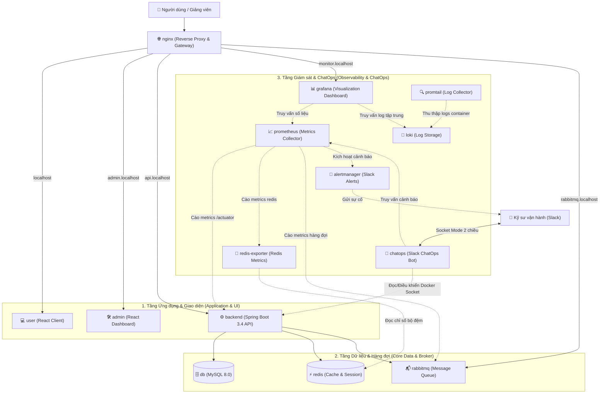

# Quiz VNUA

Nền tảng ôn tập và thi trắc nghiệm trực tuyến.
Kiến trúc: **Spring Boot 3.4.0** + **React 18 (Vite)** + **MySQL 8** + **Redis** + **RabbitMQ** + **Nginx** + **Prometheus/Grafana**.

---

## 1. Hướng Dẫn Chạy Nhanh (Khuyên Dùng)

Hệ thống đã được đóng gói toàn diện bằng Docker Compose và script điều khiển tự động 1 lệnh duy nhất.

### Yêu cầu tiên quyết
- Cài đặt và bật **[Docker Desktop](https://www.docker.com/products/docker-desktop/)** (Windows / macOS / Linux).

### Khởi động hệ thống
Mở Command Prompt (CMD) hoặc PowerShell tại thư mục dự án và chạy:

```cmd
run.cmd
```
*(Hoặc trên PowerShell: `.\run.ps1`)*

Script sẽ hiển thị bảng điều khiển menu:
```text
==============================================
         QUIZ SYSTEM CONTROLLER
==============================================
1. Chay App co ban (BE, FE, DB, Redis, RabbitMQ, Nginx)
2. Chay Full App + Monitoring (Prometheus & Grafana)
3. Xem trang thai cac container (Status)
4. Xem Logs he thong
5. Dung he thong (Stop/Down)
6. Kiem tra toan bo dau noi he thong (Doctor Health Check)
0. Thoat
```

---

## 2. Các Lệnh Thao Tác Nhanh

| Lệnh thực thi | Chức năng chi tiết |
| :--- | :--- |
| `.\run.cmd` | Mở bảng điều khiển tương tác (Menu) |
| `.\run.cmd docker-local` | Khởi động stack ứng dụng cơ bản (tiết kiệm RAM máy tính) |
| `.\run.cmd monitor` | Khởi động đầy đủ toàn bộ ứng dụng + bộ giám sát Prometheus/Grafana |
| `.\run.cmd doctor` | Tự động kiểm tra sức khỏe và đấu nối của toàn bộ 13 containers |
| `.\run.cmd status` | Kiểm tra trạng thái hoạt động của các containers |
| `.\run.cmd logs` | Theo dõi nhật ký log hệ thống theo thời gian thực |
| `.\run.cmd stop` | Dừng toàn bộ hệ thống sạch sẽ |

---

## 3. Danh Sách Địa Chỉ Truy Cập (Cổng 80)

Sau khi hệ thống khởi động, toàn bộ dịch vụ được Reverse Proxy qua Nginx cổng **80**:

| Dịch vụ | Địa chỉ truy cập | Thông tin đăng nhập mặc định |
| :--- | :--- | :--- |
| Web Sinh viên (Client) | `http://localhost` | Đăng ký hoặc tài khoản sinh viên |
| Web Quản trị (Admin) | `http://admin.localhost` | `admin` / `change-me` (cấu hình trong `.env`) |
| Backend REST API | `http://api.localhost` | Endpoint API gốc |
| Swagger UI (Tài liệu API) | `http://localhost:8080/swagger-ui` | Xem và thử nghiệm trực tiếp API |
| RabbitMQ Dashboard | `http://rabbitmq.localhost` | `guest` / `guest` |
| Grafana Dashboard | `http://monitor.localhost` | `admin` / `admin` |

---

## 4. Kiến Trúc Hạ Tầng & Vai Trò 13 Container Docker

Hệ thống được đóng gói hoàn chỉnh thành **14 container Docker** độc lập, vận hành theo kiến trúc microservices/multi-container phân tầng, kết nối qua mạng nội bộ Docker và định tuyến tập trung qua Nginx:



### Bảng chi tiết vai trò và giá trị nghiệp vụ của 14 Container

#### Nhóm 1: Tầng Ứng Dụng & Giao Diện (Application & UI)
| Container | Hình ảnh / Công nghệ | Vai trò & Giá trị trong hệ thống |
| :--- | :--- | :--- |
| **`backend`** | Spring Boot 3.4 (Java 17) | **Trái tim của hệ thống**: Xử lý toàn bộ REST API, nghiệp vụ thi cử, chấm điểm trắc nghiệm thời gian thực, bảo mật phân quyền JWT (Cookie HttpOnly), tích hợp trợ lý AI (Gemini/OpenAI) sinh đề tự động, và quản lý các giao dịch dữ liệu. |
| **`user`** | React 18 + Vite + Ant Design | **Giao diện học viên/sinh viên**: Cung cấp trải nghiệm mượt mà cho thí sinh làm bài thi trắc nghiệm trực tuyến, xem kết quả tức thì, tra cứu lịch sử thi và trò chuyện với trợ lý học tập AI. |
| **`admin`** | React 18 + Vite + Ant Design | **Giao diện quản trị viên & giảng viên**: Công cụ quản trị toàn diện giúp tạo và duyệt ngân hàng câu hỏi, soạn đề thi, tổ chức ca thi, quản lý người dùng, phân quyền và xem biểu đồ phân tích phổ điểm. |

#### Nhóm 2: Tầng Dữ Liệu Bền Vững & Hàng Đợi (Core Data & Messaging)
| Container | Hình ảnh / Công nghệ | Vai trò & Giá trị trong hệ thống |
| :--- | :--- | :--- |
| **`db`** | MySQL 8.0 Community | **Lưu trữ dữ liệu bền vững (RDBMS)**: Quản lý toàn bộ dữ liệu quan hệ gồm tài khoản, ngân hàng câu hỏi, đề thi, ca thi, lịch sử làm bài và log điểm số với bộ mã ký tự chuẩn `utf8mb4_unicode_ci`. |
| **`redis`** | Redis 7 Alpine | **Bộ đệm tốc độ cao (In-Memory Cache & Session Store)**: Lưu cache danh mục đề thi, câu hỏi nhằm giảm tải trực tiếp cho MySQL khi có hàng nghìn thí sinh cùng truy cập; quản lý refresh token, blacklist token và rate limiting chống spam request. |
| **`rabbitmq`** | RabbitMQ 3.13 Management | **Hàng đợi tin nhắn bất đồng bộ (Message Broker)**: Đảm bảo khả năng chịu tải cao bằng cách tách các tác vụ nặng ra xử lý ngầm (non-blocking) như gửi email kích hoạt/OTP, gửi email thông báo điểm thi và ghi log sự kiện. Đi kèm giao diện Web UI theo dõi queue. |

#### Nhóm 3: Cổng Điều Phối & Cổng Vào Mạng (Gateway & Reverse Proxy)
| Container | Hình ảnh / Công nghệ | Vai trò & Giá trị trong hệ thống |
| :--- | :--- | :--- |
| **`nginx`** | Nginx Alpine | **Cổng vào duy nhất (Single Entrypoint - Port 80/443)**: Đóng vai trò Reverse Proxy, định tuyến tên miền ảo (`localhost`, `admin.localhost`, `api.localhost`, `monitor.localhost`, `rabbitmq.localhost`), nén dữ liệu Gzip, cache tệp tĩnh và hỗ trợ SSL Termination an toàn. |

#### Nhóm 4: Hệ Thống Giám Sát Hiệu Năng, Nhật Ký & ChatOps (Full Observability Stack)
*(Kích hoạt khi chạy lệnh `run.cmd monitor` hoặc cờ `--profile monitoring`)*

| Container | Hình ảnh / Công nghệ | Vai trò & Giá trị trong hệ thống |
| :--- | :--- | :--- |
| **`prometheus`** | Prometheus v2.54 | **Bộ thu thập chỉ số hiệu năng (Time-Series Metrics)**: Định kỳ cào (scrape) các thông số sức khỏe hệ thống: CPU, RAM, JVM heap, số lượng request/giây (RPS), độ trễ API và trạng thái hàng đợi. |
| **`grafana`** | Grafana 11.2 | **Bảng điều khiển trực quan hóa (Monitoring Dashboard)**: Biến các chỉ số thô từ Prometheus và Loki thành biểu đồ trực quan, sinh động; tích hợp sẵn 2 dashboard chuyên sâu cho Spring Boot và Redis. |
| **`alertmanager`** | Alertmanager v0.27 | **Bộ quản lý & bắn cảnh báo sự cố**: Tiếp nhận các vi phạm ngưỡng an toàn từ Prometheus (ví dụ: CPU > 85%, tỷ lệ lỗi 5xx tăng vọt, service bị sập) để gom nhóm và bắn tin nhắn cảnh báo khẩn cấp tức thì qua Slack Webhook `#quiz-alerts`. |
| **`chatops`** | Node.js 20 + `@slack/bolt` | **Trợ lý vận hành hệ thống 2 chiều (Slack ChatOps Bot)**: Kết nối bảo mật qua Slack Socket Mode, cho phép kỹ sư gõ lệnh `/quiz status`, `/quiz restart <service>`, `/quiz logs <service>` hoặc bấm nút trực tiếp từ điện thoại để điều khiển hạ tầng Docker mà không cần mở port public. |
| **`loki`** | Grafana Loki 3.1 | **Kho lưu trữ log tập trung (Log Aggregation)**: Thu thập và lập chỉ mục nhật ký hoạt động của toàn bộ các container; cho phép tra cứu, tìm kiếm log lỗi thời gian thực ngay trên giao diện Grafana mà không cần SSH vào máy chủ. |
| **`promtail`** | Grafana Promtail 3.1 | **Agent thu gom log**: Chạy nền để liên tục đọc stream log từ Docker socket (`/var/lib/docker/containers`) của mọi container đang hoạt động rồi đẩy về cho Loki. |
| **`redis-exporter`** | Redis Exporter v1.67 | **Cầu nối số liệu bộ nhớ Redis**: Trích xuất các chỉ số nội bộ của Redis (tỷ lệ cache hit/miss, dung lượng RAM sử dụng, số kết nối client, số lượng key) về định dạng chuẩn Prometheus. |

---

## 5. Chạy Thủ Công Dành Cho Lập Trình Viên (Dev Mode Không Dùng Docker)

Nếu muốn phát triển và kiểm thử trực tiếp từng thành phần trên máy cá nhân:

### Khởi động Backend
Yêu cầu: JDK 17+, MySQL 8 và Redis đang chạy.
```powershell
cd server
Copy-Item .env.example .env.local
.\mvnw.cmd spring-boot:run
```
*(Backend chạy tại `http://localhost:8080`)*

### Khởi động Client (Sinh viên)
```powershell
cd client
npm install
npm run dev
```
*(Client chạy tại `http://localhost:3000`)*

### Khởi động Admin (Quản trị)
```powershell
cd admin
npm install
npm run dev
```
*(Admin chạy tại `http://localhost:3001`)*

---

## 6. Tài Liệu Kỹ Thuật Chi Tiết

Tài liệu chi tiết về kiến trúc, database, nghiệp vụ, API và hạ tầng giám sát được lưu trữ trong thư mục **[`docs/`](docs/README.md)**:

- **[docs/architecture.md](docs/architecture.md)**: Sơ đồ kiến trúc tổng quan, hạ tầng Nginx và cơ chế hàng đợi RabbitMQ.
- **[docs/workflows.md](docs/workflows.md)**: Sơ đồ tuần tự các luồng chính: Xác thực/Refresh Token, Làm bài thi/Nộp bài tải cao, AI sinh câu hỏi, Giám sát cảnh báo.
- **[docs/backend.md](docs/backend.md)**: Chi tiết Spring Boot 3.4.0, bảo mật JWT Cookie, xử lý tải cao, AI sinh câu hỏi từ tài liệu.
- **[docs/frontend.md](docs/frontend.md)**: Chi tiết 2 ứng dụng React Client & Admin, Ant Design, các màn hình chức năng.
- **[docs/monitoring.md](docs/monitoring.md)**: Trọn bộ Observability (Prometheus, Grafana, Loki, Alertmanager gửi cảnh báo Telegram).
- **[docs/ci-cd.md](docs/ci-cd.md)**: Quy trình CI/CD tự động, kiểm thử chất lượng, cơ chế nạp Secret qua GitHub Actions và hướng dẫn deploy VPS.
- **[docs/postman/](docs/postman/Quiz.postman_collection.json)**: Bộ sưu tập Postman Collection đầy đủ của các API.
