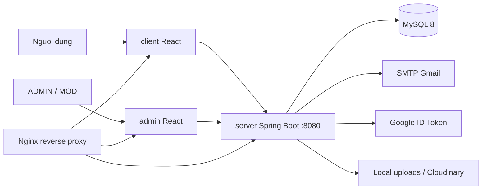

# Quiz VNUA

Quiz VNUA la he thong on tap va thi trac nghiem gom 3 ung dung:

- `client`: React app cho sinh vien/nguoi dung cuoi.
- `admin`: React app cho ADMIN va MOD.
- `server`: Spring Boot REST API, xu ly xac thuc, phan quyen, nghiep vu quiz va luu tru du lieu.

Tai lieu nay duoc cap nhat theo code hien tai trong `server`, `client` va `admin`.

## Kien truc nhanh



Frontend goi API qua Axios voi base URL mac dinh:

```text
http://localhost:8080/api/v1/
```

## Cong nghe

Backend:

- Java 17, Spring Boot 3.4.0
- Spring Web, Spring Security, Method Security
- Spring Data JPA, MySQL Connector/J
- JWT cookie, refresh token, BCrypt
- Spring Mail, Google OAuth client
- Apache POI import Excel
- Springdoc OpenAPI/Swagger UI
- Lombok, ModelMapper

Frontend `client`:

- React 18, Create React App
- React Router DOM 6, Axios
- Ant Design, Chakra UI, Tailwind CSS, styled-components
- React Hook Form, React Toastify, React OAuth Google
- i18next, Recharts

Frontend `admin`:

- React 18, Create React App
- React Router DOM 7, Axios
- Ant Design, React Icons, Moment, Recharts

Ha tang:

- MySQL 8
- Docker Compose
- Nginx Alpine

## Tinh nang chinh

Nguoi dung:

- Dang ky, xac thuc email, dang nhap, dang xuat.
- Dang nhap bang Google ID token.
- Refresh access token bang refresh token cookie.
- Quen mat khau bang OTP email.
- Xem category, subject, chapter, question va exam public.
- Lam bai thi, autosave dap an, cap nhat tien do, nop bai, xem ket qua.
- Xem lich su lam bai, so lan lam bai, bang diem tong hop.
- Quan ly subject yeu thich.
- Cap nhat ho so, doi mat khau, upload va lay avatar.
- Danh dau thong bao da doc hoac da doc tat ca.

Quan tri/MOD:

- Dashboard thong ke.
- Quan ly user, category, subject, chapter.
- Quan ly cau hoi, dap an, anh minh hoa, soft delete/restore.
- Import cau hoi tu Excel.
- Quan ly de thi.
- Xem lich su bai thi cua user.
- Gui thong bao global, personal, subject, batch; xem campaign va recipient; thu hoi campaign.
- Gan role va quyen MOD theo subject.

## Cau truc thu muc

```text
quiz/
|-- admin/                         # React app quan tri
|-- client/                        # React app nguoi dung
|-- server/                        # Spring Boot backend
|   |-- src/main/java/com/fita/vnua/quiz/
|   |   |-- configuration/          # Security, CORS, Swagger, init admin
|   |   |-- controller/             # REST controllers
|   |   |-- exception/              # Global exception handler
|   |   |-- model/                  # Entity, DTO, request, response
|   |   |-- repository/             # Spring Data repositories
|   |   |-- security/               # JWT, filters, handlers
|   |   `-- service/                # Business services
|   `-- src/main/resources/         # application*.properties, migration
|-- docs/
|   |-- SYSTEM_GRAPH.md
|   `-- postman/Quiz.postman_collection.json
|-- docker-compose.yml
`-- nginx/
```

## Yeu cau moi truong

Local:

- Java JDK 17+
- Maven 3.6+ hoac Maven Wrapper trong `server/`
- Node.js 16+/18+
- npm
- MySQL 8+

Container:

- Docker
- Docker Compose

## Cau hinh moi truong

Backend:

```text
server/src/main/resources/application.properties
server/src/main/resources/application-dev.properties
server/src/main/resources/application-prod.properties
server/.env.example
```

Bien/cau hinh quan trong:

```properties
server.port=8080
spring.datasource.url=jdbc:mysql://localhost:3306/quiz
spring.datasource.username=root
spring.datasource.password=root

jwt.secret=<secret>
jwt.access-token-expiration=900000
jwt.refresh-token-expiration=604800000

app.cors.allowed-origins=http://localhost:3000,http://localhost:3001
app.security.csrf-enabled=false

spring.mail.host=smtp.gmail.com
spring.mail.port=587
spring.mail.username=<gmail-address>
spring.mail.password=<gmail-app-password>

google.client.id=<google-client-id>

avatar.upload-dir=uploads/avatars
question.upload-dir=uploads/questions
cloudinary.enabled=false
```

Client:

```env
REACT_APP_API_URL=http://localhost:8080/api/v1/
REACT_APP_AVATAR_URL=http://localhost:8080
REACT_APP_GOOGLE_CLIENT_ID=<google-client-id>
```

Admin:

```env
REACT_APP_API_URL=http://localhost:8080/api/v1/
```

Khong commit secret that nhu JWT secret, Gmail app password, DB password production hoac Google credential.

## Chay local

Tao database:

```sql
CREATE DATABASE quiz CHARACTER SET utf8mb4 COLLATE utf8mb4_unicode_ci;
```

Chay backend tren Windows:

```bat
cd server
mvnw.cmd spring-boot:run
```

Chay backend tren Linux/macOS/Git Bash:

```bash
cd server
./mvnw spring-boot:run
```

Backend:

```text
http://localhost:8080
```

Swagger UI:

```text
http://localhost:8080/swagger-ui
```

OpenAPI JSON:

```text
http://localhost:8080/v3/api-docs
```

Chay client:

```bash
cd client
npm install
npm start
```

Client mac dinh:

```text
http://localhost:3000
```

Chay admin tren port 3001 neu client dang dung port 3000:

```powershell
cd admin
npm install
$env:PORT=3001; npm start
```

## Chay Docker Compose

`docker-compose.yml` gom:

| Service | Mo ta |
|---|---|
| `backend` | Build tu `./server`, API port noi bo `8080` |
| `user` | Build tu `./client`, port noi bo `3001` |
| `admin` | Build tu `./admin`, port noi bo `3000` |
| `db` | MySQL 8, database `quiz`, root password mac dinh `root` |
| `nginx` | Reverse proxy, publish `80` va `443` |

Chay:

```bash
docker compose --env-file server/.env up --build
```

Chay nen:

```bash
docker compose --env-file server/.env up -d --build
```

Dung:

```bash
docker compose down
```

Xoa kem volume database:

```bash
docker compose down -v
```

## API chinh

Base URL:

```text
http://localhost:8080/api/v1
```

Auth/OTP:

| Method | Endpoint | Mo ta |
|---|---|---|
| POST | `/auth/login` | Dang nhap, set access/refresh cookie |
| GET | `/auth/me` | Lay user hien tai |
| POST | `/auth/refresh` | Refresh access token bang cookie `refreshToken` |
| POST | `/auth/logout` | Revoke refresh token va clear cookie |
| POST | `/auth/register` | Dang ky va gui email verify |
| GET | `/auth/verify-email?token=...` | Xac thuc email |
| POST | `/auth/google` | Dang nhap bang Google ID token |
| POST | `/otp/send` | Gui OTP quen mat khau |
| POST | `/otp/verify` | Verify OTP |
| POST | `/otp/reset` | Reset mat khau bang reset token |

Public:

| Method | Endpoint | Mo ta |
|---|---|---|
| GET | `/public/categories` | Danh sach category |
| GET | `/public/categories/search?q=...` | Tim category |
| GET | `/public/subjects` | Danh sach subject |
| GET | `/public/subjects/search?q=...` | Tim subject |
| GET | `/public/subjects/category/{categoryId}` | Subject theo category |
| GET | `/public/subjects/{subjectId}` | Chi tiet subject |
| GET | `/public/chapters` | Danh sach chapter |
| GET | `/public/chapters/search?q=...` | Tim chapter |
| GET | `/public/chapters/subject/{subjectId}` | Chapter theo subject |
| GET | `/public/chapters/{chapterId}` | Chi tiet chapter |
| GET | `/public/questions/chapter/{chapterId}?includeCorrectAnswers=false` | Cau hoi theo chapter |
| GET | `/public/exams/subject/{subjectId}` | Exam theo subject |
| GET | `/public/exams/{examId}?includeCorrectAnswers=false&userExamId=` | Chi tiet exam |
| GET | `/public/user-exam-summaries?period=all\|week\|month` | Bang diem tong hop |

User:

| Method | Endpoint | Mo ta |
|---|---|---|
| GET | `/users/{userId}` | Lay user theo id |
| GET | `/user/{userId}` | Alias lay user theo id |
| PATCH | `/users/{userId}` | Cap nhat profile |
| PATCH | `/users/{userId}/password` | Doi mat khau |
| PUT | `/users/me/avatar` | Upload avatar multipart |
| GET | `/users/me/avatar` | Lay avatar hien tai |
| GET | `/user/subjects?userId={userId}` | Subject user da lam bai |
| POST | `/favorites` | Them favorite |
| DELETE | `/favorites` | Xoa favorite |
| GET | `/users/{userId}/favorites` | Favorite theo user |
| GET | `/user-exams?userId=...&subjectId=...` | Bai thi theo user va subject |
| GET | `/users/{userId}/user-exams` | Bai thi theo user |
| GET | `/users/{userId}/user-exams/recent` | 7 bai thi gan nhat |
| GET | `/users/{userId}/user-exams/count` | So lan lam bai theo exam |
| GET | `/user-exams/{userExamId}` | Chi tiet bai lam |
| POST | `/user-exams` | Tao bai lam dang legacy |
| POST | `/exam-attempts/start` | Tao/resume attempt |
| GET | `/users/{userId}/exam-attempts/in-progress` | Attempt dang lam |
| PUT | `/exam-attempts/{userExamId}/answers` | Autosave dap an |
| PATCH | `/exam-attempts/{userExamId}/progress` | Cap nhat progress |
| POST | `/exam-attempts/{userExamId}/submit` | Nop bai |
| PATCH | `/notifications/{id}` | Danh dau 1 thong bao da doc |
| PATCH | `/notifications` | Danh dau tat ca thong bao da doc |

Admin/MOD:

| Method | Endpoint | Mo ta |
|---|---|---|
| GET | `/admin/statistics` | Dashboard statistics |
| GET | `/admin/users` | Danh sach user |
| GET | `/admin/users/search?key=...` | Tim user |
| POST | `/admin/users` | Tao user |
| PATCH | `/admin/users/{userId}` | Cap nhat user |
| DELETE | `/admin/users/{userId}` | Xoa user |
| GET | `/admin/categories/{id}` | Chi tiet category |
| POST | `/admin/categories` | Tao category |
| PUT | `/admin/categories/{id}` | Cap nhat category |
| DELETE | `/admin/categories/{id}` | Xoa category |
| POST | `/admin/subjects` | Tao subject |
| PATCH | `/admin/subjects/{subjectId}` | Cap nhat subject |
| DELETE | `/admin/subjects/{subjectId}` | Xoa subject |
| POST | `/admin/chapters` | Tao chapter |
| PATCH | `/admin/chapters/{chapterId}` | Cap nhat chapter |
| DELETE | `/admin/chapters/{chapterId}` | Xoa chapter |
| GET | `/admin/questions` | Danh sach question |
| GET | `/admin/questions/deleted` | Question da xoa mem |
| GET | `/admin/questions/search?q=...` | Tim question |
| GET | `/admin/questions/{questionId}` | Chi tiet question |
| GET | `/admin/questions/subject/{subjectId}` | Question theo subject |
| GET | `/admin/questions/total-questions/{subjectId}` | Tong question theo subject |
| POST | `/admin/questions` | Tao question |
| PATCH | `/admin/questions/{questionId}` | Cap nhat question |
| DELETE | `/admin/questions/{questionId}` | Xoa mem question |
| PATCH | `/admin/questions/{questionId}/restore` | Restore question |
| POST | `/admin/questions/import` | Import question tu Excel |
| POST | `/admin/questions/upload-image` | Upload anh question |
| GET | `/admin/exams` | Danh sach exam |
| POST | `/admin/exams` | Tao exam |
| PUT | `/admin/exams/{examId}` | Cap nhat exam |
| DELETE | `/admin/exams/{examId}` | Xoa exam |
| GET | `/admin/user-exams` | Tat ca bai lam |
| POST | `/admin/notifications/global` | Gui thong bao global |
| POST | `/admin/notifications/personal` | Gui thong bao ca nhan |
| POST | `/admin/notifications/subject` | Gui thong bao theo subject |
| POST | `/admin/notifications/batch` | Gui thong bao theo danh sach user |
| GET | `/admin/notifications/campaigns` | Lich su campaign |
| GET | `/admin/notifications/history/{id}/recipients` | Recipient cua campaign |
| DELETE | `/admin/notifications/history/{id}` | Thu hoi campaign |
| POST | `/admin/permissions/subject-assignment` | Gan quyen MOD theo subject |
| GET | `/admin/permissions/mod/{userId}` | Lay quyen cua MOD |
| PATCH | `/admin/permissions/user/{userId}/role` | Cap nhat role |

Postman collection:

```text
docs/postman/Quiz.postman_collection.json
```

## Xac thuc va phan quyen

Spring Security dung stateless JWT cookie. Sau `POST /auth/login`, backend set cookie access token va refresh token. Frontend dung `withCredentials: true`; khi access token het han, Axios goi `POST /auth/refresh`.

Vai tro:

- `USER`: nguoi dung cuoi.
- `MOD`: duoc cap quyen thao tac theo subject qua `UserSubjectPermission`.
- `ADMIN`: toan quyen.

Route public duoc permit:

- `/api/v1/auth/login`
- `/api/v1/auth/register`
- `/api/v1/auth/google`
- `/api/v1/auth/verify-email`
- `/api/v1/auth/refresh`
- `/api/v1/otp/**`
- `/api/v1/public/**`
- `/swagger-ui/**`, `/v3/api-docs/**`
- `/avatars/**`, `/questions/**`

Route protected:

- `/api/v1/admin/**`: `ADMIN` hoac `MOD`, them `@PreAuthorize` tren tung method.
- `/api/v1/mod/**`: `ADMIN` hoac `MOD`.
- `/api/v1/user/**`: `ADMIN`, `MOD` hoac `USER`.
- Cac route con lai yeu cau dang nhap.

## Du lieu nghiep vu chinh

- `User`
- `Category`
- `Subject`
- `Chapter`
- `Question`, `Answer`
- `Exam`, `ExamQuestion`
- `UserExam`, `UserAnswer`
- `Favorite`
- `Notification`, `NotificationHistory`, `GlobalNotificationRead`
- `RefreshToken`, `EmailVerificationToken`, `OtpCode`
- `UserSubjectPermission`

## Build production

Backend:

```bash
cd server
./mvnw clean package
```

Windows:

```bat
cd server
mvnw.cmd clean package
```

Client:

```bash
cd client
npm install
npm run build
```

Admin:

```bash
cd admin
npm install
npm run build
```

## Tai lieu lien quan

- `docs/SYSTEM_GRAPH.md`: graph kien truc, security, ERD va cac sequence flow.
- `docs/postman/Quiz.postman_collection.json`: Postman collection theo controller hien tai.
- Swagger UI khi backend dang chay: `http://localhost:8080/swagger-ui`.
