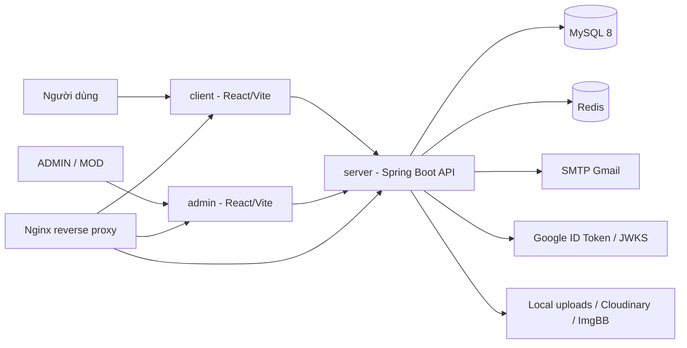

# Quiz VNUA

Quiz VNUA là hệ thống ôn tập và thi trắc nghiệm trực tuyến, gồm 3 ứng dụng chính:

- `server`: Spring Boot REST API xử lý xác thực, phân quyền, nghiệp vụ quiz, import dữ liệu và lưu trữ media.
- `client`: ứng dụng web cho sinh viên/người dùng cuối.
- `admin`: ứng dụng web cho `ADMIN` và `MOD` quản trị nội dung, đề thi, người dùng và thông báo.

Tài liệu này được viết theo cấu trúc hiện tại của repository.

## Kiến Trúc Tổng Quan



Production dự kiến dùng các domain:

```text
https://quizvnua.com        -> client
https://admin.quizvnua.com  -> admin
https://api.quizvnua.com    -> server API
```

Local Docker dùng Nginx với:

```text
http://localhost        -> client
http://admin.localhost  -> admin
http://api.localhost    -> server API
```

## Công Nghệ

Backend:

- Java 17, Spring Boot 3.4.0, Maven Wrapper
- Spring Web, Spring Security, Method Security, WebSocket
- Spring Data JPA, MySQL Connector/J, Flyway
- Redis cache
- JWT cookie, refresh token, BCrypt
- Spring Mail, Google OAuth/JWKS
- Apache POI import Excel
- Springdoc OpenAPI/Swagger UI
- Cloudinary/ImgBB/local upload cho ảnh
- Lombok

Frontend `client`:

- React 18, Vite 7
- React Router DOM 7, Axios
- Ant Design 5, React Icons
- i18next/react-i18next
- STOMP/SockJS realtime notification
- Recharts, Tailwind CSS

Frontend `admin`:

- React 18, Vite 7
- React Router DOM 7, Axios
- Ant Design 5, React Icons
- dnd-kit
- Moment, Recharts
- html2canvas, jsPDF

Hạ tầng:

- Docker Compose
- MySQL 8
- Redis 7 Alpine
- Nginx Alpine

## Tính Năng Chính

Người dùng:

- Đăng ký, xác thực email, đăng nhập, đăng xuất.
- Đăng nhập bằng Google ID token.
- Refresh access token bằng cookie.
- Quên mật khẩu bằng OTP email.
- Xem category, subject, chapter, question, exam public.
- Làm bài theo chapter hoặc exam, autosave đáp án, cập nhật tiến độ, nộp bài và xem kết quả.
- Xem lịch sử làm bài, bài đang làm, số lần làm bài và bảng xếp hạng/tổng hợp.
- Quản lý subject yêu thích.
- Cập nhật hồ sơ, đổi mật khẩu, upload avatar.
- Nhận và đánh dấu thông báo đã đọc.
- Xem tài liệu/chia sẻ nội dung học tập nếu được công khai.

Quản trị và MOD:

- Dashboard thống kê.
- Quản lý user, category, subject, chapter.
- Quản lý câu hỏi, đáp án, ảnh minh họa, soft delete/restore.
- Import câu hỏi từ Excel.
- Quản lý đề thi, preview/in đề thi.
- Xem lịch sử bài thi của user.
- Quản lý tài liệu chia sẻ.
- Gửi thông báo global, personal, theo subject hoặc theo danh sách user.
- Xem campaign, recipient và thu hồi thông báo.
- Quản lý nhóm admin, quyền menu và audit log.
- Gán role/quyền MOD theo phạm vi được cấu hình.

## Cấu Trúc Thư Mục

```text
quiz/
|-- admin/                         # React/Vite app cho ADMIN và MOD
|   |-- src/api/                    # Axios config, API services, HTTP helpers
|   |-- src/components/             # Component dùng chung
|   |-- src/config/                 # Đọc biến môi trường
|   |-- src/context/                # Auth/theme/protected route
|   |-- src/hooks/                  # Hook dùng chung
|   |-- src/layouts/                # Layout quản trị
|   |-- src/pages/                  # Feature pages: User, Question, Exam, ...
|   |-- src/routes/                 # Route config
|   |-- src/styles/                 # CSS global/layout/page/ui/vendor
|   `-- src/utils/                  # Helper cho UI, quyền, markdown, media
|-- client/                        # React/Vite app cho người dùng cuối
|   |-- src/api/                    # Axios config, API services, auth interceptors
|   |-- src/components/             # Component dùng chung
|   |-- src/config/                 # Đọc biến môi trường
|   |-- src/context/                # Auth, favorites, language, notifications, theme
|   |-- src/i18n/                   # Tài nguyên đa ngôn ngữ
|   |-- src/layouts/                # Layout client
|   |-- src/pages/                  # Account, Auth, Home, Subject, Rank, ...
|   |-- src/routes/                 # AppRouter, route definitions, guards
|   |-- src/style/                  # CSS entry
|   `-- src/utils/                  # Markdown, media URL, storage, math rendering
|-- server/                        # Spring Boot backend
|   |-- src/main/java/com/fita/vnua/quiz/
|   |   |-- config/                 # Redis cache config
|   |   |-- configuration/          # Security, Swagger, Web, WebSocket, admin init
|   |   |-- controller/             # REST controllers
|   |   |-- exception/              # Custom exception và global handler
|   |   |-- generator/              # Composite ID classes
|   |   |-- model/                  # Entity, DTO, enum, contract
|   |   |-- repository/             # Spring Data repositories
|   |   |-- security/               # JWT, filters, handlers, permission evaluator
|   |   |-- service/                # Service interfaces
|   |   |-- service/impl/           # Business logic
|   |   |-- service/mapper/         # DTO/entity mappers
|   |   |-- service/storage/        # Image storage abstraction
|   |   `-- utils/                  # Excel helper
|   `-- src/main/resources/         # application.properties và Flyway migrations
|-- docs/postman/                  # Postman collection
|-- mysql.init/                    # SQL init scripts cho MySQL container
|-- nginx/conf.d/                  # Reverse proxy config
|-- docker-compose.yml             # Production-like Docker stack
|-- docker-compose.local.yml       # Local override
|-- run.ps1                        # Script chạy/build/doctor trên PowerShell
`-- run.cmd                        # Wrapper cho Command Prompt
```

## Yêu Cầu Môi Trường

Chạy local không dùng Docker:

- Java JDK 17+
- Maven 3.6+ hoặc Maven Wrapper trong `server/`
- Node.js tương thích Vite 7
- npm
- MySQL 8
- Redis 7 nếu giữ `SPRING_CACHE_TYPE=redis`

Chạy bằng container:

- Docker
- Docker Compose

## Cấu Hình Môi Trường

Các file mẫu quan trọng:

```text
server/.env.local.example
server/.env.production.example
client/.env.local.example
client/.env.production.example
admin/.env.local.example
admin/.env.production.example
```

Tạo file cấu hình local từ file mẫu:

```powershell
Copy-Item server\.env.local.example server\.env.local
Copy-Item client\.env.local.example client\.env.local
Copy-Item admin\.env.local.example admin\.env.local
```

Backend đọc cấu hình qua `server/src/main/resources/application.properties` và biến môi trường. Các biến cần chú ý:

```env
SERVER_PORT=8080

DB_HOST=localhost
DB_PORT=3306
DB_NAME=quiz
DB_USER=root
DB_PASSWORD=root

SPRING_CACHE_TYPE=redis
REDIS_HOST=localhost
REDIS_PORT=6379

JPA_DDL_AUTO=validate
FLYWAY_BASELINE_ON_MIGRATE=true

JWT_SECRET=replace-with-at-least-32-bytes-random-secret
JWT_ACCESS_TOKEN_EXPIRATION=900000
JWT_REFRESH_TOKEN_EXPIRATION=604800000

MAIL_HOST=smtp.gmail.com
MAIL_PORT=587
MAIL_USERNAME=example@gmail.com
MAIL_PASSWORD=change-me

APP_FRONTEND_BASE_URL=http://localhost:3000
APP_CORS_ALLOWED_ORIGINS=http://localhost:3000,http://localhost:3001
APP_COOKIE_SECURE=false
APP_COOKIE_SAME_SITE=Strict
APP_SECURITY_CSRF_ENABLED=false

GOOGLE_CLIENT_ID=change-me

CLOUDINARY_ENABLED=false
CLOUDINARY_CLOUD_NAME=
CLOUDINARY_API_KEY=
CLOUDINARY_API_SECRET=
IMGBB_ENABLED=false
IMGBB_API_KEY=
IMAGE_STORAGE_PRIMARY=cloudinary

ADMIN_INITIALIZER_ENABLED=true
ADMIN_USERNAME=admin
ADMIN_PASSWORD=change-me
ADMIN_EMAIL=admin@example.com
```

Frontend dùng biến `VITE_*`:

```env
VITE_API_URL=http://localhost:8080/api/v1/
VITE_AVATAR_URL=
VITE_GOOGLE_CLIENT_ID=change-me
VITE_ADMIN_BASENAME=/
```

Không commit secret thật như `JWT_SECRET`, mật khẩu Gmail app, mật khẩu database production, Cloudinary/ImgBB key hoặc Google credential.

## Chạy Local

Tạo database:

```sql
CREATE DATABASE quiz CHARACTER SET utf8mb4 COLLATE utf8mb4_unicode_ci;
```

Chạy toàn bộ bằng script root:

```powershell
.\run.ps1 local
```

Nếu PowerShell chặn script:

```powershell
powershell -ExecutionPolicy Bypass -File .\run.ps1 local
```

Hoặc dùng wrapper từ Command Prompt:

```bat
run.cmd local
```

Script sẽ mở 3 cửa sổ riêng:

```text
http://localhost:8080  -> server API
http://localhost:3000  -> client
http://localhost:3001  -> admin
```

Chạy từng phần thủ công:

```powershell
cd server
.\mvnw.cmd spring-boot:run
```

```powershell
cd client
npm install
$env:PORT=3000; npm start
```

```powershell
cd admin
npm install
$env:PORT=3001; npm start
```

Swagger UI:

```text
http://localhost:8080/swagger-ui
```

OpenAPI JSON:

```text
http://localhost:8080/v3/api-docs
```

## Chạy Docker Compose

Chạy stack local:

```powershell
.\run.ps1 docker-local
```

Hoặc:

```bat
run.cmd docker-local
```

URL sau khi chạy:

```text
http://localhost        -> client qua Nginx
http://admin.localhost  -> admin qua Nginx
http://api.localhost    -> server API qua Nginx
http://localhost:8080   -> server API direct
http://localhost:3000   -> client direct
http://localhost:3001   -> admin direct
```

Các lệnh hỗ trợ:

```powershell
.\run.ps1 status
.\run.ps1 logs
.\run.ps1 doctor
.\run.ps1 down
```

Production-like stack:

```powershell
.\run.ps1 prod
```

Lệnh này build backend jar trước, sau đó chạy `docker compose up -d --build` với `server/.env.production`.

Các service Docker:

| Service | Mô tả |
|---|---|
| `backend` | Build từ `./server`, expose `8080` |
| `user` | Build từ `./client`, expose `3000` |
| `admin` | Build từ `./admin`, expose `3001` |
| `db` | MySQL 8, database mặc định `quiz` |
| `redis` | Redis 7 Alpine, dùng cho cache |
| `nginx` | Reverse proxy cho client/admin/API |

Chạy Docker thủ công:

```bash
docker compose --env-file server/.env.production up -d --build
```

Dừng và xóa container:

```bash
docker compose down
```

Xóa kèm volume database:

```bash
docker compose down -v
```

## Build

Build tất cả bằng script:

```powershell
.\run.ps1 build
```

Backend:

```powershell
cd server
.\mvnw.cmd clean package
```

Client:

```powershell
cd client
npm install
npm run build
```

Admin:

```powershell
cd admin
npm install
npm run build
```

## API Chính

Base URL local:

```text
http://localhost:8080/api/v1
```

Base URL production:

```text
https://api.quizvnua.com/api/v1
```

Nhóm API chính:

| Nhóm | Endpoint tiêu biểu | Mô tả |
|---|---|---|
| Auth | `/auth/login`, `/auth/me`, `/auth/refresh`, `/auth/logout`, `/auth/register`, `/auth/google` | Đăng nhập, đăng ký, Google login, refresh token |
| OTP | `/otp/send`, `/otp/verify`, `/otp/reset` | Quên mật khẩu bằng OTP |
| Public content | `/public/categories`, `/public/subjects`, `/public/chapters`, `/public/questions`, `/public/exams` | Dữ liệu học tập public |
| User profile | `/users/{userId}`, `/users/me/avatar`, `/users/{userId}/favorites` | Hồ sơ, avatar, subject yêu thích |
| Exam attempt | `/exam-attempts/start`, `/exam-attempts/{userExamId}/answers`, `/exam-attempts/{userExamId}/progress`, `/exam-attempts/{userExamId}/submit` | Làm bài và nộp bài |
| User exam | `/user-exams`, `/users/{userId}/user-exams`, `/user-exams/{userExamId}` | Lịch sử và chi tiết bài làm |
| Notification | `/notifications/{id}`, `/notifications` | Đọc thông báo |
| Admin users | `/admin/users`, `/admin/users/search` | Quản lý người dùng |
| Admin content | `/admin/categories`, `/admin/subjects`, `/admin/chapters`, `/admin/questions`, `/admin/exams` | Quản lý nội dung và đề thi |
| Admin import/export | `/admin/questions/import`, `/admin/questions/upload-image`, các endpoint export | Import Excel, upload ảnh, tải dữ liệu |
| Admin notification | `/admin/notifications/global`, `/admin/notifications/personal`, `/admin/notifications/subject`, `/admin/notifications/batch`, `/admin/notifications/campaigns` | Gửi và quản lý campaign thông báo |
| Admin groups/audit | `/admin/groups`, `/api/v1/admin/audit-logs` | Nhóm quyền admin và audit log |

Postman collection:

```text
docs/postman/Quiz.postman_collection.json
```

## Xác Thực Và Phân Quyền

Backend dùng Spring Security với JWT đặt trong cookie. Sau khi đăng nhập, frontend gọi API với `withCredentials: true`; khi access token hết hạn, HTTP interceptor gọi `/auth/refresh`.

Vai trò chính:

- `USER`: người dùng cuối.
- `MOD`: quản trị viên giới hạn theo quyền được gán.
- `ADMIN`: toàn quyền.

Một số route public:

- `/api/v1/auth/login`
- `/api/v1/auth/register`
- `/api/v1/auth/google`
- `/api/v1/auth/verify-email`
- `/api/v1/auth/refresh`
- `/api/v1/otp/**`
- `/api/v1/public/**`
- `/swagger-ui/**`, `/v3/api-docs/**`
- `/avatars/**`, `/questions/**`

Route quản trị dùng kết hợp role và kiểm tra quyền chi tiết qua service/security layer.

## Dữ Liệu Nghiệp Vụ Chính

Các entity đáng chú ý:

- `User`
- `Category`, `Subject`, `Chapter`
- `Question`, `Answer`
- `Exam`, `ExamQuestion`
- `UserExam`, `UserExamQuestion`, `UserAnswer`
- `Favorite`
- `Notification`, `NotificationHistory`, `GlobalNotificationRead`
- `RefreshToken`, `EmailVerificationToken`, `OtpCode`
- `AdminGroup`, `AdminGroupPermission`, `AdminUserGroup`
- `AuditLog`
- `SharedDocument`

## Tài Liệu Liên Quan

- `docs/postman/Quiz.postman_collection.json`: Postman collection cho API.
- Swagger UI khi backend đang chạy: `http://localhost:8080/swagger-ui`.
- OpenAPI JSON khi backend đang chạy: `http://localhost:8080/v3/api-docs`.

