# Graph tuong quan he thong Quiz

Tai lieu nay tom tat cac quan he chinh cua project theo 3 lop: trien khai, ung dung/API, va du lieu nghiep vu.

## 1. Kien truc tong quan

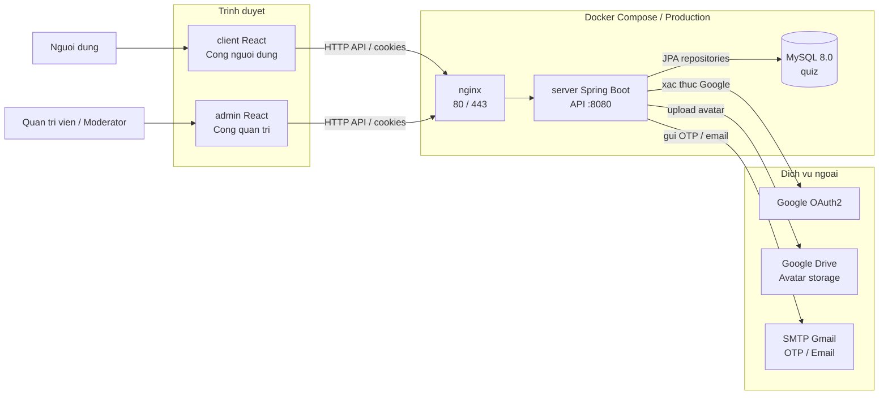

## 2. Quan he giua frontend, API va service backend

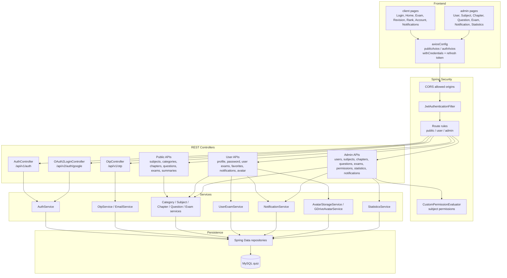

## 3. Phan quyen API

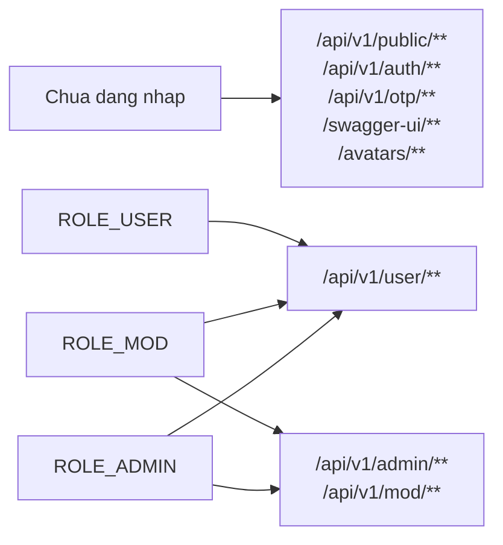

## 4. ERD rut gon

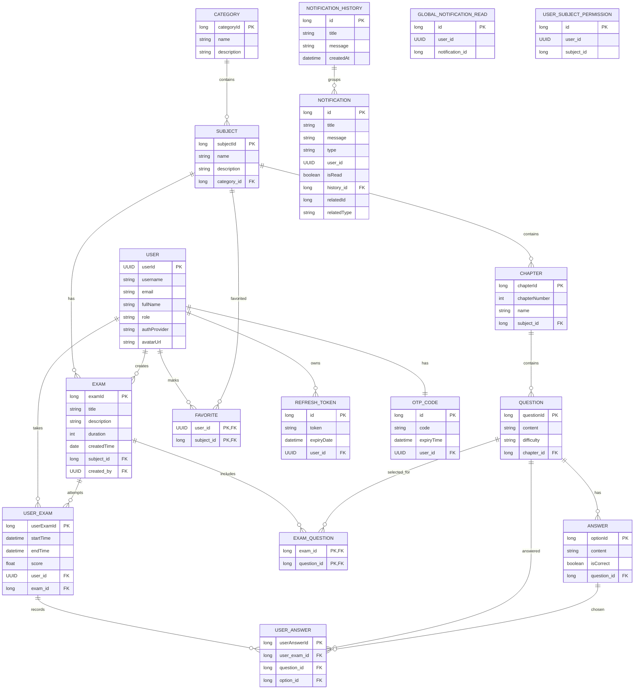

## 5. Luong lam bai thi

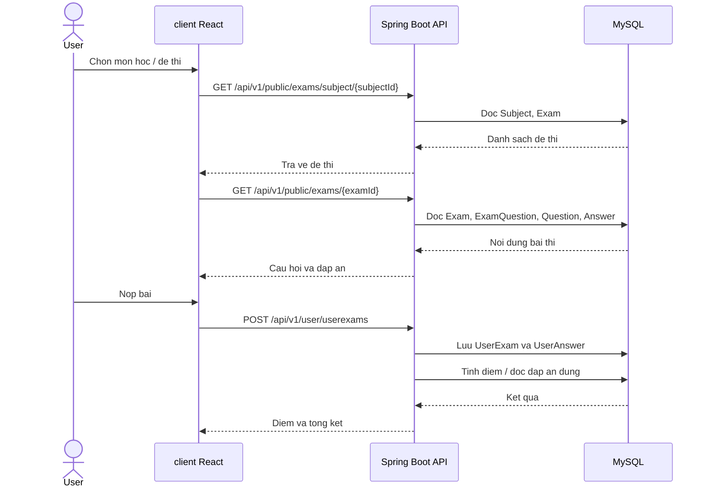

## 6. Luong dang nhap va refresh token

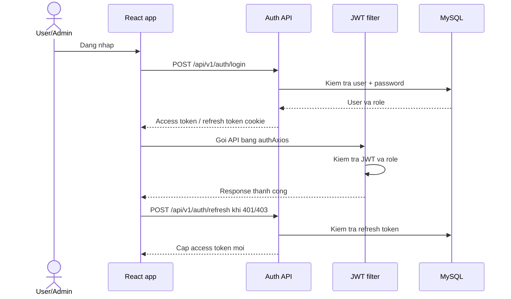

## 7. Luong quan tri danh muc, mon hoc, chuong

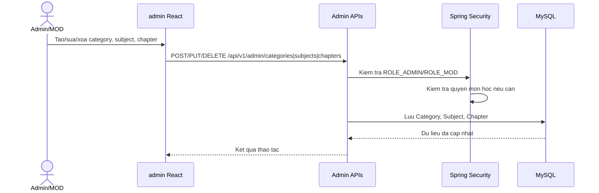

## 8. Luong import cau hoi tu Excel

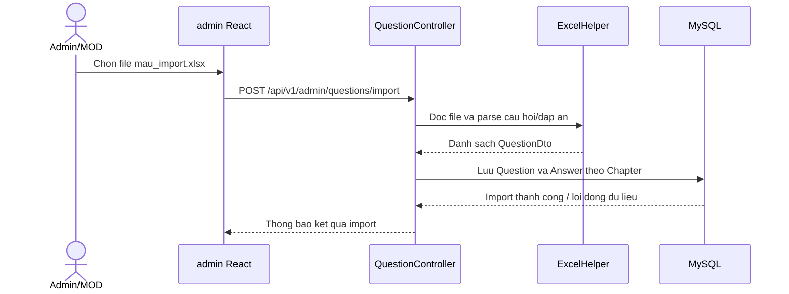

## 9. Luong on tap theo mon hoc va chuong

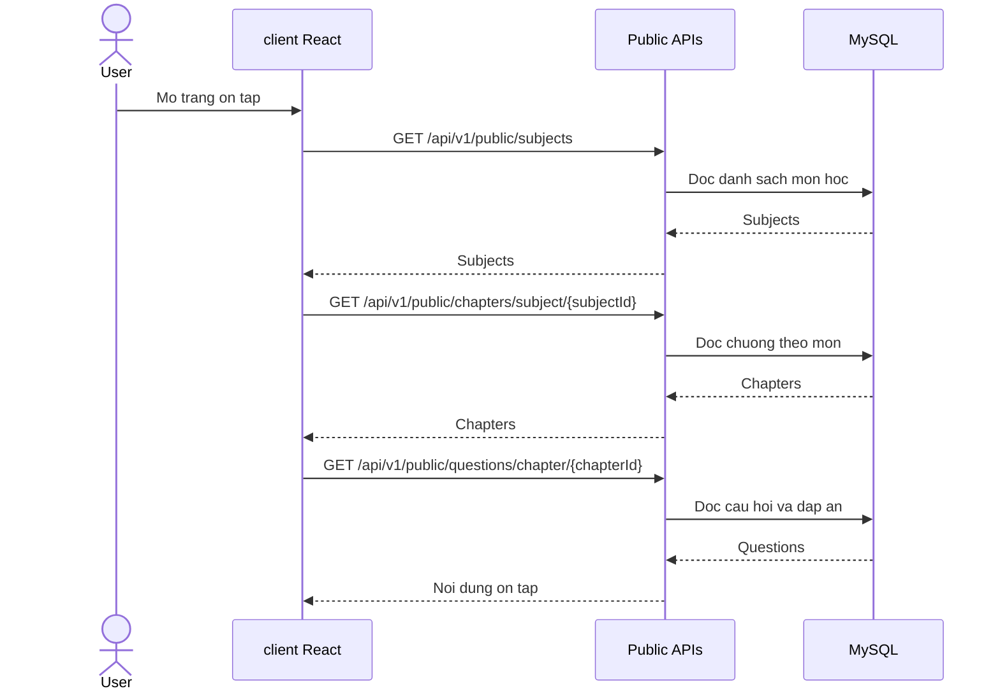

## 10. Luong yeu thich mon hoc

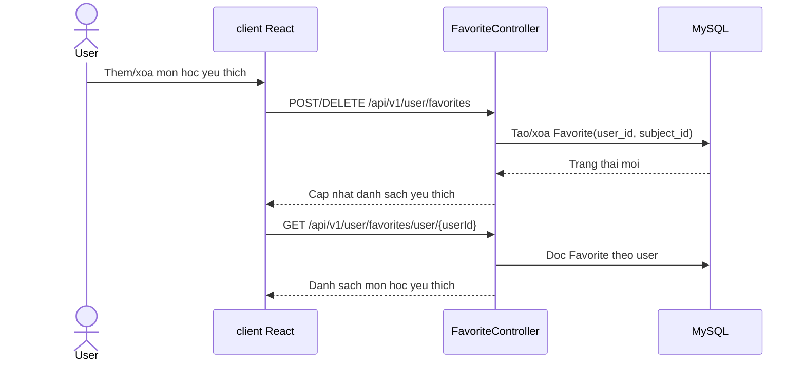

## 11. Luong thong bao

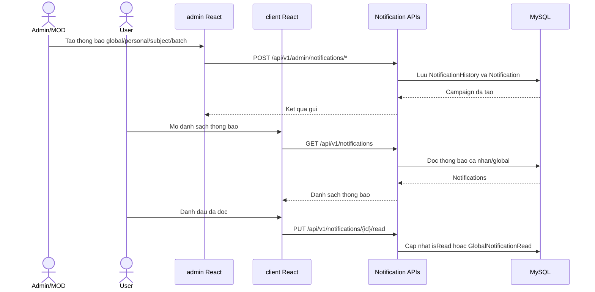

## 12. Luong quen mat khau bang OTP

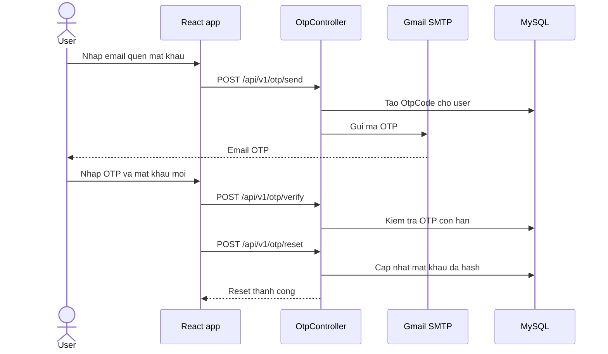

## 13. Luong dang nhap Google

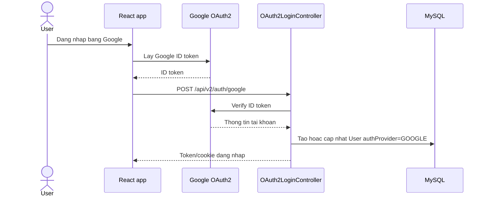

## 14. Luong cap nhat avatar

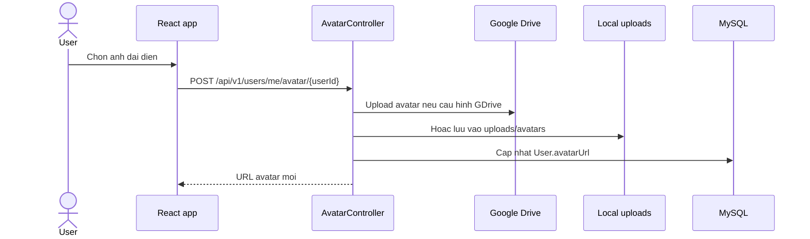

## 15. Luong thong ke admin

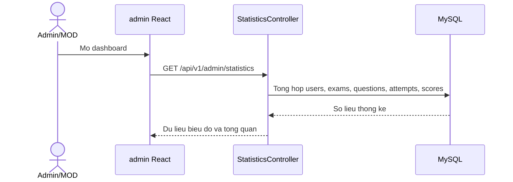

## 16. Luong gan quyen MOD theo mon hoc

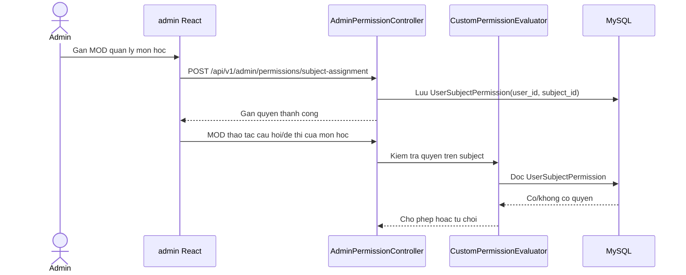
