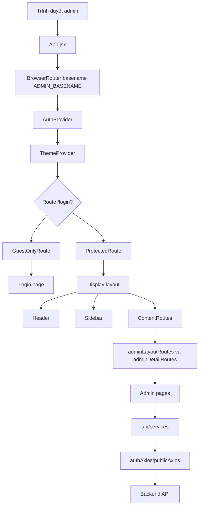
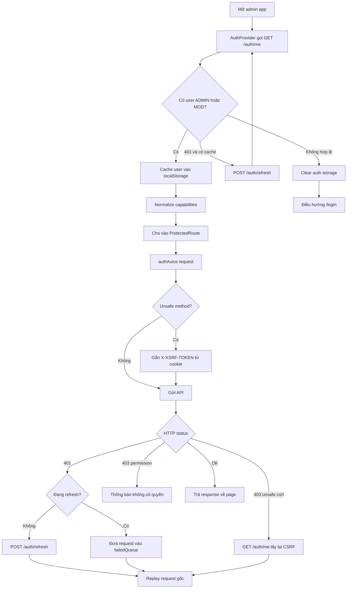
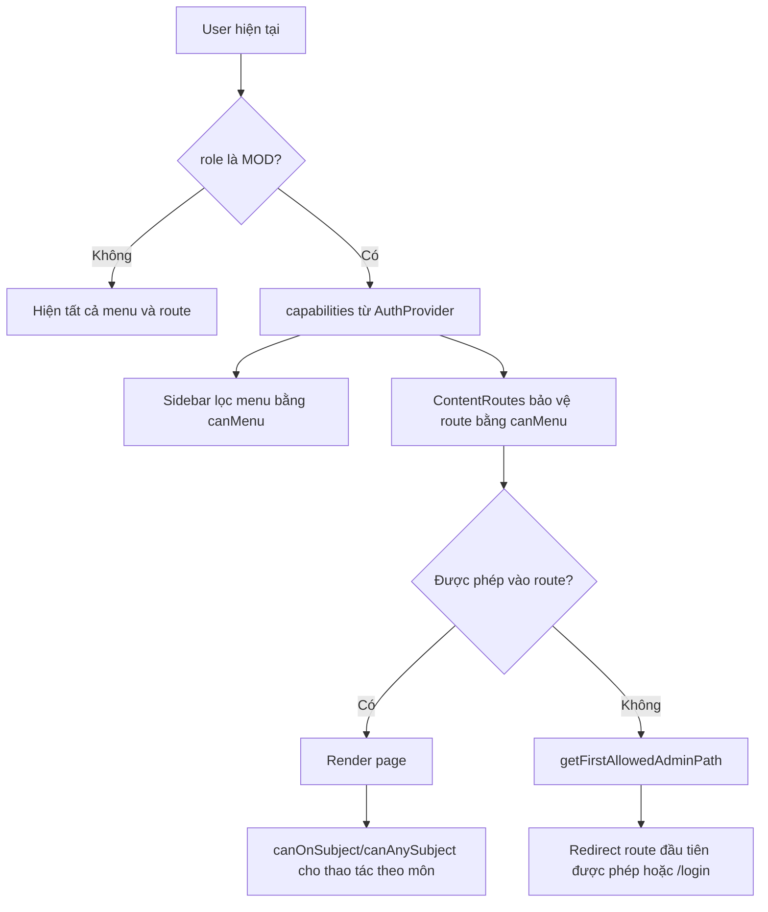
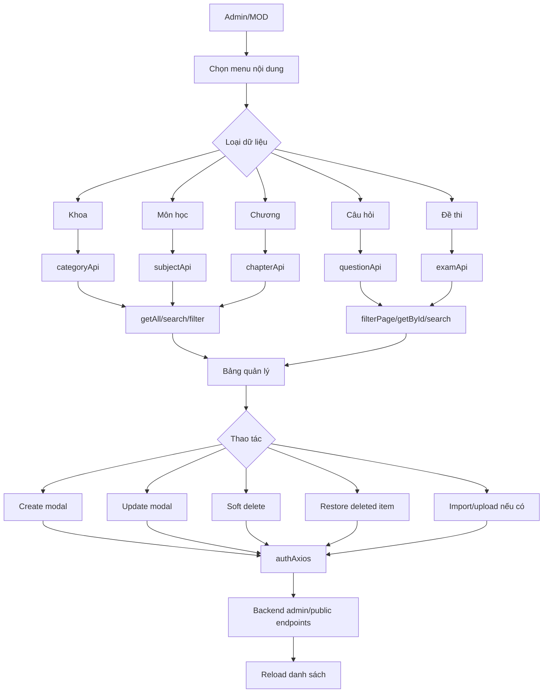

# VNUA Quiz Admin

Tài liệu này được tạo từ codebase-memory MCP sau khi index lại repository `quiz-admin`.

## Tổng quan

VNUA Quiz Admin là ứng dụng React/Vite dùng Ant Design để quản trị hệ thống quiz. Ứng dụng có các nhóm chức năng chính:

- Xác thực admin/mod, refresh session, CSRF và điều hướng theo quyền.
- Dashboard, thống kê, audit log và export dữ liệu.
- Quản lý người dùng và nhóm quyền.
- Quản lý nội dung học tập: khoa, môn học, chương, câu hỏi, đề thi.
- Quản lý bài thi của người dùng và chi tiết bài làm.
- Quản lý thông báo và danh sách người nhận.
- Quản lý tài liệu upload.

## Kiến trúc ứng dụng



## Luồng xác thực và phiên đăng nhập



## Luồng phân quyền MOD



## Route và chức năng

| Route | Page | Chức năng chính | API service |
| --- | --- | --- | --- |
| `/login` | `pages/Login` | Đăng nhập admin/mod | `publicAxios /auth/*` |
| `/` | `pages/Home` | Dashboard, thống kê, export nhanh | `adminOpsApi`, các API thống kê trong page |
| `/users` | `pages/User` | Danh sách, tìm/lọc, thêm, sửa nhóm quyền, xóa, restore user | `userApi`, `adminGroupApi`, `profileApi` |
| `/groups` | `pages/AdminGroups` | Quản lý nhóm quyền và permissions | `adminGroupApi` |
| `/exams` | `pages/Exam` | Quản lý đề thi, tạo đề, lọc, xóa, restore | `examApi` |
| `/categories` | `pages/Categories` | Quản lý khoa, tìm/lọc, thêm, sửa, xóa, restore | `categoryApi` |
| `/subjects` | `pages/Subject` | Quản lý môn học theo khoa, thêm, sửa, xóa, restore | `subjectApi`, `categoryApi` |
| `/chapters` | `pages/Chapter` | Quản lý chương theo môn, lọc, xóa, restore | `chapterApi`, `subjectApi`, `categoryApi` |
| `/questions` | `pages/Question` | Quản lý câu hỏi, Markdown/LaTeX, upload ảnh, import, xóa, restore | `questionApi`, `subjectApi`, `chapterApi` |
| `/userexams` | `pages/ExamUser` | Danh sách bài thi của người dùng, lọc và xem chi tiết | `userExamApi` |
| `/userexam/:userExamId` | `UserExamDetailPageView` | Chi tiết bài làm, câu hỏi và đáp án đúng | `fetchUserExamDetail`, `fetchExamQuestionsWithCorrectAnswers` |
| `/notifications` | `pages/Notification` | Tạo, lọc, thu hồi thông báo, xem người nhận | `notificationApi`, API trong page notification |
| `/documents` | `pages/Documents` | Upload, sửa metadata, xóa tài liệu | `documentApi` |
| `/audit-logs` | `pages/AuditLog` | Xem audit log mới nhất | `auditLogApi` |

## Flow CRUD nội dung học tập



## Flow người dùng và nhóm quyền

```mermaid
flowchart TD
  UsersPage[/users] --> UserApi[userApi]
  UsersPage --> Search[search/filter/getAll/getDeleted]
  Search --> UserTable[Bảng người dùng]
  UserTable --> AddUser[AddUserModal create]
  UserTable --> Disable[remove user]
  UserTable --> RestoreUser[restore user]
  UserTable --> EditGroups[Mở gán nhóm quyền]
  EditGroups --> AdminGroupApi[adminGroupApi]
  AdminGroupApi --> GetUserGroups[getUserGroups]
  AdminGroupApi --> AssignGroups[assignUserGroups]
  GroupsPage[/groups] --> GroupList[getAll groups]
  GroupList --> SaveGroup[save group]
  GroupList --> RemoveGroup[remove group]
  GroupList --> Permissions[getPermissions/savePermissions]
  Permissions --> Capabilities[capabilities dùng bởi AuthProvider]
```

## Flow bài thi người dùng

```mermaid
flowchart TD
  UserExamList[/userexams] --> Filter[Lọc/tìm bài thi]
  Filter --> Table[Bảng bài thi]
  Table --> DetailLink[/userexam/:userExamId]
  DetailLink --> FetchDetail[fetchUserExamDetail]
  FetchDetail --> ExamId[Lấy examId và thông tin bài làm]
  ExamId --> FetchQuestions[fetchExamQuestionsWithCorrectAnswers]
  FetchQuestions --> Compare[So sánh câu trả lời người dùng với đáp án đúng]
  Compare --> Render[Render chi tiết câu hỏi, đáp án, điểm]
```

## Flow thông báo

```mermaid
flowchart TD
  NotificationPage[/notifications] --> FetchCampaigns[Lấy danh sách/thống kê chiến dịch]
  FetchCampaigns --> Filter[Lọc theo trạng thái, loại, thời gian]
  Filter --> CampaignTable[Bảng thông báo]
  CampaignTable --> Create[CreateNotificationModal]
  CampaignTable --> Recall[Thu hồi thông báo]
  CampaignTable --> Recipients[Xem người nhận]
  Recipients --> FetchRecipients[fetchNotificationRecipients]
  FetchRecipients --> RecipientDetailModal[RecipientDetailModal]
```

## Flow tài liệu

```mermaid
flowchart TD
  DocumentsPage[/documents] --> Load[documentApi.getAll]
  Load --> Table[Bảng tài liệu]
  Table --> Upload[Upload file multipart/form-data]
  Table --> Update[Cập nhật metadata x-www-form-urlencoded]
  Table --> Delete[Xóa tài liệu]
  Upload --> Reload[Reload danh sách]
  Update --> Reload
  Delete --> Reload
```

## Flow export và audit

```mermaid
flowchart TD
  Dashboard[/] --> ExportChoice{Chọn export}
  ExportChoice --> UsersCsv[downloadUsers]
  ExportChoice --> ExamResultsCsv[downloadExamResults]
  ExportChoice --> QuestionsCsv[downloadQuestions]
  UsersCsv --> Blob[Download CSV blob]
  ExamResultsCsv --> Blob
  QuestionsCsv --> Blob
  AuditPage[/audit-logs] --> Latest[auditLogApi.getLatest]
  Latest --> AuditTable[Bảng audit log]
```

## API layer

Tất cả request quản trị đi qua `authAxios` trong `src/api/axiosConfig.js`, dùng chung:

- `ADMIN_API_URL` từ `src/config/env.js`.
- `withCredentials`, XSRF cookie/header.
- Retry CSRF cho unsafe method khi gặp 403.
- Refresh token bằng `/auth/refresh` khi gặp 401.
- Hàng đợi `failedQueue` để gom các request bị 401 trong lúc refresh.
- Redirect về `/login` khi refresh thất bại.

`publicAxios` được dùng cho các luồng public/session như `/auth/me`, `/auth/refresh`, `/auth/logout`.

## Ghi chú từ codebase-memory MCP

- Repository đã được index ở chế độ `full`.
- Graph ghi nhận các hotspot chính: `ManagementPageLayout`, `AuthProvider`, `ContentRoutes`, `categoryApi`, `subjectApi`, `chapterApi`, `questionApi`, `examApi`, `userApi`, `documentApi`, `adminGroupApi`.
- Một số node trong graph vẫn hiện đường dẫn `.js` cũ, trong khi code hiện tại dùng `.jsx`; README này ưu tiên file thực tế trên disk.
