# System graph Quiz VNUA

Tai lieu nay mo ta lien ket giua BE, FE, security, data va cac flow chinh theo code hien tai.

## 1. Deployment overview

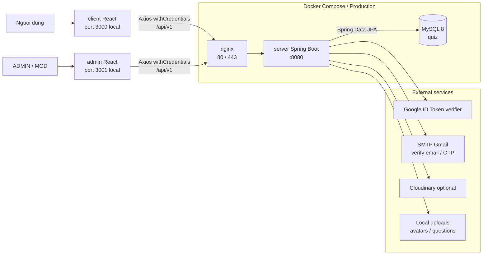

## 2. Frontend to backend map

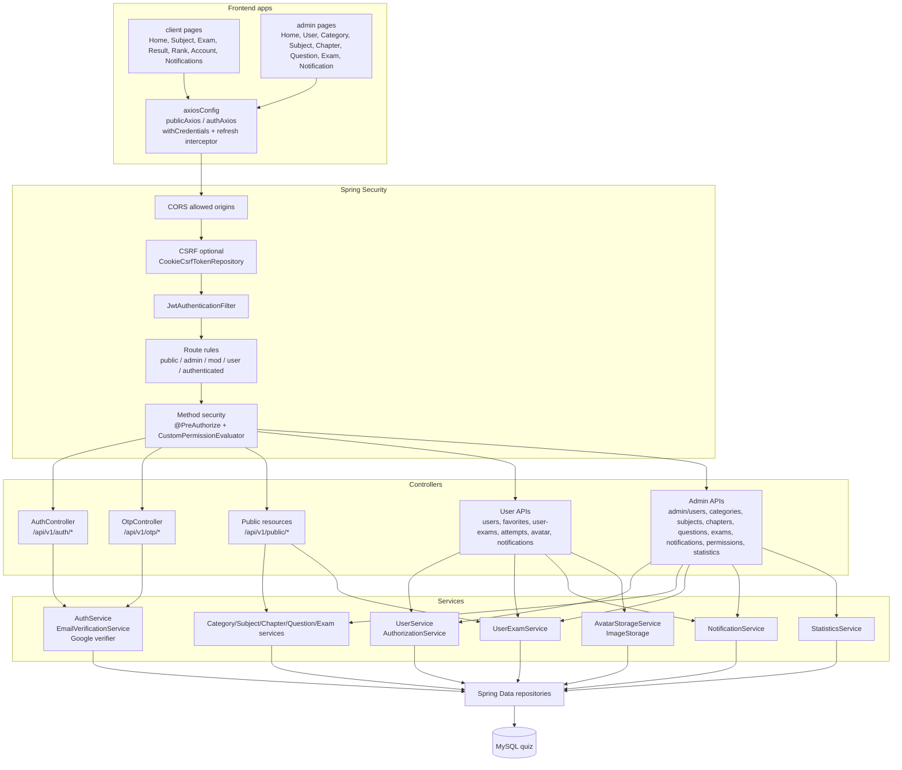

## 3. Security route graph

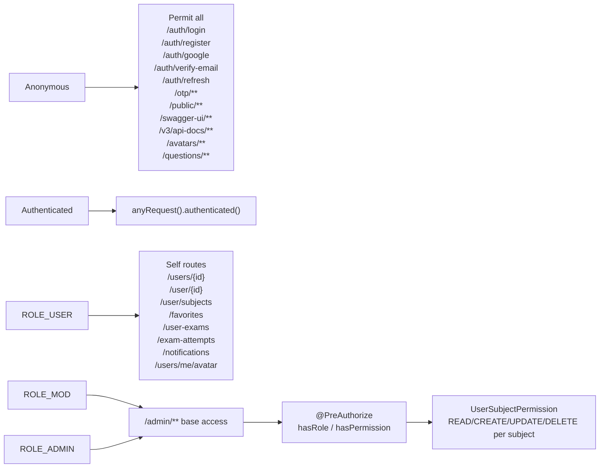

## 4. API group graph

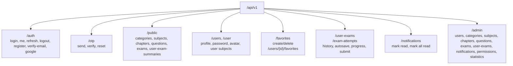

## 5. ERD rut gon

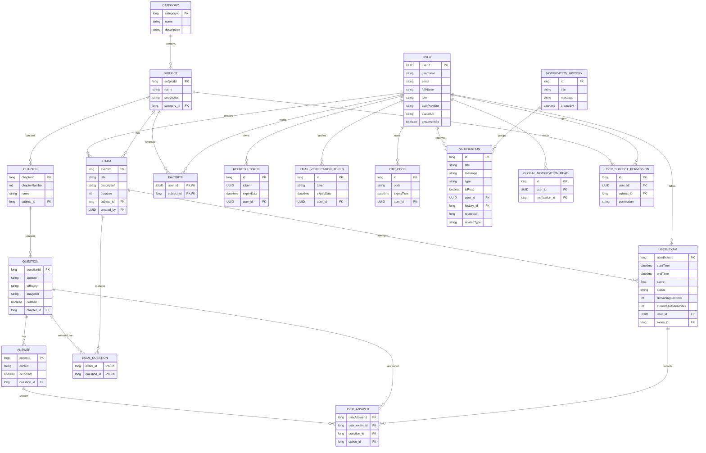

## 6. Login, cookie va refresh token

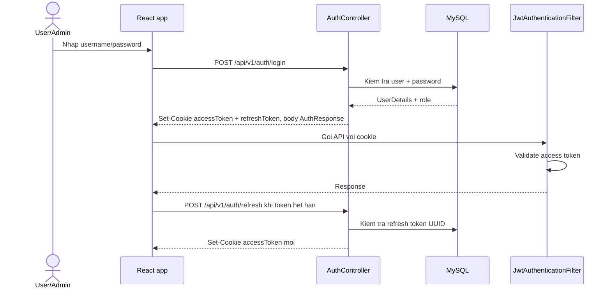

## 7. Register va verify email

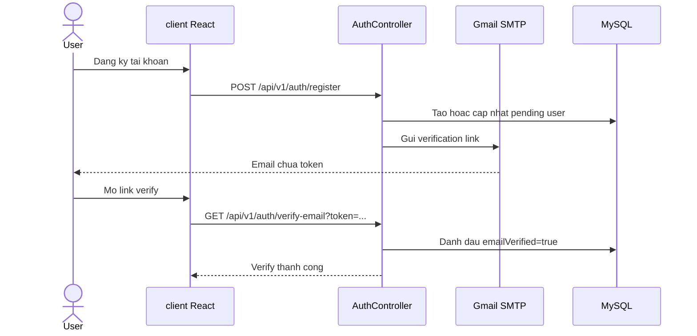

## 8. Google login

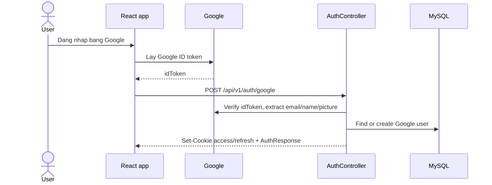

## 9. Quen mat khau bang OTP

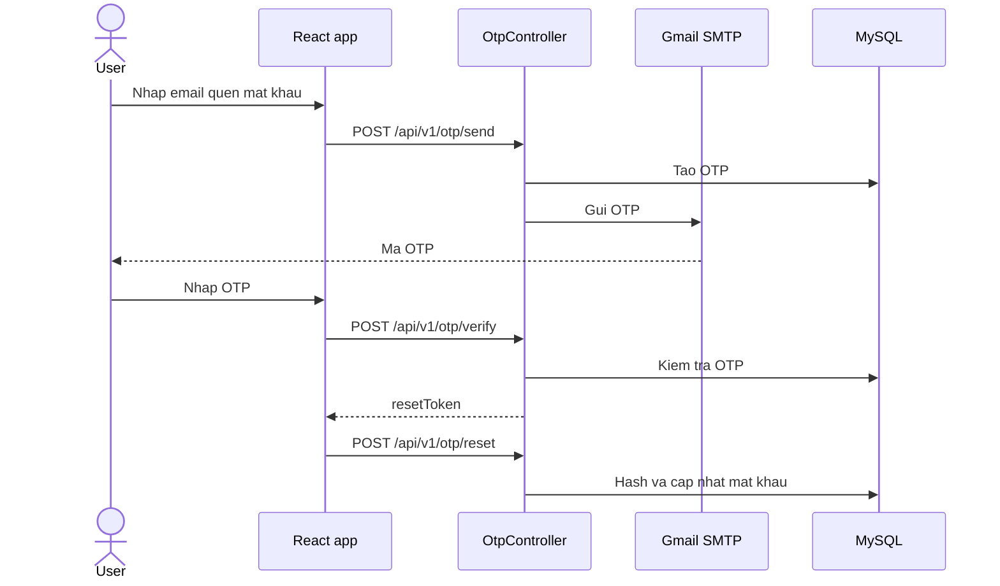

## 10. On tap theo subject/chapter

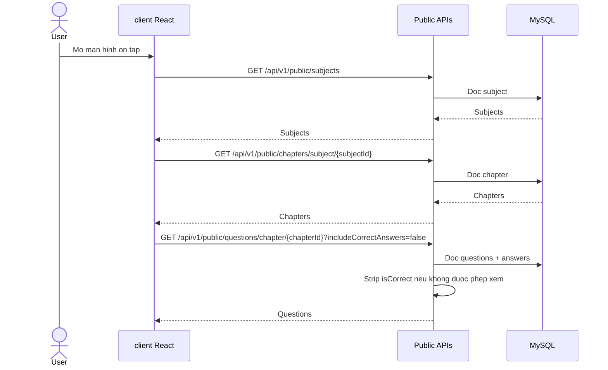

## 11. Lam bai thi va autosave

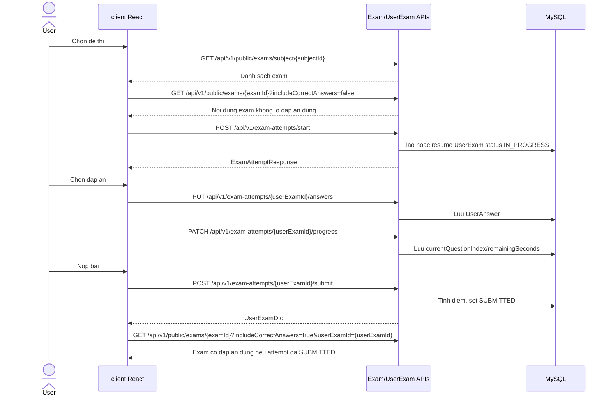

## 12. Quan tri noi dung quiz

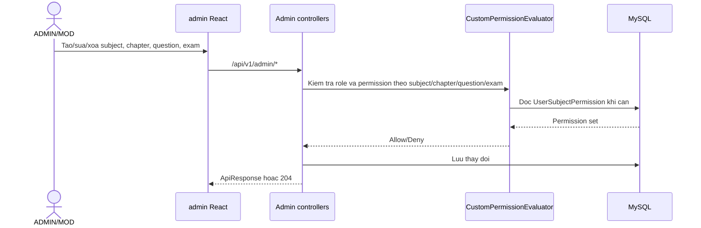

## 13. Import cau hoi tu Excel

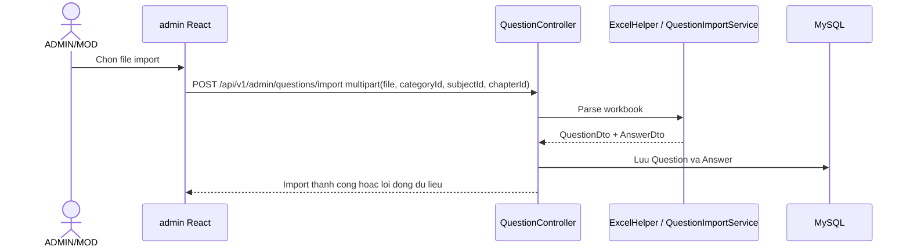

## 14. Favorite subject

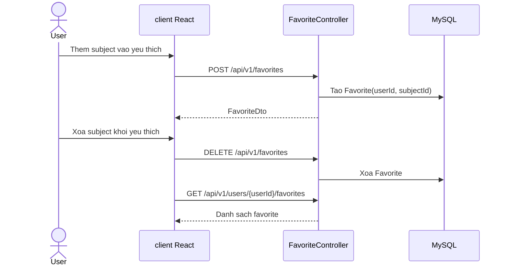

## 15. Notification

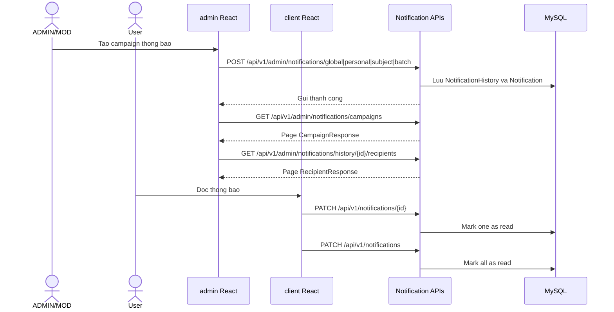

Note: code hien tai cua `NotificationController` chua expose endpoint lay danh sach notification cho user, chi co mark read va mark all read.

## 16. Avatar va anh cau hoi

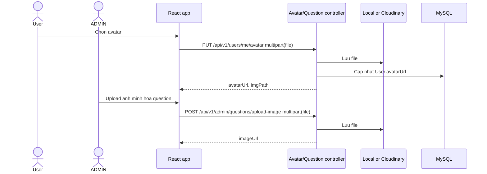

## 17. Gan quyen MOD theo subject

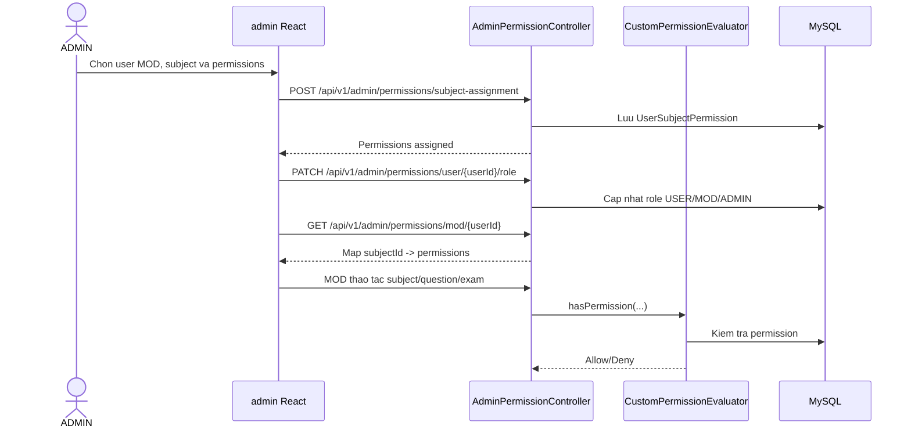
