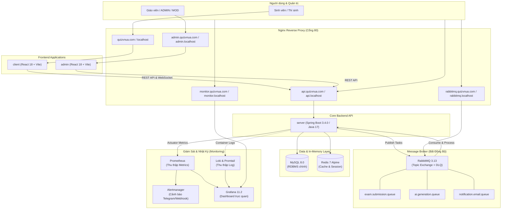

# Kiến Trúc Hệ Thống (System Architecture)

Quiz VNUA là nền tảng ôn tập và thi trắc nghiệm trực tuyến quy mô trường học, được xây dựng theo kiến trúc Micro-services/Monorepo phân tầng rõ ràng, bảo vệ bởi Reverse Proxy Nginx và hỗ trợ xử lý tải cao bất đồng bộ qua RabbitMQ.

---

## 1. Sơ Đồ Kiến Trúc Tổng Thể

---

## 2. Hệ Thống Domain & Định Tuyến (Routing)

Tất cả các dịch vụ đều chạy ngầm trong mạng nội bộ Docker và chỉ xuất bản duy nhất qua **Nginx Reverse Proxy** tại cổng **80** (hoặc 443 khi lên production):

| Domain Local | Domain Production | Service Đích | Mục Đích |
| :--- | :--- | :--- | :--- |
| `http://localhost` | `https://quizvnua.com` | `client:3000` | Trang thi và ôn tập cho sinh viên |
| `http://admin.localhost` | `https://admin.quizvnua.com` | `admin:3001` | Trang quản trị hệ thống, nội dung thi |
| `http://api.localhost` | `https://api.quizvnua.com` | `backend:8080` | REST API Spring Boot |
| `http://monitor.localhost` | `https://monitor.quizvnua.com` | `grafana:3000` | Bảng điều khiển giám sát Grafana |
| `http://rabbitmq.localhost` | `https://rabbitmq.quizvnua.com` | `rabbitmq:15672` | Bảng quản lý hàng đợi RabbitMQ |

---

## 3. Cơ Chế Xử Lý Tải Bất Đồng Bộ (RabbitMQ)

Hệ thống sử dụng Topic Exchange `quiz.exchange` kết hợp Dead Letter Exchange `quiz.dlx`:

1. **Nộp bài thi số lượng lớn (`exam.submission.queue`):**
   - API trả về `202 Accepted` cho thí sinh trong 50ms.
   - Workers nhặt bài từ Queue để chấm điểm và lưu kết quả vào MySQL.
   - Bật Manual ACK: Chỉ xóa message khi đã ghi DB thành công; nếu lỗi sẽ chuyển sang Dead Letter Queue, bảo đảm không bao giờ mất bài thi.

2. **Tác vụ AI sinh câu hỏi (`ai.generation.queue`):**
   - Xử lý đọc file PDF/DOCX/TXT và gọi LLM (Gemini / OpenAI) trong background.
   - Giới hạn `prefetch = 1` để kiểm soát tốc độ gọi AI, tránh lỗi 429 Quota Exceeded.

3. **Gửi email thông báo (`notification.email.queue`):**
   - Tách biệt hoàn toàn việc gửi mail SMTP ra khỏi luồng chính, tránh làm chậm các request của người dùng.
