# Biểu Đồ Hoạt Động Các Tính Năng Hệ Thống (Activity Diagrams)

Tài liệu này cung cấp các **Biểu đồ hoạt động (UML Activity Diagrams)** mô tả chi tiết luồng điều khiển, các bước xử lý nghiệp vụ, điểm rẽ nhánh quyết định (decision diamonds), xử lý song song và tương tác giữa các thành phần trong hệ thống **Quiz VNUA**.

---

## Mục Lục
1. [Quy Ước Ký Hiệu Biểu Đồ](#quy-ước-ký-hiệu-biểu-đồ)
2. [1. Luồng Đăng Ký Tài Khoản & Kích Hoạt Email](#1-luồng-đăng-ký-tài-khoản--kích-hoạt-email)
3. [2. Luồng Xác Thực Đăng Nhập & Tự Động Refresh Token Ngầm](#2-luồng-xác-thực-đăng-nhập--tự-động-refresh-token-ngầm)
4. [3. Luồng Quên Mật Khẩu & Khôi Phục Qua Mã OTP](#3-luồng-quên-mật-khẩu--khôi-phục-qua-mã-otp)
5. [4. Luồng Quản Lý Ngân Hàng Câu Hỏi & Import Excel Hàng Loạt](#4-luồng-quản-lý-ngân-hàng-câu-hỏi--import-excel-hàng-loạt)
6. [5. Luồng Tạo & Cấu Hình Đề Thi (Thủ Công & Ma Trận Ngẫu Nhiên)](#5-luồng-tạo--cấu-hình-đề-thi-thủ-công--ma-trận-ngẫu-nhiên)
7. [6. Luồng Làm Bài Thi, Tự Động Lưu (Autosave) & Nộp Bài Tải Cao Bất Đồng Bộ](#6-luồng-làm-bài-thi-tự-động-lưu-autosave--nộp-bài-tải-cao-bất-đồng-bộ)
8. [7. Luồng Trợ Lý AI: Sinh Câu Hỏi Trắc Nghiệm Từ Tài Liệu](#7-luồng-trợ-lý-ai-sinh-câu-hỏi-trắc-nghiệm-từ-tài-liệu)
9. [8. Luồng Chiến Dịch Thông Báo & Phân Phối Realtime Qua WebSocket](#8-luồng-chiến-dịch-thông-báo--phân-phối-realtime-qua-websocket)
10. [9. Luồng Giám Sát Hạ Tầng & Tự Động Bắn Cảnh Báo Telegram](#9-luồng-giám-sát-hạ-tầng--tự-động-bắn-cảnh-báo-telegram)
11. [10. Luồng Luyện Tập Theo Chương & Ôn Tập Thông Minh Câu Hay Sai](#10-luồng-luyện-tập-theo-chương--ôn-tập-thông-minh-câu-hay-sai)
12. [11. Biểu Đồ Trạng Thái Vòng Đời Bài Thi (State Machine Diagram)](#11-biểu-đồ-trạng-thái-vòng-đời-bài-thi-state-machine-diagram)
13. [12. Luồng Trợ Lý AI: Sinh Lộ Trình Học Tập Cá Nhân Hóa](#12-luồng-trợ-lý-ai-sinh-lộ-trình-học-tập-cá-nhân-hóa)
14. [13. Luồng Tính Toán & Đệm Bảng Xếp Hạng Thí Sinh](#13-luồng-tính-toán--đệm-bảng-xếp-hạng-thí-sinh)
15. [14. Luồng Quản Lý & Tải Xuống Tài Liệu Học Tập An Toàn](#14-luồng-quản-lý--tải-xuống-tài-liệu-học-tập-an-toàn)
16. [15. Luồng Phân Quyền Quản Trị Ma Trận & Ghi Nhận Kiểm Toán](#15-luồng-phân-quyền-quản-trị-ma-trận--ghi-nhận-kiểm-toán)
17. [16. Luồng Cập Nhật Hồ Sơ & Thay Đổi Ảnh Đại Diện](#16-luồng-cập-nhật-hồ-sơ--thay-đổi-ảnh-đại-diện)
18. [17. Luồng Báo Cáo Thống Kê & Xuất Dữ Liệu CSV Hàng Loạt](#17-luồng-báo-cáo-thống-kê--xuất-dữ-liệu-csv-hàng-loạt)
19. [18. Luồng Xóa Mềm & Khôi Phục Dữ Liệu](#18-luồng-xóa-mềm--khôi-phục-dữ-liệu)
20. [19. Luồng Đánh Dấu & Quản Lý Môn Học Yêu Thích](#19-luồng-đánh-dấu--quản-lý-môn-học-yêu-thích)
21. [20. Luồng Quản Lý Người Dùng & Khóa/Mở Khóa Tài Khoản](#20-luồng-quản-lý-người-dùng--khóamở-khóa-tài-khoản)
22. [21. Luồng Xử Lý Lỗi Tải Cao & Chống Mất Mát Bài Thi Qua Dead Letter Queue](#21-luồng-xử-lý-lỗi-tải-cao--chống-mất-mát-bài-thi-qua-dead-letter-queue)
23. [22. Luồng Gửi Email Bảng Điểm Tự Động Sau Khi Chấm Thi](#22-luồng-gửi-email-bảng-điểm-tự-động-sau-khi-chấm-thi)

---

## Quy Ước Ký Hiệu Biểu Đồ

Mỗi biểu đồ hoạt động tuân theo chuẩn UML Activity Diagram, phân chia thành các làn trách nhiệm (Swimlanes):
- **Client (Frontend):** Ứng dụng web React cho Sinh viên (`client/`) hoặc Quản trị viên (`admin/`).
- **Backend API Server:** Dịch vụ Spring Boot 3.4.0 (`server/`).
- **Storage / Broker:** Cơ sở dữ liệu MySQL, Bộ đệm Redis, và Hàng đợi thông điệp RabbitMQ.
- **External Services / Background Workers:** Các dịch vụ bên ngoài (Google Gemini API, Mail Server SMTP, Telegram Bot API) và các Background Worker Consumer.

Ký hiệu hình học:
- `((Bắt đầu))`: Điểm khởi đầu (Initial Node).
- `[...]`: Hành động hoặc tác vụ xử lý (Action State).
- `{"... ?"}`: Điểm rẽ nhánh điều kiện quyết định (Decision Node).
- `(((Kết thúc)))`: Điểm kết thúc luồng (Final/End Node).

---

## 1. Luồng Đăng Ký Tài Khoản & Kích Hoạt Email

Mô tả quá trình người dùng đăng ký tài khoản mới và xác thực quyền sở hữu hộp thư điện tử thông qua đường dẫn kích hoạt bảo mật.

Controller xử lý: [`AuthController.java`](../../server/src/main/java/com/fita/vnua/quiz/controller/AuthController.java) (`POST /api/v1/auth/register` và `GET /api/v1/auth/verify-email`).

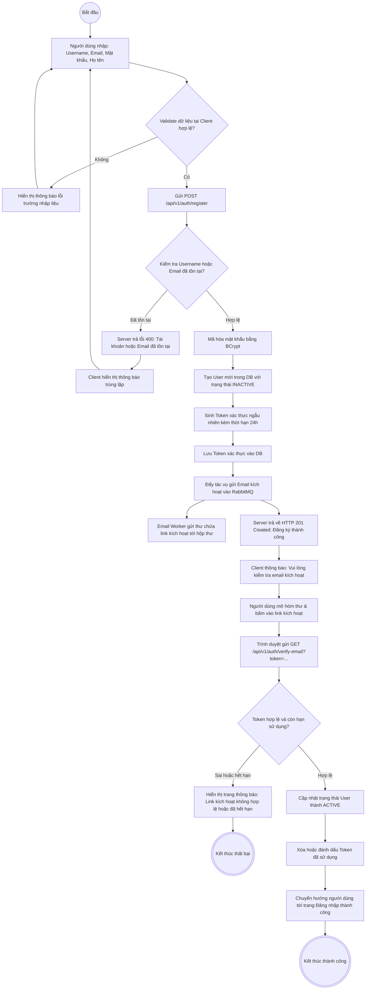

---

## 2. Luồng Xác Thực Đăng Nhập & Tự Động Refresh Token Ngầm

Hệ thống hỗ trợ 2 hình thức đăng nhập: Mật khẩu truyền thống và Google OAuth (One-Tap). Cơ chế bảo mật lưu `accessToken` (15 phút) và `refreshToken` (7 ngày) trong `HttpOnly Cookie`. Khi token hết hạn, Axios Interceptor tự động xin cấp mới mà không làm gián đoạn trải nghiệm người dùng.

Controller xử lý: [`AuthController.java`](../../server/src/main/java/com/fita/vnua/quiz/controller/AuthController.java) (`POST /login`, `POST /google`, `POST /refresh`, `POST /logout`).

```mermaid
flowchart TD
    StartNode((Bắt đầu)) --> ChooseMethod{"Người dùng chọn hình thức đăng nhập nào?"}
    
    %% Nhánh đăng nhập thường
    ChooseMethod -- Mật khẩu thường --> InputCredentials[Nhập Username/Email và Mật khẩu]
    InputCredentials --> PostLogin[Gửi POST /api/v1/auth/login]
    PostLogin --> QueryUser[Truy vấn User trong MySQL theo Username/Email]
    QueryUser --> UserExists{"User có tồn tại trong hệ thống?"}
    UserExists -- Không --> LoginFail401[Ghi Audit Log & Trả về HTTP 401: Sai thông tin đăng nhập]
    
    UserExists -- Có --> CheckActive{"Tài khoản có đang ACTIVE?"}
    CheckActive -- Bị khóa / Chưa kích hoạt --> ReturnDisabled[Trả về HTTP 403: Tài khoản đã bị vô hiệu hóa]
    ReturnDisabled --> ShowError[Client hiển thị thông báo lỗi]
    LoginFail401 --> ShowError
    ShowError --> InputCredentials
    
    CheckActive -- ACTIVE --> VerifyBCrypt{"Khớp mật khẩu BCrypt?"}
    VerifyBCrypt -- Không khớp --> LoginFail401
    
    %% Nhánh đăng nhập Google
    ChooseMethod -- Google OAuth --> GoogleBtn[Bấm đăng nhập bằng tài khoản Google]
    GoogleBtn --> RecvIdToken[Nhận Google ID Token từ Google OAuth Client]
    RecvIdToken --> PostGoogle[Gửi POST /api/v1/auth/google]
    PostGoogle --> VerifyGoogleToken{"Xác minh Google Token với Google API?"}
    VerifyGoogleToken -- Không hợp lệ --> LoginFail401
    VerifyGoogleToken -- Hợp lệ --> FindOrCreateGoogle[Tìm User theo email hoặc Tự động tạo User mới]
    
    %% Cấp phát Token
    VerifyBCrypt -- Khớp --> GenTokens[Sinh Access Token 15 phút & Refresh Token UUID 7 ngày]
    FindOrCreateGoogle --> GenTokens
    
    GenTokens --> SaveRefreshToken[Lưu RefreshToken vào MySQL Database]
    SaveRefreshToken --> SetCookies[Đính kèm Set-Cookie HttpOnly accessToken và refreshToken]
    SetCookies --> RecordAudit[Ghi nhận nhật ký đăng nhập thành công vào Audit Log]
    RecordAudit --> ReturnAuthSuccess[Server trả về HTTP 200 kèm thông tin User Profile]
    ReturnAuthSuccess --> RedirectDashboard[Client lưu thông tin User và chuyển hướng vào Dashboard]
    
    %% Tiến trình Silent Refresh
    RedirectDashboard --> UserAction[Người dùng thực hiện thao tác gọi API cần quyền]
    UserAction --> ApiCall[Client gửi request kèm Cookie tới Backend]
    ApiCall --> CheckAccessExpired{"Access Token trong Cookie còn hạn không?"}
    
    CheckAccessExpired -- Còn hạn --> ExecApi[Backend xử lý request bình thường và trả về kết quả]
    ExecApi --> EndDone(((Hoàn thành tác vụ)))
    
    CheckAccessExpired -- Hết hạn --> Return401[Backend trả về mã lỗi HTTP 401 Unauthorized]
    Return401 --> InterceptorCatch[Axios Response Interceptor phát hiện lỗi 401]
    InterceptorCatch --> SilentRefresh[Interceptor tạm dừng queue và gửi POST /api/v1/auth/refresh]
    SilentRefresh --> CheckRefreshValid{"RefreshToken trong Cookie có hợp lệ và còn hạn trong DB?"}
    
    CheckRefreshValid -- Hết hạn hoặc thu hồi --> ForceLogout[Xóa sạch Cookie, yêu cầu người dùng đăng nhập lại]
    ForceLogout --> EndForceLogin(((Quay lại màn hình đăng nhập)))
    
    CheckRefreshValid -- Hợp lệ --> GenNewAccess[Sinh Access Token mới và cấp lại Set-Cookie]
    GenNewAccess --> RetryRequest[Interceptor tự động gửi lại request API ban đầu]
    RetryRequest --> ExecApi
```

---

## 3. Luồng Quên Mật Khẩu & Khôi Phục Qua Mã OTP

Quy trình cấp lại mật khẩu an toàn thông qua mã xác thực 6 số (OTP) có thời hạn giới hạn (5 phút) gửi về hòm thư người dùng.

Controller xử lý: [`OtpController.java`](../../server/src/main/java/com/fita/vnua/quiz/controller/OtpController.java) và [`AuthController.java`](../../server/src/main/java/com/fita/vnua/quiz/controller/AuthController.java).

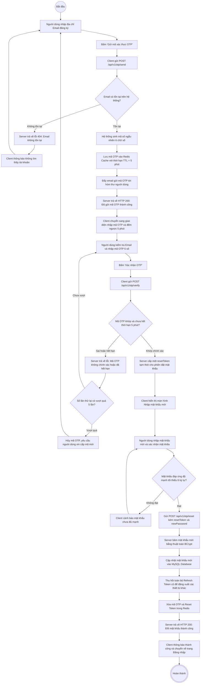

---

## 4. Luồng Quản Lý Ngân Hàng Câu Hỏi & Import Excel Hàng Loạt

Quản lý cây danh mục (Khối ngành -> Môn học -> Chương) và hỗ trợ tải danh sách câu hỏi hàng loạt bằng file Excel có xem trước lỗi (Preview).

Controller xử lý: [`QuestionController.java`](../../server/src/main/java/com/fita/vnua/quiz/controller/QuestionController.java) (`POST /api/v1/admin/questions/import/preview` và `POST /api/v1/admin/questions/import`).

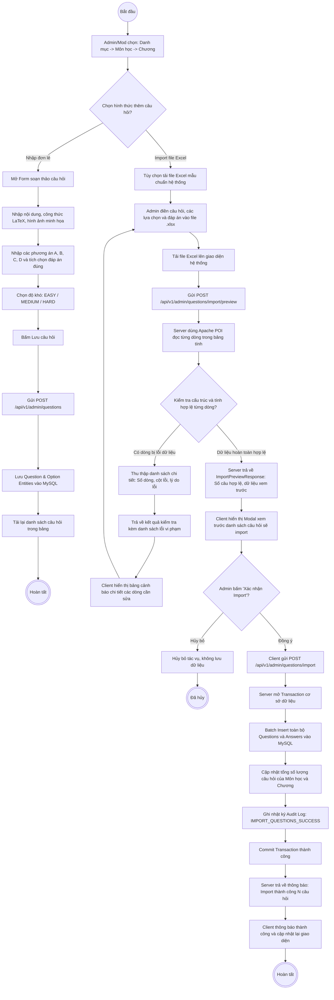

---

## 5. Luồng Tạo & Cấu Hình Đề Thi (Thủ Công & Ma Trận Ngẫu Nhiên)

Cho phép giáo viên tạo đề thi theo 2 hình thức: Cố định (chọn câu hỏi cụ thể) hoặc Sinh tự động theo Ma trận độ khó (Dễ / Trung bình / Khó) theo từng chương.

Controller xử lý: [`ExamController.java`](../../server/src/main/java/com/fita/vnua/quiz/controller/ExamController.java) (`POST /api/v1/admin/exams`).

```mermaid
flowchart TD
    StartNode((Bắt đầu)) --> OpenCreateExam[Admin mở màn hình 'Tạo đề thi mới']
    OpenCreateExam --> InputMeta[Nhập thông tin cơ bản: Tiêu đề, Môn học, Mô tả]
    InputMeta --> SetRules[Cấu hình quy chế: Thời gian làm bài phút, Điểm đạt, Số lần thi tối đa]
    SetRules --> SetShuffle[Tùy chọn: Xáo trộn thứ tự câu hỏi và Xáo trộn đáp án]
    SetShuffle --> SetExamMode{"Chọn phương thức thiết lập câu hỏi cho đề thi?"}
    
    %% Phương thức chọn thủ công
    SetExamMode -- Chọn thủ công từng câu --> FilterQuestions[Lọc câu hỏi trong ngân hàng theo Chương và Độ khó]
    FilterQuestions --> SelectManual[Tích chọn các câu hỏi cụ thể đưa vào danh sách đề thi]
    SelectManual --> ReviewCount[Kiểm tra tổng số câu hỏi đã chọn]
    
    %% Phương thức ma trận tự động
    SetExamMode -- Sinh theo ma trận tự động --> DefineMatrix[Thiết lập ma trận: Chọn các Chương cần thi]
    DefineMatrix --> InputRatios[Cấu hình số câu cho từng mức: Dễ, Trung bình, Khó cho mỗi Chương]
    InputRatios --> ClickGenerate[Bấm 'Thử nghiệm sinh đề ngẫu nhiên']
    ClickGenerate --> QueryAvailable[Server truy vấn số lượng câu hỏi hiện có trong DB theo điều kiện]
    QueryAvailable --> CheckEnough{"Ngân hàng câu hỏi có đủ số lượng theo cấu hình?"}
    
    CheckEnough -- Không đủ câu hỏi --> ShowShortageErr[Báo lỗi: Thiếu câu hỏi ở Chương X mức độ Y]
    ShowShortageErr --> InputRatios
    
    CheckEnough -- Đủ số lượng --> AutoSample[Thuật toán ngẫu nhiên bốc danh sách câu hỏi phù hợp]
    AutoSample --> PreviewExam[Hiển thị danh sách câu hỏi được chọn tự động để Admin duyệt]
    PreviewExam --> AdminApprove{"Admin duyệt danh sách vừa sinh?"}
    AdminApprove -- Muốn sinh lại --> ClickGenerate
    AdminApprove -- Chấp thuận --> ReviewCount
    
    ReviewCount --> ChooseStatus{"Lựa chọn trạng thái đề thi?"}
    ChooseStatus -- Lưu nháp --> SetDraft[Đặt trạng thái DRAFT]
    ChooseStatus -- Xuất bản ngay --> SetPublish[Đặt trạng thái PUBLISHED để thí sinh có thể nhìn thấy]
    
    SetDraft --> SendCreateExamApi[Client gửi POST /api/v1/admin/exams]
    SetPublish --> SendCreateExamApi
    
    SendCreateExamApi --> SaveExamDB[Server lưu bản ghi Exam và ExamQuestion mapping vào MySQL]
    SaveExamDB --> RecordExamAudit[Ghi Audit Log: CREATE_EXAM]
    RecordExamAudit --> ExportPdfOpt{"Có xuất file PDF đề thi để in ấn không?"}
    
    ExportPdfOpt -- Có --> TriggerJsPdf[Frontend gọi jsPDF & html2canvas render đề thi ra file .pdf]
    TriggerJsPdf --> DownloadPdfFile[Tải file đề thi PDF về máy tính]
    DownloadPdfFile --> EndSuccess(((Hoàn thành)))
    
    ExportPdfOpt -- Không --> EndSuccess
```

---

## 6. Luồng Làm Bài Thi, Tự Động Lưu (Autosave) & Nộp Bài Tải Cao Bất Đồng Bộ

Luồng xử lý trọng yếu nhất của hệ thống Quiz VNUA: Hỗ trợ hàng nghìn thí sinh làm bài đồng thời, tự động lưu câu trả lời vào Redis để chống mất dữ liệu khi rớt mạng, và nộp bài bất đồng bộ qua RabbitMQ để triệt tiêu nguy cơ nghẽn cơ sở dữ liệu MySQL vào phút cuối ca thi.

Controller & Consumer xử lý:
- [`UserExamController.java`](../../server/src/main/java/com/fita/vnua/quiz/controller/UserExamController.java)
- [`RabbitMqConfig.java`](../../server/src/main/java/com/fita/vnua/quiz/config/RabbitMqConfig.java)
- [`ExamSubmissionConsumer.java`](../../server/src/main/java/com/fita/vnua/quiz/queue/consumer/ExamSubmissionConsumer.java)

```mermaid
flowchart TD
    StartNode((Bắt đầu)) --> StudentSelectExam[Sinh viên chọn Đề thi và bấm 'Bắt đầu làm bài']
    StudentSelectExam --> StartApi[Client gửi POST /api/v1/exam-attempts/start]
    StartApi --> CheckEligibility{"Kiểm tra điều kiện: Đúng giờ thi, chưa vượt số lần cho phép?"}
    
    CheckEligibility -- Không hợp lệ --> ReturnRefuse[Server từ chối: Báo lý do không đủ điều kiện làm bài]
    ReturnRefuse --> EndRefuse(((Dừng tác vụ)))
    
    CheckEligibility -- Hợp lệ --> CreateUserExam[Tạo UserExam mới trạng thái IN_PROGRESS trong MySQL]
    CreateUserExam --> SnapshotQuestions[Sao lưu Snapshot đề thi vào UserExamQuestion để cố định câu hỏi]
    SnapshotQuestions --> InitRedisSession[Khởi tạo phiên làm bài trong Redis Cache với TTL theo thời gian thi]
    InitRedisSession --> ReturnExamContent[Server trả về danh sách câu hỏi & thời gian làm bài]
    ReturnExamContent --> ClientRenderExam[Client hiển thị giao diện làm bài và kích hoạt đồng hồ đếm ngược]
    
    %% Vòng lặp làm bài & Autosave
    ClientRenderExam --> DoExamLoop[Sinh viên đọc câu hỏi và chọn đáp án]
    DoExamLoop --> AnswerClick[Sinh viên click chọn một đáp án]
    AnswerClick --> TriggerAutosave[Client ngầm gửi PUT /api/v1/exam-attempts/userExamId/answers]
    TriggerAutosave --> SaveToRedis[Backend ghi nhận câu trả lời vào Redis Cache không lock MySQL]
    SaveToRedis --> MarkSavedState[Client hiển thị icon: Đã lưu đám mây]
    MarkSavedState --> CheckFinishCond{"Đã hết giờ thi HOẶC sinh viên bấm Nộp bài?"}
    
    CheckFinishCond -- Chưa hết giờ & tiếp tục làm --> DoExamLoop
    
    %% Nộp bài thi
    CheckFinishCond -- Nộp bài hoặc hết giờ --> ConfirmSubmit[Xác nhận nộp bài thi]
    ConfirmSubmit --> SubmitApi[Client gửi POST /api/v1/exam-attempts/userExamId/submit]
    SubmitApi --> CheckState{"Kiểm tra trạng thái bài thi có đang IN_PROGRESS?"}
    CheckState -- Đã nộp trước đó --> ReturnDuplicateSubmit[Báo lỗi: Bài thi này đã được nộp]
    ReturnDuplicateSubmit --> EndDup(((Dừng)))
    
    CheckState -- Hợp lệ --> PackMessage[Đóng gói thông điệp ExamSubmissionMessage gồm userExamId, userId]
    PackMessage --> PushRabbitMQ[Đẩy message vào RabbitMQ Queue: exam.submission.queue]
    PushRabbitMQ --> Return202Accepted[Server trả về HTTP 202 Accepted: Đã nhận bài, hệ thống đang chấm điểm]
    Return202Accepted --> ShowGradingWaiting[Client hiển thị màn hình: Bài thi đã nộp thành công, đang xử lý chấm...]
    
    %% Xử lý chấm điểm bất đồng bộ (Worker Consumer)
    PushRabbitMQ -.-> WorkerListen[ExamSubmissionConsumer rút message từ hàng đợi]
    WorkerListen --> LoadStudentAnswers[Worker đọc toàn bộ đáp án của thí sinh đã lưu trong Redis Cache]
    WorkerListen --> LoadCorrectAnswers[Worker đọc Bareme đáp án chuẩn của đề thi từ MySQL]
    LoadStudentAnswers --> CompareLogic[Thuật toán so khớp đáp án, đếm số câu đúng, tính điểm trên thang 100]
    LoadCorrectAnswers --> CompareLogic
    CompareLogic --> SaveResultDB[Cập nhật UserExam: Status = SUBMITTED, Score, EndTime, CorrectCount]
    SaveResultDB --> EvictCache[Xóa bộ đệm phiên làm bài trong Redis và evict cache ranking]
    EvictCache --> PushEmailQueue[Đẩy tác vụ vào RabbitMQ: notification.email.queue]
    PushEmailQueue --> WorkerAck[Gửi tín hiệu Manual ACK xác nhận hoàn tất tới RabbitMQ]
    
    %% Nhận kết quả
    ShowGradingWaiting --> PollingResult[Client gọi GET /api/v1/user-exams/userExamId]
    PollingResult --> IsGraded{"Bài thi đã được Worker chấm xong?"}
    IsGraded -- Đang chờ --> WaitInterval[Chờ 1 giây] --> PollingResult
    IsGraded -- Đã hoàn tất --> DisplayScoreBoard[Client hiển thị bảng điểm, phân tích câu đúng/sai & lời giải chi tiết]
    DisplayScoreBoard --> EndDone(((Hoàn thành bài thi)))
```

---

## 7. Luồng Trợ Lý AI: Sinh Câu Hỏi Trắc Nghiệm Từ Tài Liệu

Tự động hóa biên soạn câu hỏi từ giáo trình, bài giảng dạng PDF, Word (DOCX) hoặc TXT thông qua mô hình ngôn ngữ lớn (Google Gemini / OpenAI), xử lý qua hàng đợi bất đồng bộ và trả kết quả realtime qua WebSocket.

Controller xử lý: [`AiController.java`](../../server/src/main/java/com/fita/vnua/quiz/controller/AiController.java) (`POST /api/v1/ai/generate-questions-from-file`).

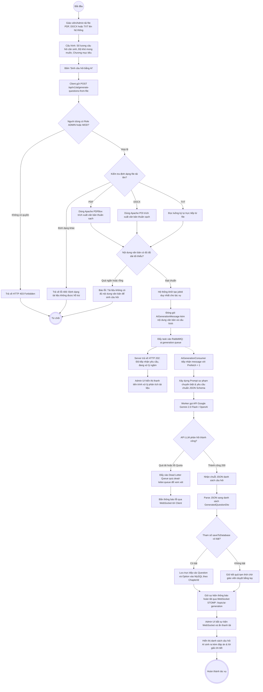

---

## 8. Luồng Chiến Dịch Thông Báo & Phân Phối Realtime Qua WebSocket

Cho phép Ban giám hiệu hoặc Quản trị viên phát đi thông báo hệ thống, thông báo theo môn học hoặc gửi riêng cho nhóm sinh viên, kết hợp lưu trữ cơ sở dữ liệu và đẩy tức thì (Push) qua kết nối WebSocket STOMP.

Controller & Config xử lý:
- [`AdminNotificationController.java`](../../server/src/main/java/com/fita/vnua/quiz/controller/AdminNotificationController.java)
- [`NotificationController.java`](../../server/src/main/java/com/fita/vnua/quiz/controller/NotificationController.java)
- [`WebSocketConfig.java`](../../server/src/main/java/com/fita/vnua/quiz/configuration/WebSocketConfig.java)

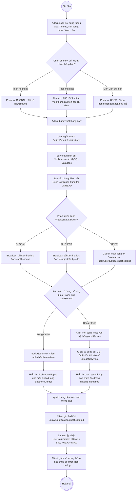

---

## 9. Luồng Giám Sát Hạ Tầng & Tự Động Bắn Cảnh Báo Telegram

Bộ giải pháp giám sát toàn diện (Observability) liên tục đo lường sức khỏe của Spring Boot Actuator, đánh giá các quy tắc cảnh báo tại Prometheus Server, và kích hoạt thông báo khẩn cấp tới nhóm Telegram Kỹ thuật qua Alertmanager khi phát hiện bất thường.

Cấu hình tại:
- `monitoring/prometheus/alert_rules.yml`
- `monitoring/alertmanager/alertmanager.yml`

```mermaid
flowchart TD
    StartNode([● Bắt đầu chu kỳ]) --> PromScheduler[Prometheus kích hoạt chu kỳ thu thập dữ liệu Scrape Interval = 10s]
    PromScheduler --> ScrapeActuator[Prometheus gửi GET /actuator/prometheus tới Spring Boot Backend]
    ScrapeActuator --> ReturnMetrics[Backend trả về các số liệu: JVM Heap, CPU, DB Hikari Pool, HTTP 5xx Rate]
    ReturnMetrics --> StoreTsdb[Prometheus lưu trữ số liệu vào Time-Series Database]
    
    StoreTsdb --> EvalAlertRules[Prometheus đánh giá các biểu thức PromQL trong alert_rules.yml]
    EvalAlertRules --> CheckThreshold{"Có số liệu nào vượt ngưỡng vi phạm?"}
    
    CheckThreshold -- Các chỉ số bình thường --> NextLoop[Đợi chu kỳ 10 giây tiếp theo]
    NextLoop --> PromScheduler
    
    CheckThreshold -- Vượt ngưỡng an toàn --> CheckDuration{"Tình trạng vi phạm có kéo dài quá 1 phút?"}
    CheckDuration -- Chưa đủ 1 phút --> MarkPending[Đặt trạng thái Rule = PENDING và tiếp tục theo dõi]
    MarkPending --> NextLoop
    
    CheckDuration -- Đã kéo dài quá 1 phút --> MarkFiring[Prometheus chuyển trạng thái Rule = FIRING]
    MarkFiring --> DispatchToAM[Gửi POST /api/v2/alerts tới Alertmanager Server]
    
    DispatchToAM --> AmDeduplicate[Alertmanager gom nhóm Grouping & Khử trùng lặp Deduplication cảnh báo]
    AmDeduplicate --> RenderHtmlMsg[Định dạng nội dung tin nhắn HTML Tiếng Việt hiển thị chi tiết sự cố]
    RenderHtmlMsg --> CallTelegramApi[Alertmanager gọi Telegram Bot API gửi tin nhắn tới nhóm Telegram Kỹ thuật]
    CallTelegramApi --> DevPhoneRing[Điện thoại/máy tính của đội ngũ Kỹ thuật viên nhận thông báo khẩn]
    
    DevPhoneRing --> DevAction[Kỹ thuật viên mở Grafana Dashboard và Loki Log Viewer để tra cứu]
    DevAction --> IdentifyRootCause[Xác định nguyên nhân gốc rễ: Nghẽn kết nối DB, tràn bộ nhớ, hoặc CPU cao]
    IdentifyRootCause --> ApplyFix[Thực hiện xử lý: Mở rộng tài nguyên Pod, tối ưu câu truy vấn, hoặc khởi động lại]
    
    ApplyFix --> FixDone[Sự cố được khắc phục thành công]
    FixDone --> PromNextScrape[Prometheus thu thập lại metrics ở chu kỳ kế tiếp]
    PromNextScrape --> VerifyRecovered{"Metrics đã trở về dưới ngưỡng cảnh báo?"}
    
    VerifyRecovered -- Vẫn còn vi phạm --> DevAction
    VerifyRecovered -- Đã an toàn hoàn toàn --> SendResolved[Prometheus gửi tín hiệu RESOLVED tới Alertmanager]
    SendResolved --> SendTelegramRecovered[Alertmanager gửi tin nhắn Telegram: Sự cố đã được xử lý thành công]
    SendTelegramRecovered --> EndResolved(((Hoàn thành giám sát & xử lý)))
```

---

## 10. Luồng Luyện Tập Theo Chương & Ôn Tập Thông Minh Câu Hay Sai

Khác với chế độ thi tính giờ quy chế nghiêm ngặt, chế độ Luyện tập tập trung vào việc hỗ trợ sinh viên củng cố kiến thức theo từng Chương hoặc ôn tập các câu từng làm sai trong lịch sử (`smart wrong practice`). Hệ thống cung cấp phản hồi tức thì (Instant Feedback) kèm giải thích chi tiết và công thức Toán học LaTeX.

Controller & Hooks xử lý:
- Client: [`pages/Subject/ChapterPractice/index.jsx`](../../client/src/pages/Subject/ChapterPractice/index.jsx), [`useChapterPractice.js`](../../client/src/pages/Subject/ChapterPractice/hooks/useChapterPractice.js)
- Server: [`QuestionController.java`](../../server/src/main/java/com/fita/vnua/quiz/controller/QuestionController.java) (`GET /api/v1/public/questions/chapter/{id}` và `GET /api/v1/questions/practice/wrong`)

```mermaid
flowchart TD
    StartNode((Bắt đầu)) --> SelectSubject[Sinh viên chọn Môn học và điều hướng vào trang Luyện tập]
    SelectSubject --> ChooseMode{"Chọn chế độ ôn luyện?"}
    
    %% Chế độ luyện theo chương
    ChooseMode -- Luyện theo từng Chương --> SelectChapter[Chọn Chương mục cụ thể cần ôn luyện]
    SelectChapter --> ConfigPractice[Thiết lập: Số lượng câu hỏi, Độ khó mong muốn, Thứ tự ngẫu nhiên]
    ConfigPractice --> CallChapterApi[Client gửi GET /api/v1/public/questions/chapter/chapterId]
    CallChapterApi --> QueryChapterQuestions[Server truy vấn danh sách câu hỏi & đáp án chuẩn từ MySQL]
    
    %% Chế độ ôn câu hay sai
    ChooseMode -- Ôn tập thông minh câu sai --> CallWrongApi[Client gửi GET /api/v1/questions/practice/wrong]
    CallWrongApi --> QueryWrongDB[Server truy vấn các câu hỏi sinh viên từng trả lời sai trong lịch sử thi]
    QueryWrongDB --> CheckHasWrong{"Có câu hỏi nào từng làm sai?"}
    CheckHasWrong -- Không có câu sai --> ShowEmptyWrong[Hiển thị thông báo: Bạn chưa có câu hỏi sai nào trong môn này]
    ShowEmptyWrong --> SelectChapter
    
    CheckHasWrong -- Có câu sai --> ReturnQuestions[Server trả về danh sách câu hỏi kèm đáp án đúng & giải thích]
    QueryChapterQuestions --> ReturnQuestions
    
    ReturnQuestions --> InitSession[Client khởi tạo phiên luyện tập và render câu hỏi đầu tiên]
    InitSession --> RenderContent[Hiển thị nội dung câu hỏi, hình ảnh và công thức Toán học LaTeX]
    
    %% Vòng lặp trả lời câu hỏi
    RenderContent --> StudentAnswer[Sinh viên đọc câu hỏi và chọn đáp án]
    StudentAnswer --> MarkQuestionOpt{"Có muốn đánh dấu câu hỏi nghi vấn?"}
    MarkQuestionOpt -- Có --> ToggleMark[Bấm nút Đánh dấu câu hỏi để xem lại sau]
    ToggleMark --> ShowFeedback
    MarkQuestionOpt -- Không --> ShowFeedback
    
    ShowFeedback[Hệ thống hiển thị phản hồi tức thì Instant Feedback]
    ShowFeedback --> CheckCorrect{"Đáp án sinh viên chọn là Đúng hay Sai?"}
    
    CheckCorrect -- Đúng --> HighlightGreen[Tô màu xanh đáp án đúng và tăng điểm tích lũy buổi học]
    CheckCorrect -- Sai --> HighlightRed[Tô màu đỏ đáp án đã chọn và viền xanh đáp án chính xác]
    HighlightRed --> LogWrongRecord[Ghi nhận câu hỏi vào danh sách câu sai để ghi nhớ]
    
    HighlightGreen --> ShowExplainBlock[Hiển thị khối Giải thích chi tiết & kiến thức cốt lõi bên dưới]
    LogWrongRecord --> ShowExplainBlock
    
    ShowExplainBlock --> NeedAiOpt{"Có cần AI giải thích sâu thêm không?"}
    NeedAiOpt -- Bấm Hỏi AI --> CallAiExplain[Gửi POST /api/v1/ai/explain-question để nhận phân tích mở rộng]
    CallAiExplain --> DisplayAiNote[Render lời giải thích bổ sung của AI]
    DisplayAiNote --> NextQuestionStep
    NeedAiOpt -- Không --> NextQuestionStep
    
    NextQuestionStep --> CheckLastQuestion{"Đã hoàn thành câu hỏi cuối cùng?"}
    CheckLastQuestion -- Còn câu tiếp theo --> ClickNext[Bấm 'Câu tiếp theo' hoặc chọn câu từ bảng điều hướng]
    ClickNext --> RenderContent
    
    CheckLastQuestion -- Hết danh sách câu hỏi --> ShowSummary[Hiển thị bảng tổng kết: Số câu đúng, tỷ lệ chính xác %, danh sách câu cần xem lại]
    ShowSummary --> EndPractice(((Hoàn thành buổi ôn tập)))
```

---

## 11. Biểu Đồ Trạng Thái Vòng Đời Bài Thi (State Machine Diagram)

Mô tả sự chuyển đổi trạng thái của thực thể bài thi [`UserExam`](../../server/src/main/java/com/fita/vnua/quiz/model/entity/UserExam.java) từ lúc sinh viên mở đề thi đến khi hoàn tất chấm điểm và tra cứu kết quả:

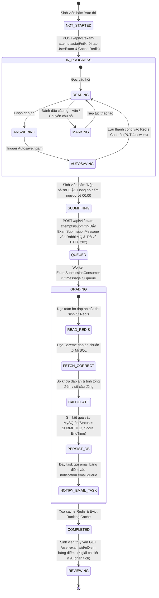

---

```

---

## 12. Luồng Trợ Lý AI: Sinh Lộ Trình Học Tập Cá Nhân Hóa

Mô tả quá trình hệ thống tổng hợp toàn bộ lịch sử thi, các câu hỏi từng làm sai và điểm số các môn để yêu cầu mô hình Google Gemini 2.0 Flash phân tích và xây dựng lộ trình học tập cá nhân hóa theo từng chặng.

Controller & Services xử lý:
- Client: [`Roadmap.jsx`](../../client/src/pages/Account/components/Roadmap.jsx)
- Server: [`AiController.java`](../../server/src/main/java/com/fita/vnua/quiz/controller/AiController.java) (`GET /api/v1/ai/roadmap`), [`AiRoadmapService.java`](../../server/src/main/java/com/fita/vnua/quiz/service/AiRoadmapService.java)

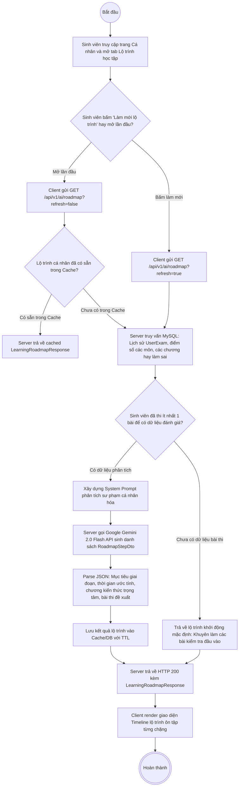

---

## 13. Luồng Tính Toán & Đệm Bảng Xếp Hạng Thí Sinh

Quy trình truy vấn bảng vinh danh Top thí sinh kết hợp cơ chế bộ đệm Redis để tối ưu hóa hiệu năng truy vấn và cơ chế tự động xóa bộ đệm (`@CacheEvict`) khi có bài thi mới nộp.

Controller & Services xử lý:
- Client: [`pages/Rank/index.jsx`](../../client/src/pages/Rank/index.jsx)
- Server: [`UserExamController.java`](../../server/src/main/java/com/fita/vnua/quiz/controller/UserExamController.java) (`GET /api/v1/public/rankings`), [`RankingService.java`](../../server/src/main/java/com/fita/vnua/quiz/service/RankingService.java)

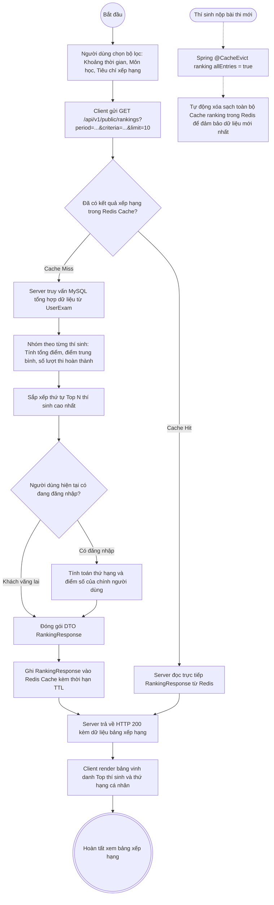

---

## 14. Luồng Quản Lý & Tải Xuống Tài Liệu Học Tập An Toàn

Quy trình tải lên tài liệu học tập của giảng viên và tải về an toàn của sinh viên với xác thực MIME type và mã hóa tên file UTF-8 chuẩn mực.

Controller & Services xử lý:
- Client: [`pages/Documents/index.jsx`](../../client/src/pages/Documents/index.jsx)
- Server: [`SharedDocumentController.java`](../../server/src/main/java/com/fita/vnua/quiz/controller/SharedDocumentController.java), [`SharedDocumentService.java`](../../server/src/main/java/com/fita/vnua/quiz/service/SharedDocumentService.java)

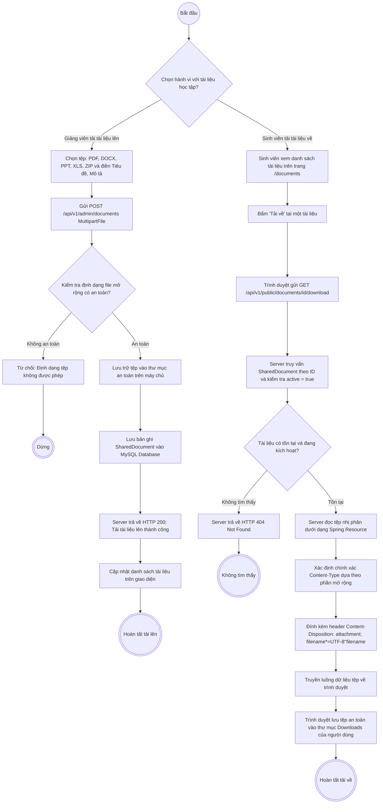

---

## 15. Luồng Phân Quyền Quản Trị Ma Trận & Ghi Nhận Kiểm Toán

Mô hình phân quyền dựa trên vai trò (RBAC) và nhóm quyền (`AdminGroup`), kết hợp hệ thống ghi nhận nhật ký kiểm toán (`AuditLog`) phục vụ giám sát minh bạch các thao tác nhạy cảm.

Controller & Services xử lý:
- Server: [`AdminGroupController.java`](../../server/src/main/java/com/fita/vnua/quiz/controller/AdminGroupController.java), [`AuditLogController.java`](../../server/src/main/java/com/fita/vnua/quiz/controller/AuditLogController.java), [`AuditLogService.java`](../../server/src/main/java/com/fita/vnua/quiz/service/AuditLogService.java)

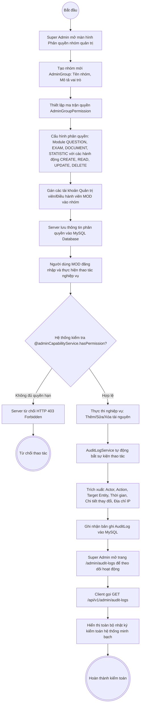

---

## 16. Luồng Cập Nhật Hồ Sơ & Thay Đổi Ảnh Đại Diện

Quy trình cập nhật thông tin cá nhân kèm bộ chọn địa chỉ hành chính Việt Nam và tải lên ảnh đại diện có cơ chế dọn dẹp file cũ trên ổ đĩa.

Controller & Services xử lý:
- Client: [`pages/Account/index.jsx`](../../client/src/pages/Account/index.jsx), [`useVietnamAddressPicker.js`](../../client/src/pages/Account/hooks/useVietnamAddressPicker.js)
- Server: [`AvatarController.java`](../../server/src/main/java/com/fita/vnua/quiz/controller/AvatarController.java), [`AvatarStorageService.java`](../../server/src/main/java/com/fita/vnua/quiz/service/AvatarStorageService.java), [`UserController.java`](../../server/src/main/java/com/fita/vnua/quiz/controller/UserController.java)

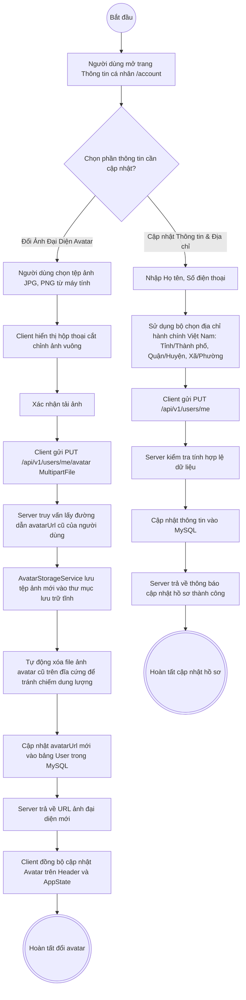

---

## 17. Luồng Báo Cáo Thống Kê & Xuất Dữ Liệu CSV Hàng Loạt

Quy trình tổng hợp số liệu phân tích Dashboard và xuất dữ liệu dạng file CSV hỗ trợ tiếng Việt có chèn BOM mở bằng Excel không lỗi font.

Controller & Services xử lý:
- Server: [`StatisticsController.java`](../../server/src/main/java/com/fita/vnua/quiz/controller/StatisticsController.java), [`AdminExportController.java`](../../server/src/main/java/com/fita/vnua/quiz/controller/AdminExportController.java)

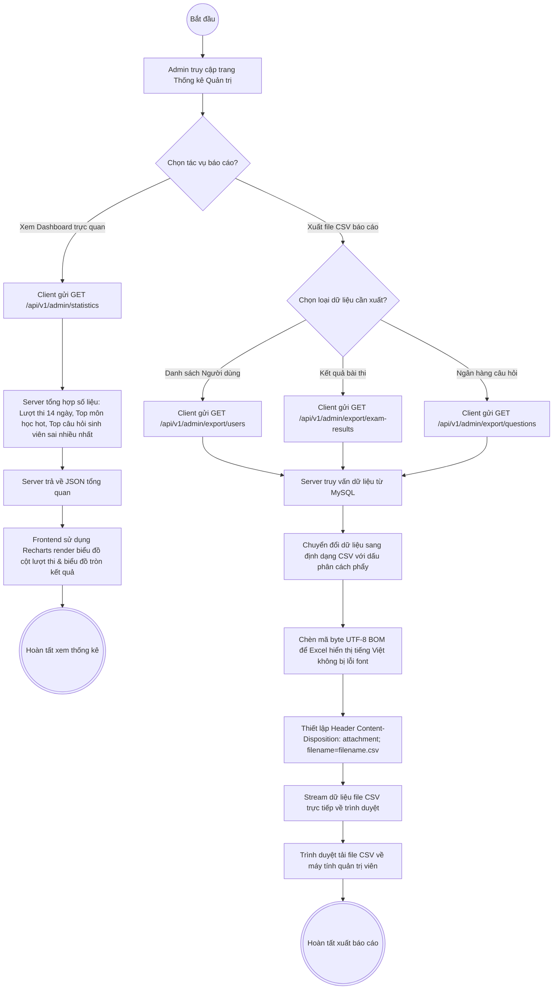

---

## 18. Luồng Xóa Mềm & Khôi Phục Dữ Liệu

Đảm bảo tính toàn vẹn dữ liệu quan hệ (Data Integrity) bằng cơ chế Soft Delete (`deleted = true`) và hỗ trợ khôi phục qua màn hình thùng rác.

Controller xử lý:
- Server: [`ExamController.java`](../../server/src/main/java/com/fita/vnua/quiz/controller/ExamController.java) (`GET /admin/exams/deleted`), [`QuestionController.java`](../../server/src/main/java/com/fita/vnua/quiz/controller/QuestionController.java)

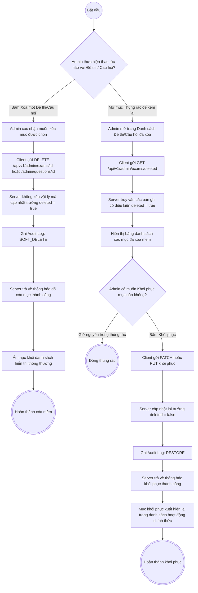

---

## 19. Luồng Đánh Dấu & Quản Lý Môn Học Yêu Thích

Trải nghiệm người dùng mượt mà với Optimistic UI, lưu trữ cơ sở dữ liệu và đồng bộ trạng thái toàn cục trong `FavoritesContext`.

Controller & Context xử lý:
- Client: [`FavoritesContext.jsx`](../../client/src/context/favorites/FavoritesContext.jsx), [`useFavoritesModal.js`](../../client/src/components/common/Header/FavoritesModal/hooks/useFavoritesModal.js)
- Server: [`FavoriteController.java`](../../server/src/main/java/com/fita/vnua/quiz/controller/FavoriteController.java) (`POST/DELETE /api/v1/favorites`)

```mermaid
flowchart TD
    StartNode((Bắt đầu)) --> ViewSubjectCard[Sinh viên xem thẻ môn học trên trang Môn học hoặc Trang chủ]
    ViewSubjectCard --> ClickHeartBtn[Sinh viên bấm icon Ngôi sao / Trái tim yêu thích]
    
    ClickHeartBtn --> CheckFavState{"Môn học này hiện đã nằm trong danh sách yêu thích chưa?"}
    
    %% Thêm yêu thích
    CheckFavState -- Chưa có --> OptimisticAdd[Client cập nhật tức thì: Đổi màu icon sáng và tăng bộ đếm]
    OptimisticAdd --> CallPostFav[Client gửi POST /api/v1/favorites { subjectId }]
    CallPostFav --> SaveFavDB[Server lưu bản ghi mới vào bảng Favorite trong MySQL]
    SaveFavDB --> ReturnFavAdded[Server trả về HTTP 200 kèm FavoriteDto]
    ReturnFavAdded --> SyncContextAdd[Đồng bộ môn học mới vào FavoritesContext toàn ứng dụng]
    SyncContextAdd --> EndFavAdd(((Đã thêm vào yêu thích)))
    
    %% Bỏ yêu thích
    CheckFavState -- Đã có sẵn --> OptimisticRemove[Client cập nhật tức thì: Đổi màu icon xám và giảm bộ đếm]
    OptimisticRemove --> CallDeleteFav[Client gửi DELETE /api/v1/favorites { subjectId }]
    CallDeleteFav --> DeleteFavDB[Server xóa bản ghi tương ứng khỏi bảng Favorite]
    DeleteFavDB --> ReturnFavDeleted[Server trả về HTTP 200: Xóa yêu thích thành công]
    ReturnFavDeleted --> SyncContextRemove[Xóa môn học khỏi FavoritesContext]
    SyncContextRemove --> EndFavRemove(((Đã bỏ yêu thích)))
    
    %% Mở Modal xem danh sách yêu thích
    StartNode --> ClickFavHeader[Sinh viên bấm icon Ngôi sao trên thanh Header]
    ClickFavHeader --> OpenFavModal[Mở FavoritesModalView hiển thị danh sách các môn học yêu thích]
    OpenFavModal --> QuickAccess[Bấm vào môn học yêu thích để chuyển hướng ngay vào phòng thi/ôn tập]
    QuickAccess --> EndQuickNav(((Điều hướng nhanh thành công)))
```

```

---

## 20. Luồng Quản Lý Người Dùng & Khóa/Mở Khóa Tài Khoản

Quản trị viên có thể quản lý người dùng, thay đổi vai trò (USER, MOD, ADMIN), và khóa hoặc mở khóa tài khoản người dùng (`enabled = false/true`). Khi tài khoản bị vô hiệu hóa, mọi truy cập và đăng nhập đều bị chặn ngay lập tức bởi cơ chế Spring Security.

Controller & Services xử lý:
- Server: [`UserController.java`](../../server/src/main/java/com/fita/vnua/quiz/controller/UserController.java) (`GET /api/v1/admin/users`, `PATCH /api/v1/admin/users/{userId}/status`, `PATCH /api/v1/admin/users/{userId}/role`)

```mermaid
flowchart TD
    StartNode((Bắt đầu)) --> AdminOpenUserMgmt[Admin mở màn hình Quản lý người dùng]
    AdminOpenUserMgmt --> SearchFilterUsers[Tìm kiếm theo Tên, Email, lọc theo Vai trò hoặc Trạng thái]
    SearchFilterUsers --> FetchUsersApi[Client gửi GET /api/v1/admin/users phân trang]
    FetchUsersApi --> RenderUserTable[Hiển thị bảng danh sách tài khoản người dùng]
    
    RenderUserTable --> ChooseAdminAction{"Admin thực hiện thao tác gì?"}
    
    %% Khóa / Mở khóa
    ChooseAdminAction -- Khóa hoặc Mở khóa tài khoản --> ToggleStatus[Bấm nút Chuyển đổi trạng thái Enabled/Disabled]
    ToggleStatus --> SendStatusApi[Client gửi PATCH /api/v1/admin/users/userId/status enabled = boolean]
    SendStatusApi --> UpdateEnabledDB[Server cập nhật trường enabled trong MySQL Database]
    UpdateEnabledDB --> LogAuditStatus[Ghi Audit Log: UPDATE_USER_STATUS]
    LogAuditStatus --> ReturnStatusOk[Server trả về HTTP 200: Cập nhật trạng thái thành công]
    ReturnStatusOk --> RefreshUserRow[Client cập nhật Badge trạng thái trên bảng]
    
    %% Hậu quả khi tài khoản bị khóa
    RefreshUserRow --> LockedUserTryLogin[Tài khoản bị khóa cố gắng đăng nhập hoặc gọi API cần quyền]
    LockedUserTryLogin --> SpringSecCheck{"Spring Security CustomUserDetailsService kiểm tra user.isEnabled?"}
    SpringSecCheck -- isEnabled = false --> ThrowDisabled[Ném ngoại lệ DisabledException]
    ThrowDisabled --> LogDisabledAudit[Ghi Audit Log: LOGIN_DISABLED]
    LogDisabledAudit --> Return403Forbidden[Server trả về HTTP 403: Tài khoản đã bị vô hiệu hóa]
    Return403Forbidden --> BlockAccess(((Chặn hoàn toàn quyền truy cập)))
    
    %% Phân vai trò
    ChooseAdminAction -- Đổi vai trò quyền hạn --> SelectRole[Chọn vai trò mới: USER / MOD / ADMIN]
    SelectRole --> SendRoleApi[Client gửi PATCH /api/v1/admin/users/userId/role]
    SendRoleApi --> UpdateRoleDB[Server cập nhật trường role trong MySQL]
    UpdateRoleDB --> LogAuditRole[Ghi Audit Log: UPDATE_USER_ROLE]
    LogAuditRole --> ReturnRoleOk[Server xác nhận đổi vai trò thành công]
    ReturnRoleOk --> EndRoleDone(((Hoàn tất phân quyền)))
```

---

## 21. Luồng Xử Lý Lỗi Tải Cao & Chống Mất Mát Bài Thi Qua Dead Letter Queue

Cơ chế chịu lỗi (Fault-Tolerance) đảm bảo khi hàng đợi xử lý chấm thi hoặc AI sinh câu hỏi gặp sự cố ngoại lệ nghiêm trọng (sập DB, tràn RAM, deadlock), toàn bộ bài làm của thí sinh sẽ được chuyển an toàn sang Dead Letter Queue (`quiz.dead-letter.queue`) thay vì bị thất thoát.

Config & Consumers xử lý:
- Server: [`RabbitMqConfig.java`](../../server/src/main/java/com/fita/vnua/quiz/config/RabbitMqConfig.java), [`ExamSubmissionConsumer.java`](../../server/src/main/java/com/fita/vnua/quiz/queue/consumer/ExamSubmissionConsumer.java), [`DeadLetterQueueConsumer.java`](../../server/src/main/java/com/fita/vnua/quiz/queue/consumer/DeadLetterQueueConsumer.java)

```mermaid
flowchart TD
    StartNode((Bắt đầu)) --> ExamConsumerFetch[ExamSubmissionConsumer rút message bài thi từ exam.submission.queue]
    ExamConsumerFetch --> TryGradeBlock[Worker bắt đầu khối lệnh try-catch chấm bài thi]
    TryGradeBlock --> CallDbService[Gọi userExamService.submitAttempt userExamId, userId]
    
    CallDbService --> CheckDbError{"Quá trình chấm bài hoặc ghi MySQL có gặp sự cố?"}
    
    %% Xử lý thành công
    CheckDbError -- Thành công không lỗi --> PersistSuccess[Lưu kết quả điểm thi vào DB thành công]
    PersistSuccess --> SendAck[Worker gửi manual ACK xác nhận hoàn tất tới RabbitMQ]
    SendAck --> EndSuccess(((Hoàn thành chấm bài bình thường)))
    
    %% Xử lý lỗi & Dead Letter Queue
    CheckDbError -- Gặp ngoại lệ nghiêm trọng: DB Timeout, Deadlock --> CatchException[Bắt ngoại lệ và log lỗi ERROR]
    CatchException --> RejectMsg[Worker gửi tín hiệu NACK / REJECT tới RabbitMQ]
    RejectMsg --> RabbitRouting[RabbitMQ kiểm tra cấu hình x-dead-letter-exchange = quiz.dlx]
    RabbitRouting --> RouteToDlx[Chuyển tiếp message sang Dead Letter Exchange quiz.dlx]
    RouteToDlx --> BindDlq[Đẩy message vào hàng đợi lưu trữ sự cố quiz.dead-letter.queue]
    
    BindDlq --> DlqConsumerListen[DeadLetterQueueConsumer nhặt message lỗi từ quiz.dead-letter.queue]
    DlqConsumerListen --> InspectHeaders[Trích xuất thông tin: Nguyên nhân lỗi, số lần thử lại, timestamp, payload gốc]
    InspectHeaders --> AlertOps[Ghi log cảnh báo nghiêm trọng vào hệ thống Log tập trung Loki]
    AlertOps --> SafeStorage[Bảo lưu toàn vẹn bài làm của sinh viên để phục hồi an toàn sau khi DB ổn định]
    SafeStorage --> EndDlqDone(((Bảo vệ an toàn dữ liệu, chống mất bài thi)))
```

---

## 22. Luồng Gửi Email Bảng Điểm Tự Động Sau Khi Chấm Thi

Tách biệt tiến trình gửi email ra khỏi luồng chấm thi chính bằng hàng đợi RabbitMQ `notification.email.queue`, giúp việc nộp bài diễn ra tức thì và kết quả thi được gửi về hòm thư người dùng một cách bền vững.

Consumers & Config xử lý:
- Server: [`ExamSubmissionConsumer.java`](../../server/src/main/java/com/fita/vnua/quiz/queue/consumer/ExamSubmissionConsumer.java), [`EmailNotificationConsumer.java`](../../server/src/main/java/com/fita/vnua/quiz/queue/consumer/EmailNotificationConsumer.java), [`RabbitMqConfig.java`](../../server/src/main/java/com/fita/vnua/quiz/config/RabbitMqConfig.java)

```mermaid
flowchart TD
    StartNode((Bắt đầu)) --> FinishGrading[ExamSubmissionConsumer hoàn tất tính điểm bài thi UserExam]
    FinishGrading --> PrepareEmailMsg[Đóng gói EmailNotificationMessage: User ID, Exam ID, Điểm số, Số câu đúng, Thời gian thi]
    PrepareEmailMsg --> PushEmailQueue[Đẩy message vào RabbitMQ queue: notification.email.queue]
    PushEmailQueue --> WorkerAckExam[Worker xác nhận xong tác vụ chấm thi]
    
    PushEmailQueue -.-> EmailConsumerFetch[EmailNotificationConsumer rút message từ notification.email.queue]
    EmailConsumerFetch --> QueryStudentMail[Truy vấn MySQL lấy địa chỉ email & họ tên sinh viên]
    QueryStudentMail --> CheckMailConfig{"Hệ thống có cấu hình SMTP Server hợp lệ?"}
    
    CheckMailConfig -- Không có cấu hình SMTP --> LogSkip[Ghi log cảnh báo và bỏ qua tác vụ gửi email]
    LogSkip --> EndSkip(((Dừng)))
    
    CheckMailConfig -- Cấu hình hợp lệ --> BuildHtmlTemplate[Xây dựng nội dung Email HTML tiếng Việt chuyên nghiệp: Bảng điểm, Lời chúc, Link tra cứu]
    BuildHtmlTemplate --> CallJavaMail[Gọi Spring JavaMailSender kết nối tới SMTP Server]
    CallJavaMail --> CheckSmtpSend{"Gửi qua SMTP thành công?"}
    
    CheckSmtpSend -- Thất bại --> SmtpRetry[Tự động retry gửi lại tối đa 3 lần]
    SmtpRetry --> CheckRetryMax{"Đã vượt quá số lần retry?"}
    CheckRetryMax -- Vượt quá --> PushMailDlq[Đẩy vào dead-letter queue để kiểm tra]
    PushMailDlq --> EndMailDlq(((Lưu lỗi email)))
    CheckRetryMax -- Chưa vượt --> CallJavaMail
    
    CheckSmtpSend -- Thành công --> MailboxArrival[Hộp thư sinh viên nhận email thông báo kết quả thi kèm bảng điểm chi tiết]
    MailboxArrival --> EndSuccess(((Hoàn tất gửi email bảng điểm)))
```

---

## Tổng Kết

Các biểu đồ hoạt động trên đã mô tả toàn bộ vòng đời tác vụ của các phân hệ nghiệp vụ then chốt trong hệ thống **Quiz VNUA**:
- Đảm bảo tính minh bạch trong luồng xử lý dữ liệu giữa **Frontend**, **Backend**, **Cache**, **Queue** và **Database**.
- Phản ánh chính xác các cơ chế chống quá tải và mở rộng hệ thống (Asynchronous Processing với RabbitMQ, Autosave trên Redis, Caching, và JWT Refresh Token ngầm).
- Đóng vai trò là tài liệu chuẩn mực hỗ trợ phát triển, bảo trì, kiểm thử phần mềm cũng như báo cáo đồ án kỹ thuật.


