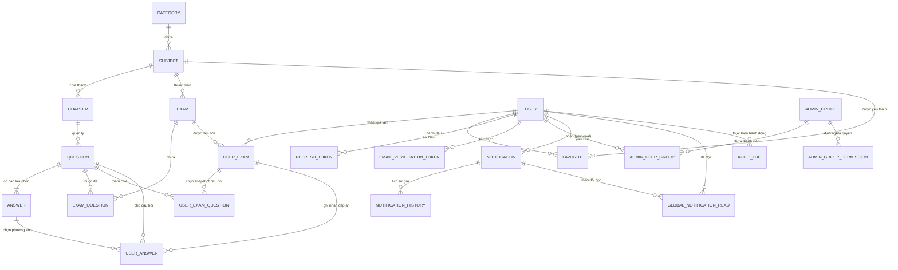
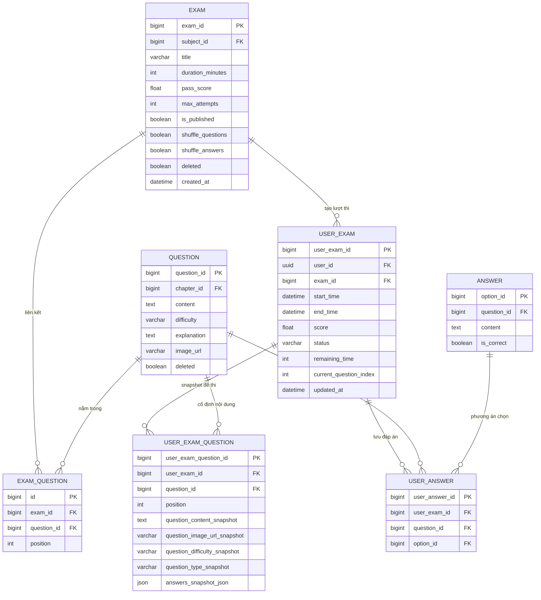
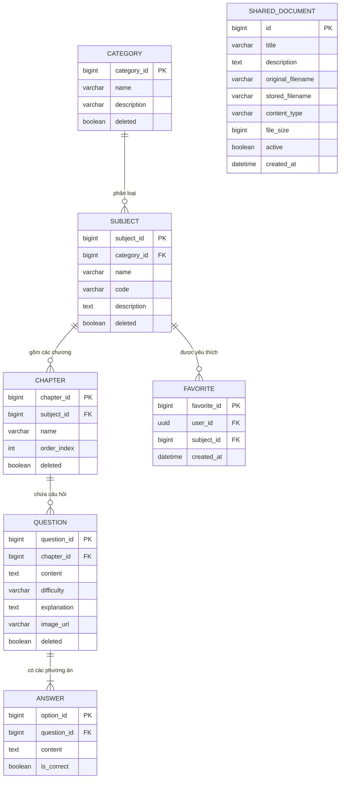
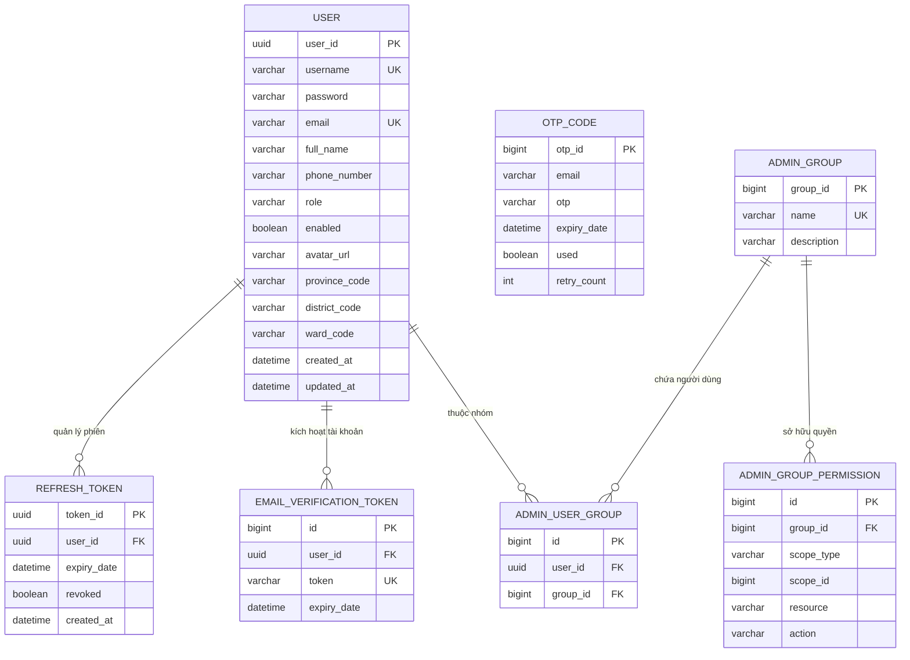
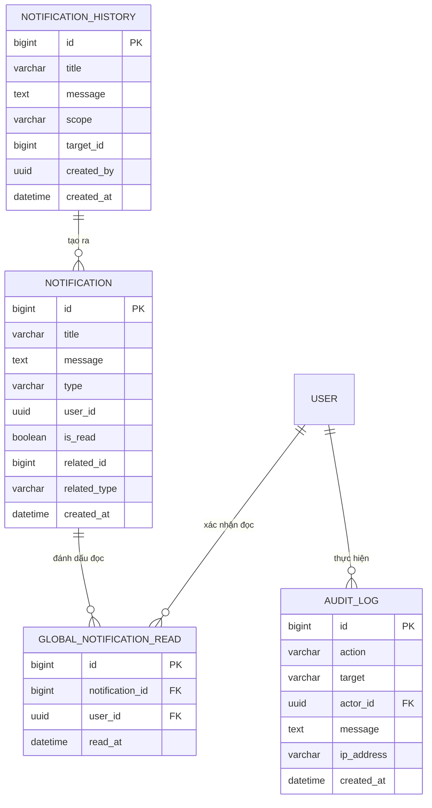

# Sơ Đồ Quan Hệ Thực Thể Hệ Thống (Entity-Relationship Diagram - ERD)

Tài liệu này đặc tả toàn bộ kiến trúc cơ sở dữ liệu quan hệ của hệ thống **Quiz VNUA**, bao gồm sơ đồ quan hệ thực thể (ERD) mức khái niệm, các sơ đồ phân hệ chi tiết và từ điển dữ liệu (Data Dictionary) của 23 thực thể JPA đang vận hành trong hệ thống.

---

## Mục Lục
1. [Sơ Đồ Quan Hệ Thực Thể Toàn Hệ Thống (Global ERD)](#1-sơ-đồ-quan-hệ-thực-thể-toàn-hệ-thống-global-erd)
2. [Phân Hệ 1: Khảo Thí & Làm Bài Thi (Exam & Attempt Subsystem)](#2-phân-hệ-1-khảo-thí--làm-bài-thi-exam--attempt-subsystem)
3. [Phân Hệ 2: Danh Mục & Ngân Hàng Câu Hỏi (Course Catalog & Question Bank)](#3-phân-hệ-2-danh-mục--ngân-hàng-câu-hỏi-course-catalog--question-bank)
4. [Phân Hệ 3: Người Dùng, Phân Quyền & Bảo Mật (User, RBAC & Security)](#4-phân-hệ-3-người-dùng-phân-quyền--bảo-mật-user-rbac--security)
5. [Phân Hệ 4: Thông Báo Thời Gian Thực & Nhật Ký Kiểm Toán (Notification & Audit)](#5-phân-hệ-4-thông-báo-thời-gian-thực--nhật-ký-kiểm-toán-notification--audit)
6. [Từ Điển Dữ Liệu Chi Tiết (Data Dictionary)](#6-từ-điển-dữ-liệu-chi-tiết-data-dictionary)

---

## 1. Sơ Đồ Quan Hệ Thực Thể Toàn Hệ Thống (Global ERD)

Mô hình dữ liệu quan hệ tổng thể kết nối giữa 4 phân hệ chính: Quản trị danh mục, Ngân hàng câu hỏi, Khảo thí nộp bài, và Phân quyền bảo mật:

---

## 2. Phân Hệ 1: Khảo Thí & Làm Bài Thi (Exam & Attempt Subsystem)

Phân hệ quan trọng nhất đảm nhiệm việc lưu trữ đề thi, snapshot đề thi khi thí sinh vào thi, quá trình autosave câu trả lời và kết quả chấm thi cuối cùng:

> [!NOTE]
> Bảng `USER_EXAM_QUESTION` lưu lại bản sao (Snapshot) toàn bộ nội dung câu hỏi và danh sách đáp án tại thời điểm thí sinh bắt đầu làm bài. Cơ chế này đảm bảo: Nếu giáo viên có chỉnh sửa nội dung hoặc đáp án của câu hỏi gốc trong ngân hàng thì bài thi đang làm của thí sinh vẫn giữ nguyên tính khách quan và toàn vẹn.

---

## 3. Phân Hệ 2: Danh Mục & Ngân Hàng Câu Hỏi (Course Catalog & Question Bank)

Quản lý cây phân cấp đào tạo từ Khối ngành $\rightarrow$ Môn học $\rightarrow$ Chương $\rightarrow$ Câu hỏi & Đáp án, kèm danh sách môn học yêu thích và kho tài liệu chia sẻ:

---

## 4. Phân Hệ 3: Người Dùng, Phân Quyền & Bảo Mật (User, RBAC & Security)

Cấu trúc phân quyền ma trận (RBAC) cho phép Super Admin tạo các nhóm quyền (`ADMIN_GROUP`) và gán quyền linh hoạt theo từng module tài nguyên (`QUESTION`, `EXAM`, `DOCUMENT`, `STATISTIC`) cho các tài khoản `MOD`:

---

## 5. Phân Hệ 4: Thông Báo Thời Gian Thực & Nhật Ký Kiểm Toán (Notification & Audit)

Hỗ trợ thông báo toàn hệ thống (GLOBAL) hoặc thông báo cá nhân (PERSONAL) kèm theo dõi trạng thái đã đọc và nhật ký kiểm toán hệ thống:

---

## 6. Từ Điển Dữ Liệu Chi Tiết (Data Dictionary)

### Bảng `users` (Thông tin người dùng)
| Tên cột | Kiểu dữ liệu | Khóa | Nullable | Mô tả nghiệp vụ |
| :--- | :--- | :---: | :---: | :--- |
| `user_id` | `BINARY(16)` / `UUID` | **PK** | No | Mã định danh duy nhất (UUID v4) |
| `username` | `VARCHAR(50)` | **UK** | No | Tên đăng nhập (duy nhất) |
| `password` | `VARCHAR(255)` | | Yes | Mật khẩu băm BCrypt (Null nếu dùng Google login thuần) |
| `email` | `VARCHAR(100)` | **UK** | No | Hộp thư điện tử (duy nhất) |
| `full_name` | `VARCHAR(100)` | | Yes | Họ và tên sinh viên / giảng viên |
| `phone_number` | `VARCHAR(20)` | | Yes | Số điện thoại liên hệ |
| `role` | `VARCHAR(20)` | | No | Vai trò: `USER`, `MOD`, `ADMIN` |
| `enabled` | `BOOLEAN` | | No | Trạng thái kích hoạt (false khi chưa xác thực email) |
| `avatar_url` | `VARCHAR(500)` | | Yes | Đường dẫn URL ảnh đại diện |
| `province_code` | `VARCHAR(20)` | | Yes | Mã tỉnh/thành phố theo chuẩn hành chính VN |
| `district_code` | `VARCHAR(20)` | | Yes | Mã quận/huyện |
| `ward_code` | `VARCHAR(20)` | | Yes | Mã xã/phường |
| `created_at` | `DATETIME` | | No | Thời điểm tạo tài khoản |
| `updated_at` | `DATETIME` | | Yes | Thời điểm cập nhật hồ sơ gần nhất |

---

### Bảng `user_exam` (Lượt làm bài thi của thí sinh)
| Tên cột | Kiểu dữ liệu | Khóa | Nullable | Mô tả nghiệp vụ |
| :--- | :--- | :---: | :---: | :--- |
| `user_exam_id` | `BIGINT AUTO_INCREMENT` | **PK** | No | Mã lượt thi duy nhất |
| `user_id` | `BINARY(16)` / `UUID` | **FK** | No | Khóa ngoại trỏ tới `users(user_id)` |
| `exam_id` | `BIGINT` | **FK** | No | Khóa ngoại trỏ tới `exams(exam_id)` |
| `start_time` | `DATETIME` | | No | Thời điểm bắt đầu tính giờ làm bài |
| `end_time` | `DATETIME` | | Yes | Thời điểm nộp bài hoàn tất |
| `score` | `FLOAT` | | Yes | Điểm thi đạt được (thang điểm 100) |
| `status` | `VARCHAR(30)` | | No | Trạng thái: `IN_PROGRESS`, `SUBMITTED` |
| `remaining_time` | `INT` | | Yes | Số giây làm bài còn lại được autosave |
| `current_question_index`| `INT` | | Yes | Vị trí câu hỏi thí sinh đang dừng lại |
| `updated_at` | `DATETIME` | | Yes | Thời điểm ghi nhận thay đổi gần nhất |

---

### Bảng `user_exam_question` (Snapshot câu hỏi của ca thi)
| Tên cột | Kiểu dữ liệu | Khóa | Nullable | Mô tả nghiệp vụ |
| :--- | :--- | :---: | :---: | :--- |
| `user_exam_question_id` | `BIGINT AUTO_INCREMENT` | **PK** | No | Mã định danh bản ghi snapshot |
| `user_exam_id` | `BIGINT` | **FK** | No | Khóa ngoại trỏ tới `user_exam(user_exam_id)` |
| `question_id` | `BIGINT` | **FK** | No | Khóa ngoại trỏ tới `questions(question_id)` |
| `position` | `INT` | | No | Thứ tự câu hỏi trong đề của thí sinh (sau khi xáo) |
| `question_content_snapshot`| `TEXT` | | Yes | Nội dung câu hỏi tại thời điểm bắt đầu thi |
| `question_image_url_snapshot`| `VARCHAR(1000)` | | Yes | Hình ảnh đính kèm tại thời điểm thi |
| `question_difficulty_snapshot`| `VARCHAR(32)` | | Yes | Mức độ khó câu hỏi (EASY / MEDIUM / HARD) |
| `answers_snapshot_json`| `JSON` | | Yes | Mảng JSON chứa các lựa chọn đáp án tại thời điểm thi |

---

### Bảng `user_answers` (Đáp án thí sinh lựa chọn)
| Tên cột | Kiểu dữ liệu | Khóa | Nullable | Mô tả nghiệp vụ |
| :--- | :--- | :---: | :---: | :--- |
| `user_answer_id` | `BIGINT AUTO_INCREMENT` | **PK** | No | Mã câu trả lời |
| `user_exam_id` | `BIGINT` | **FK** | No | Khóa ngoại trỏ tới `user_exam` |
| `question_id` | `BIGINT` | **FK** | No | Khóa ngoại trỏ tới `questions` |
| `option_id` | `BIGINT` | **FK** | No | Khóa ngoại trỏ tới `answers` (phương án chọn) |

---

### Bảng `exams` (Đề thi trắc nghiệm)
| Tên cột | Kiểu dữ liệu | Khóa | Nullable | Mô tả nghiệp vụ |
| :--- | :--- | :---: | :---: | :--- |
| `exam_id` | `BIGINT AUTO_INCREMENT` | **PK** | No | Mã đề thi |
| `subject_id` | `BIGINT` | **FK** | No | Khóa ngoại trỏ tới `subjects(subject_id)` |
| `title` | `VARCHAR(255)` | | No | Tên đề thi (ví dụ: "Thi kết thúc học phần LTHĐT") |
| `duration` | `INT` | | No | Thời lượng làm bài (tính bằng phút) |
| `pass_score` | `FLOAT` | | Yes | Điểm sàn đạt yêu cầu |
| `max_attempts` | `INT` | | Yes | Số lần làm bài tối đa (null = không giới hạn) |
| `is_published` | `BOOLEAN` | | No | Trạng thái công khai cho sinh viên thấy |
| `shuffle_questions` | `BOOLEAN` | | No | Cờ cho phép xáo trộn vị trí câu hỏi |
| `shuffle_answers` | `BOOLEAN` | | No | Cờ cho phép xáo trộn thứ tự các đáp án A/B/C/D |
| `deleted` | `BOOLEAN` | | No | Cờ xóa mềm (soft delete) |

---

### Bảng `questions` (Ngân hàng câu hỏi)
| Tên cột | Kiểu dữ liệu | Khóa | Nullable | Mô tả nghiệp vụ |
| :--- | :--- | :---: | :---: | :--- |
| `question_id` | `BIGINT AUTO_INCREMENT` | **PK** | No | Mã câu hỏi |
| `chapter_id` | `BIGINT` | **FK** | No | Khóa ngoại trỏ tới `chapters(chapter_id)` |
| `content` | `TEXT` | | No | Nội dung câu hỏi (hỗ trợ công thức LaTeX) |
| `difficulty` | `VARCHAR(20)` | | No | Mức độ khó: `EASY`, `MEDIUM`, `HARD` |
| `explanation` | `TEXT` | | Yes | Lời giải thích chi tiết đáp án đúng |
| `image_url` | `VARCHAR(500)` | | Yes | Đường dẫn ảnh minh họa đính kèm |
| `deleted` | `BOOLEAN` | | No | Cờ xóa mềm |

---

### Bảng `answers` (Các phương án lựa chọn)
| Tên cột | Kiểu dữ liệu | Khóa | Nullable | Mô tả nghiệp vụ |
| :--- | :--- | :---: | :---: | :--- |
| `option_id` | `BIGINT AUTO_INCREMENT` | **PK** | No | Mã phương án lựa chọn |
| `question_id` | `BIGINT` | **FK** | No | Khóa ngoại trỏ tới `questions(question_id)` |
| `content` | `TEXT` | | No | Nội dung phương án trả lời |
| `is_correct` | `BOOLEAN` | | No | Đánh dấu đáp án đúng (`true`/`false`) |

---

### Bảng `admin_group_permission` (Phân quyền ma trận RBAC)
| Tên cột | Kiểu dữ liệu | Khóa | Nullable | Mô tả nghiệp vụ |
| :--- | :--- | :---: | :---: | :--- |
| `id` | `BIGINT AUTO_INCREMENT` | **PK** | No | Mã định danh quyền |
| `group_id` | `BIGINT` | **FK** | No | Khóa ngoại trỏ tới `admin_groups(group_id)` |
| `scope_type` | `VARCHAR(50)` | | No | Phạm vi quyền: `GLOBAL`, `CATEGORY`, `SUBJECT` |
| `scope_id` | `BIGINT` | | Yes | ID đối tượng cụ thể (nếu scope không phải GLOBAL) |
| `resource` | `VARCHAR(80)` | | No | Tài nguyên: `QUESTION`, `EXAM`, `DOCUMENT`, `STATISTIC` |
| `action` | `VARCHAR(50)` | | No | Thao tác: `CREATE`, `READ`, `UPDATE`, `DELETE` |

---

### Bảng `audit_logs` (Nhật ký kiểm toán hệ thống)
| Tên cột | Kiểu dữ liệu | Khóa | Nullable | Mô tả nghiệp vụ |
| :--- | :--- | :---: | :---: | :--- |
| `id` | `BIGINT AUTO_INCREMENT` | **PK** | No | Mã bản ghi nhật ký |
| `action` | `VARCHAR(50)` | | No | Tên hành động: `LOGIN_SUCCESS`, `CREATE`, `UPDATE`, `DELETE` |
| `target` | `VARCHAR(100)` | | Yes | Đối tượng bị tác động (ví dụ: `EXAM`, `QUESTION`) |
| `actor_id` | `BINARY(16)` / `UUID` | **FK** | Yes | Khóa ngoại trỏ tới `users` người thực hiện |
| `message` | `TEXT` | | Yes | Mô tả tóm tắt nội dung thay đổi |
| `ip_address` | `VARCHAR(50)` | | Yes | Địa chỉ IP của máy khách |
| `created_at` | `DATETIME` | | No | Thời điểm phát sinh sự kiện |
