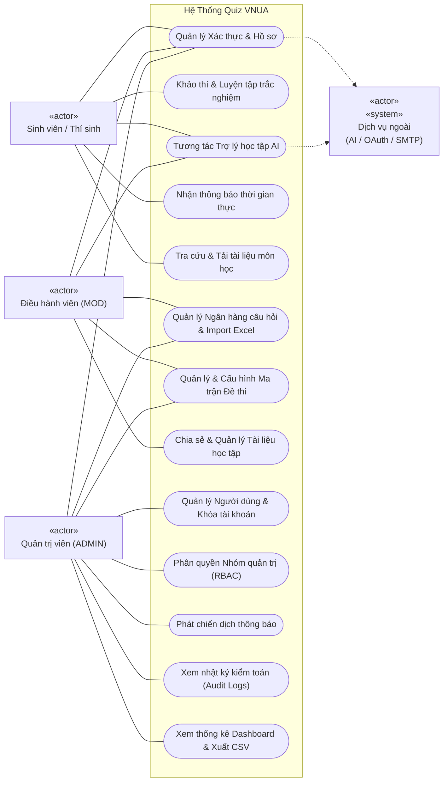
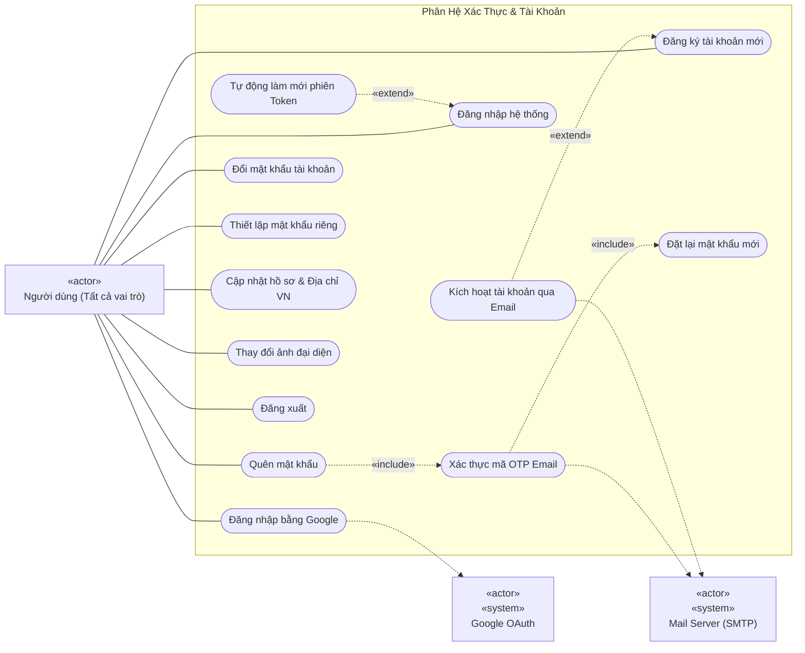
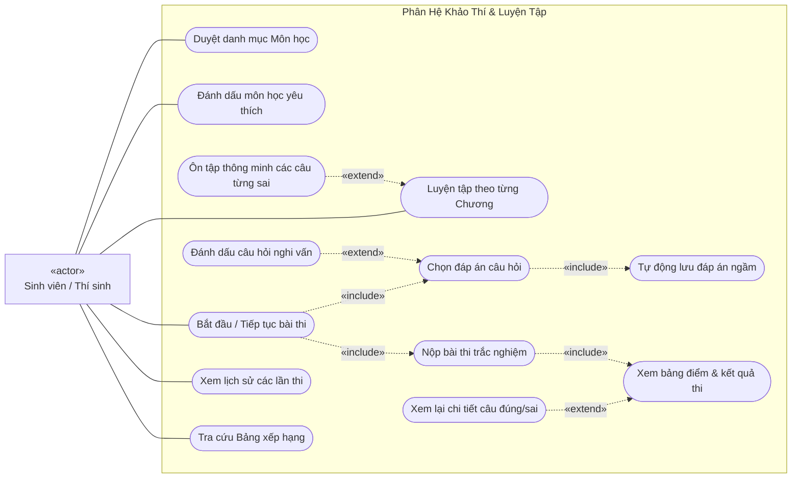
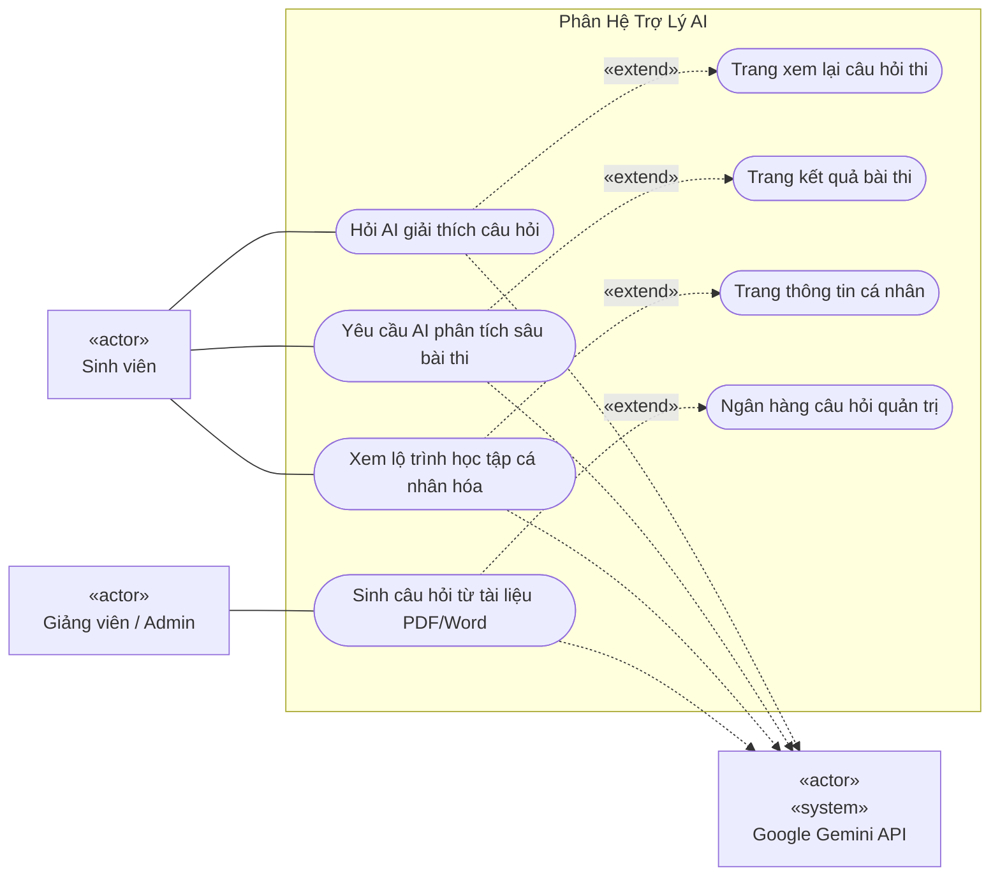
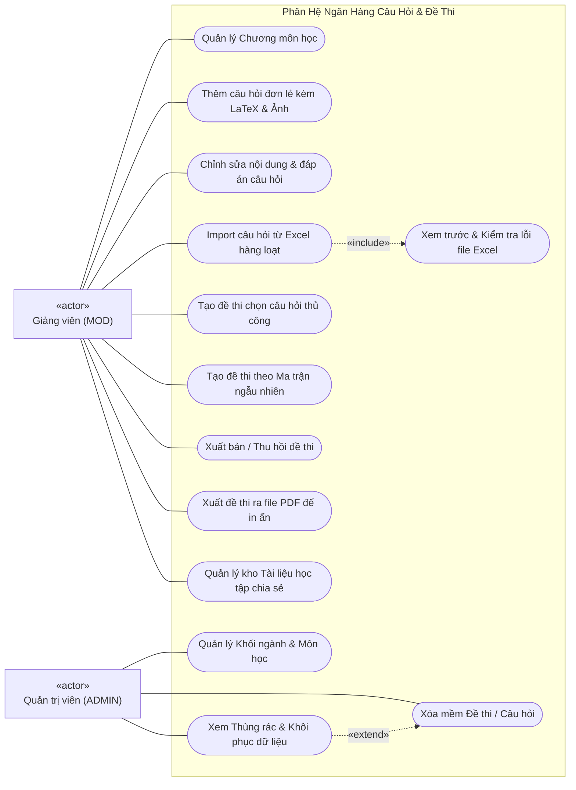
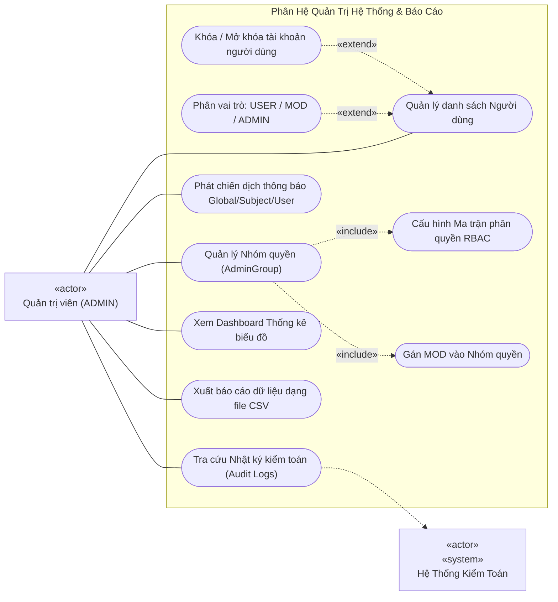
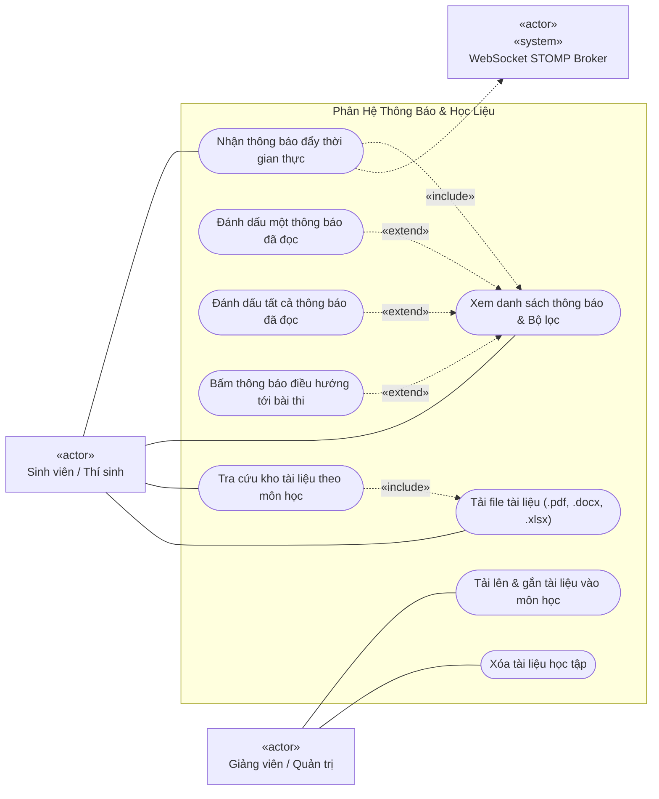

# Sơ Đồ Ca Sử Dụng Hệ Thống (Use Case Diagrams)

Tài liệu này đặc tả toàn bộ các ca sử dụng (Use Cases) của hệ thống **Quiz VNUA**, bao gồm sơ đồ phân rã chức năng tổng thể, các sơ đồ ca sử dụng theo từng phân hệ nghiệp vụ, và bảng đặc tả chi tiết (Use Case Specifications) phục vụ báo cáo đồ án và kiểm thử phần mềm.

---

## Mục Lục
1. [Danh Sách Tác Nhân Hệ Thống (Actors)](#1-danh-sách-tác-nhân-hệ-thống-actors)
2. [Sơ Đồ Ca Sử Dụng Tổng Thể (System Overview Use Case)](#2-sơ-đồ-ca-sử-dụng-tổng-thể-system-overview-use-case)
3. [Phân Hệ 1: Xác Thực & Tài Khoản (Authentication & Account)](#3-phân-hệ-1-xác-thực--tài-khoản-authentication--account)
4. [Phân Hệ 2: Khảo Thí & Luyện Tập (Exam Taking & Practice)](#4-phân-hệ-2-khảo-thí--luyện-tập-exam-taking--practice)
5. [Phân Hệ 3: Trợ Lý Học Tập AI (AI Study Assistant)](#5-phân-hệ-3-trợ-lý-học-tập-ai-ai-study-assistant)
6. [Phân Hệ 4: Quản Trị Ngân Hàng Câu Hỏi & Đề Thi (Question Bank & Exam Admin)](#6-phân-hệ-4-quản-trị-ngân-hàng-câu-hỏi--đề-thi-question-bank--exam-admin)
7. [Phân Hệ 5: Vận Hành Hệ Thống, Phân Quyền & Báo Cáo (Administration & Analytics)](#7-phân-hệ-5-vận-hành-hệ-thống-phân-quyền--báo-cáo-administration--analytics)
8. [Phân Hệ 6: Thông Báo Thời Gian Thực & Kho Tài Liệu (Notifications & Study Documents)](#8-phân-hệ-6-thông-báo-thời-gian-thực--kho-tài-liệu-notifications--study-documents)
9. [Bảng Đặc Tả Chi Tiết Các Use Case Trọng Tâm (Use Case Specifications)](#9-bảng-đặc-tả-chi-tiết-các-use-case-trọng-tâm-use-case-specifications)

---

## 1. Danh Sách Tác Nhân Hệ Thống (Actors)

Theo đặc tả UML 2.5 (ISO/IEC 19505), tác nhân (Actor) được phân loại thành Tác nhân con người (Human Actor) và Tác nhân hệ thống ngoài (System Actor):

| Tác nhân (Actor) | Phân loại UML Stereotype | Mô tả vai trò và quyền hạn |
| :--- | :---: | :--- |
| **Sinh viên / Thí sinh (Student / User)** | `«actor»` | Người dùng cuối tham gia học tập, ôn luyện kiến thức theo chương, làm bài thi trắc nghiệm, nhận kết quả, hỏi trợ lý AI và xem bảng xếp hạng. |
| **Giảng viên / Điều hành viên (MOD)** | `«actor»` | Quản lý nội dung học thuật trong phạm vi môn học được phân quyền: Quản lý ngân hàng câu hỏi, import Excel, tạo và xuất bản đề thi, chia sẻ tài liệu. |
| **Quản trị viên hệ thống (Super ADMIN)** | `«actor»` | Toàn quyền kiểm soát hệ thống: Quản lý tài khoản người dùng, phân quyền nhóm quản trị (RBAC), phát chiến dịch thông báo, xem Audit Log, cấu hình hệ thống và xuất báo cáo CSV. |
| **Google OAuth Service** | `«actor» «system»` | Dịch vụ ngoài: Xác thực danh tính người dùng thông qua Google ID Token (One-Tap / OAuth2). |
| **Google Gemini API** | `«actor» «system»` | Dịch vụ ngoài: Mô hình ngôn ngữ lớn (LLM) hỗ trợ sinh câu hỏi từ tài liệu, giải thích chi tiết đáp án và phân tích lộ trình học. |
| **Mail Server (SMTP)** | `«actor» «system»` | Dịch vụ ngoài: Gửi email kích hoạt tài khoản, mã xác thực OTP khôi phục mật khẩu và thông báo điểm thi. |
| **Telegram Bot API** | `«actor» «system»` | Dịch vụ ngoài: Tiếp nhận cảnh báo sự cố máy chủ thời gian thực từ Alertmanager để gửi tới nhóm kỹ thuật. |

---

## 2. Sơ Đồ Ca Sử Dụng Tổng Thể (System Overview Use Case)

Thể hiện ranh giới hệ thống (System Boundary) và các nhóm chức năng chính mà từng tác nhân được phép tương tác theo chuẩn quy ước hình học UML (Hình chữ nhật cho Ranh giới hệ thống, Hình Oval cho Ca sử dụng):

---

## 3. Phân Hệ 1: Xác Thực & Tài Khoản (Authentication & Account)

Bao gồm toàn bộ các ca sử dụng liên quan đến định danh, bảo mật phiên làm việc và quản lý thông tin cá nhân:

---

## 4. Phân Hệ 2: Khảo Thí & Luyện Tập (Exam Taking & Practice)

Phân hệ dành riêng cho thí sinh tham gia làm bài kiểm tra tính giờ quy chế hoặc tự do luyện tập nâng cao kiến thức:

---

## 5. Phân Hệ 3: Trợ Lý Học Tập AI (AI Study Assistant)

Tích hợp trí tuệ nhân tạo tạo sinh nhằm tăng cường hiệu quả tiếp thu bài học và khắc phục các lỗ hổng kiến thức:

---

## 6. Phân Hệ 4: Quản Trị Ngân Hàng Câu Hỏi & Đề Thi (Question Bank & Exam Admin)

Dành cho Giảng viên (`MOD`) và Quản trị viên (`ADMIN`) quản trị vòng đời của câu hỏi, bộ đề thi và học liệu:

---

## 7. Phân Hệ 5: Vận Hành Hệ Thống, Phân Quyền & Báo Cáo (Administration & Analytics)

Dành riêng cho Quản trị viên cấp cao (`ADMIN`) kiểm soát an toàn thông tin, theo dõi kiểm toán và xuất báo cáo:

---

## 8. Phân Hệ 6: Thông Báo Thời Gian Thực & Kho Tài Liệu (Notifications & Study Documents)

Đặc tả các ca sử dụng tương tác kênh thông báo đẩy WebSocket STOMP và hệ thống chia sẻ học liệu môn học:

---

## 9. Bảng Đặc Tả Chi Tiết Các Use Case Trọng Tâm (Use Case Specifications)

### Ca Sử Dụng 1: `UC-EXAM-01` - Bắt Đầu & Nộp Bài Thi Trắc Nghiệm Trực Tuyến

* **Mã ca sử dụng:** `UC-EXAM-01`
* **Tên ca sử dụng:** Làm bài thi và nộp bài trực tuyến
* **Tác nhân chính:** Sinh viên (Thí sinh)
* **Tiền điều kiện (Pre-conditions):**
  1. Thí sinh đã đăng nhập tài khoản có trạng thái `ACTIVE`.
  2. Đề thi đang ở trạng thái `PUBLISHED` và nằm trong khung giờ mở thi.
  3. Thí sinh chưa vượt quá số lượt thi tối đa (`maxAttempts`) của đề.
* **Hậu điều kiện (Post-conditions):**
  1. Bản ghi `UserExam` được cập nhật trạng thái `SUBMITTED`, lưu điểm số và thời gian hoàn thành.
  2. Bộ đệm session bài thi trong Redis được giải phóng.
  3. Bảng điểm được gửi tự động về hòm thư sinh viên qua RabbitMQ.
* **Luồng sự kiện chính (Basic Flow):**
  1. Thí sinh chọn đề thi và nhấn nút *"Bắt đầu làm bài thi"*.
  2. Hệ thống gọi `POST /api/v1/exam-attempts/start`, tạo bản ghi `UserExam` trạng thái `IN_PROGRESS`, sao lưu snapshot câu hỏi vào `UserExamQuestion` và khởi tạo cache Redis.
  3. Hệ thống trả về đề thi, giao diện bắt đầu đếm ngược thời gian làm bài theo giây.
  4. Thí sinh đọc câu hỏi và chọn đáp án $\rightarrow$ Client tự động gửi `PUT /api/v1/exam-attempts/{id}/answers` lưu vết tức thì vào Redis Cache (Autosave).
  5. Thí sinh có thể đánh dấu câu hỏi nghi vấn để kiểm tra lại qua bảng điều hướng.
  6. Sau khi hoàn thành, thí sinh bấm nút *"Nộp bài thi"* (hoặc khi đồng hồ đếm ngược về 00:00).
  7. Client gửi `POST /api/v1/exam-attempts/{id}/submit`.
  8. Backend đóng gói thông điệp `ExamSubmissionMessage` đẩy vào hàng đợi RabbitMQ `exam.submission.queue` và phản hồi ngay mã `HTTP 202 Accepted`.
  9. Consumer ngầm chấm điểm, lưu kết quả MySQL và gửi email kết quả.
  10. Client hiển thị kết quả bài thi: Điểm số, số câu đúng/sai, biểu đồ phân tích và lời giải chi tiết.
* **Luồng thay thế / Ngoại lệ (Alternative Flows):**
  * *4a. Sự cố mất mạng hoặc vô tình đóng trình duyệt:* Thí sinh mở lại trang thi $\rightarrow$ Hệ thống khôi phục trạng thái làm bài từ `localStorage` và Redis Cache $\rightarrow$ Tiếp tục làm bài với thời gian còn lại.
  * *6a. Thí sinh quên nộp bài khi hết giờ:* Đồng hồ đếm ngược về 0 $\rightarrow$ Hệ thống tự động khóa chọn đáp án và kích hoạt luồng tự động nộp bài thay thí sinh.

---

### Ca Sử Dụng 2: `UC-ADMIN-02` - Import Ngân Hàng Câu Hỏi Từ File Excel

* **Mã ca sử dụng:** `UC-ADMIN-02`
* **Tên ca sử dụng:** Nhập câu hỏi hàng loạt từ file bảng tính Excel
* **Tác nhân chính:** Giảng viên (`MOD`) hoặc Quản trị viên (`ADMIN`)
* **Tiền điều kiện:** Người dùng có quyền `CREATE` trên môn học chỉ định.
* **Hậu điều kiện:** Hàng trăm câu hỏi và đáp án được thêm vào cơ sở dữ liệu theo Database Transaction, đồng bộ tổng số câu hỏi của môn.
* **Luồng sự kiện chính:**
  1. Người dùng chọn Khối ngành $\rightarrow$ Môn học $\rightarrow$ Chương mục tiêu.
  2. Người dùng tải file Excel `.xlsx` chứa danh sách câu hỏi lên hệ thống.
  3. Client gửi `POST /api/v1/admin/questions/import/preview`.
  4. Server dùng Apache POI đọc từng dòng, validate tính hợp lệ: Tiêu đề, các cột lựa chọn A/B/C/D, độ khó và vị trí đáp án đúng.
  5. Server trả về kết quả kiểm tra xem trước: Số dòng hợp lệ, dữ liệu xem trước.
  6. Người dùng kiểm tra bảng xem trước và bấm nút *"Xác nhận Import"*.
  7. Client gửi `POST /api/v1/admin/questions/import`.
  8. Server mở Transaction, Batch Insert toàn bộ câu hỏi và các đáp án vào MySQL.
  9. Ghi nhật ký vào `AuditLog` và cập nhật số lượng câu hỏi trên giao diện.
* **Luồng ngoại lệ (Exception Flow):**
  * *4a. File Excel có dòng sai định dạng:* Server phát hiện dòng thiếu đáp án đúng hoặc sai cột $\rightarrow$ Trả về danh sách chi tiết các dòng vi phạm $\rightarrow$ Client hiển thị bảng lỗi để người dùng sửa lại file trước khi nạp lại.

---

### Ca Sử Dụng 3: `UC-AI-03` - Trợ Lý AI Phân Tích Chuyên Sâu Kết Quả Bài Thi

* **Mã ca sử dụng:** `UC-AI-03`
* **Tên ca sử dụng:** Phân tích năng lực bài thi bằng mô hình ngôn ngữ lớn (Gemini LLM)
* **Tác nhân chính:** Sinh viên (Thí sinh), Google Gemini API
* **Tiền điều kiện:** Thí sinh đã hoàn thành và nộp bài thi thành công.
* **Hậu điều kiện:** Sinh viên nhận được bản phân tích sư phạm chi tiết về ưu điểm, điểm yếu và gợi ý học tập.
* **Luồng sự kiện chính:**
  1. Tại trang kết quả thi, sinh viên bấm nút *"Yêu cầu AI Phân tích bài thi"*.
  2. Client gửi `POST /api/v1/ai/analyze-exam-result` kèm `userExamId`.
  3. Server tổng hợp thông tin bài thi: Điểm số, tỷ lệ đúng/sai theo từng chương và theo mức độ khó (Dễ / Trung bình / Khó).
  4. Server xây dựng System Prompt sư phạm và gửi yêu cầu tới Google Gemini 2.0 Flash API theo định dạng JSON Schema.
  5. Gemini phản hồi nội dung phân tích chi tiết.
  6. Server parse dữ liệu sang `ExamAnalysisResponse` và trả về `HTTP 200`.
  7. Client render thẻ trực quan `ExamAiAnalysisCard` gồm: Đánh giá tổng quan, phân tích điểm yếu cốt lõi và lộ trình hành động khắc phục.
