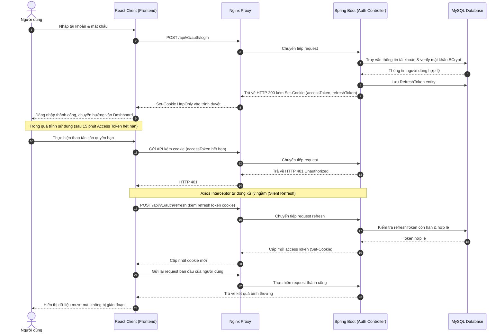
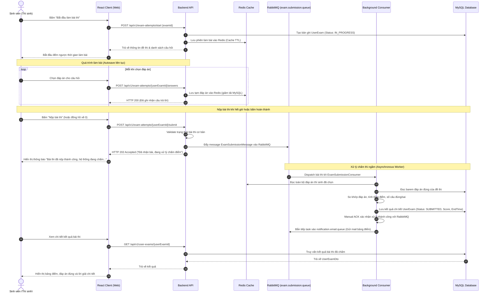
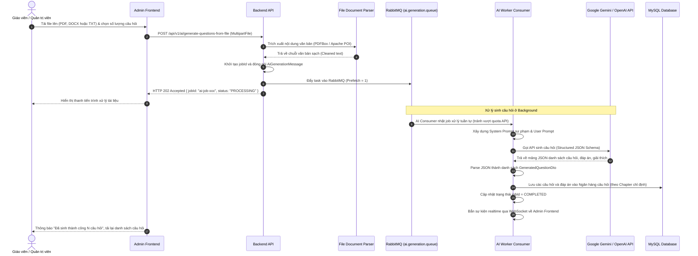
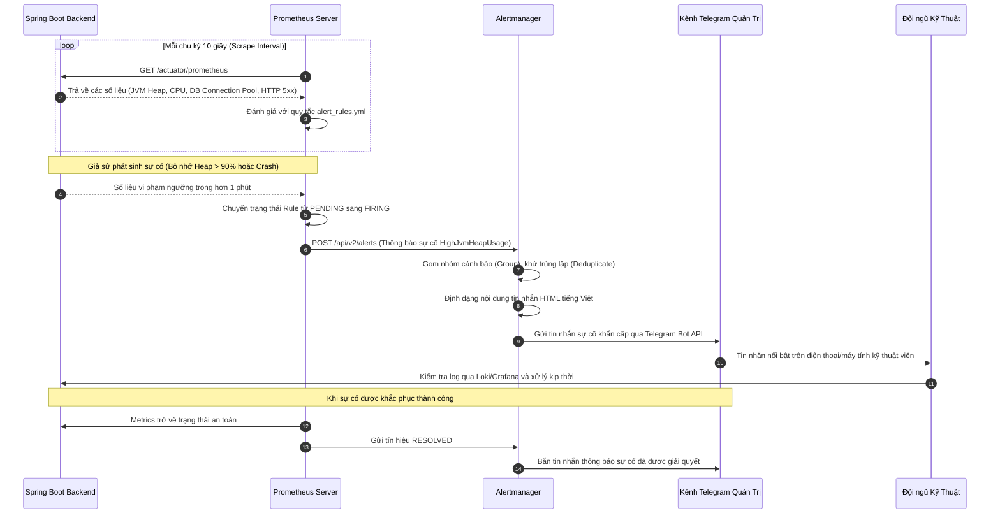
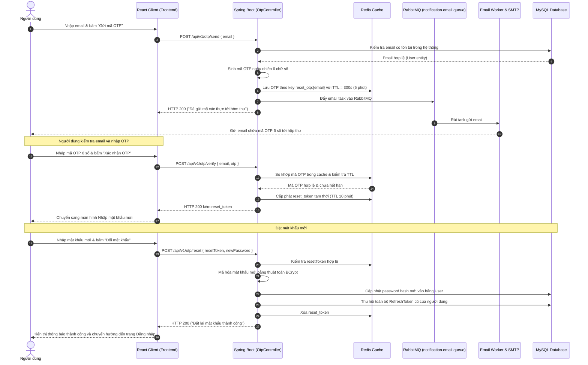
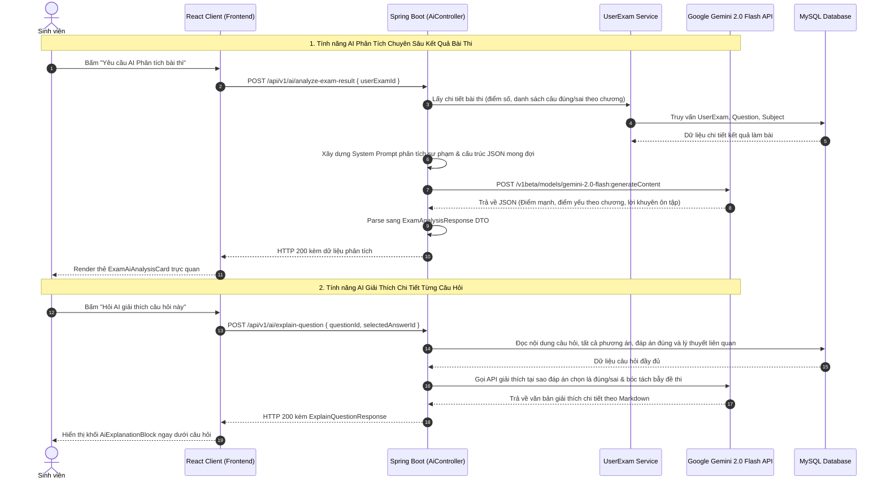
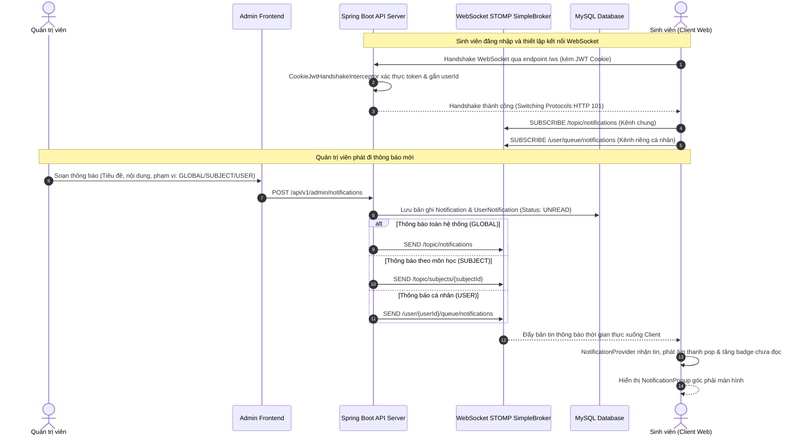
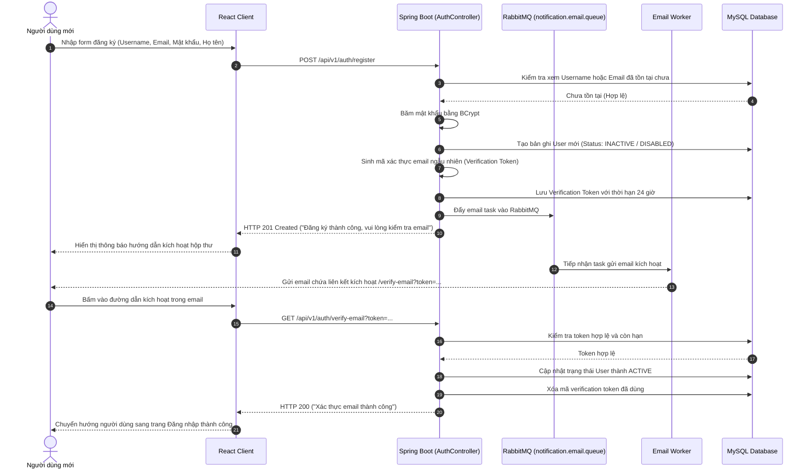
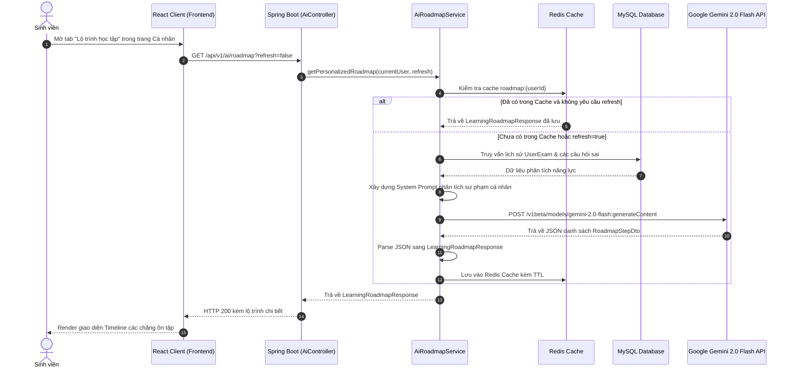
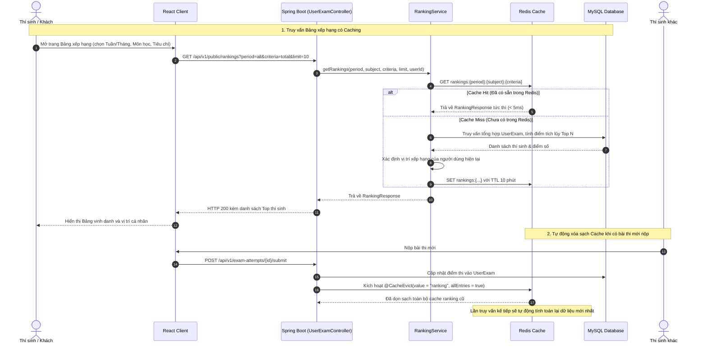

# Sơ Đồ Luồng Hoạt Động Các Chức Năng Chính (Workflows)

Tài liệu này mô tả chi tiết bằng sơ đồ tuần tự (Sequence Diagram) cho các nghiệp vụ trọng tâm trong hệ thống Quiz VNUA.

> [!TIP]
> Để xem chi tiết các **Biểu đồ hoạt động UML (Activity Diagrams)** với đầy đủ các bước rẽ nhánh điều kiện, xử lý lỗi và lưu đồ tác vụ, vui lòng xem tài liệu: **[Biểu Đồ Hoạt Động (Activity Diagrams)](./activity-diagrams.md)**.

---

## 1. Luồng Xác Thực & Tự Động Làm Mới Token (Authentication & Auto Refresh)

Hệ thống sử dụng cơ chế bảo mật kép: Access Token có thời hạn ngắn (15 phút) và Refresh Token có thời hạn dài (7 ngày) lưu an toàn trong `HttpOnly Cookie`.

---

## 2. Luồng Làm Bài Thi & Nộp Bài Tải Cao Bất Đồng Bộ (Exam Taking & Async Submission)

Để giải quyết bài toán hàng trăm/hàng nghìn thí sinh nộp bài cùng lúc vào phút cuối của ca thi, hệ thống sử dụng hàng đợi RabbitMQ để phân tách việc tiếp nhận bài thi và tiến trình chấm điểm.

---

## 3. Luồng AI Sinh Câu Hỏi Trắc Nghiệm Từ Tài Liệu (Background AI Generation)

Tác vụ phân tích tài liệu và gọi mô hình ngôn ngữ lớn (Gemini / OpenAI) thường mất từ 10 - 30 giây. Do đó luồng được xử lý bất đồng bộ để tránh nghẽn thread pool của server.

---

## 4. Luồng Thu Thập Metrics & Tự Động Bắn Cảnh Báo (Monitoring & Alerting)

Bộ giải pháp Observability theo dõi liên tục trạng thái của Backend và phát hiện sự cố sớm:

---

## 5. Luồng Quên Mật Khẩu & Khôi Phục Qua Mã OTP Email (Forgot Password & OTP Reset)

Quy trình xác thực đa bước để đặt lại mật khẩu an toàn sử dụng mã OTP 6 số lưu tạm trong Redis Cache kèm thời hạn TTL = 5 phút:

---

## 6. Luồng Trợ Lý AI: Phân Tích Kết Quả Bài Thi & Giải Thích Câu Hỏi (AI Exam Analysis & Explanation)

Tích hợp Google Gemini 2.0 Flash / OpenAI API để cung cấp dịch vụ gia sư ảo học tập cá nhân hóa:

---

## 7. Luồng Phân Phối Thông Báo Realtime Qua WebSocket STOMP (Realtime Notifications)

Cơ chế Push Notification thời gian thực kết hợp lưu trữ lịch sử trong cơ sở dữ liệu:

---

## 8. Luồng Đăng Ký Tài Khoản & Kích Hoạt Qua Email (Registration & Verification)

Quy trình đăng ký người dùng mới đảm bảo xác minh danh tính qua email trước khi cho phép hoạt động:

---

## 9. Luồng Trợ Lý AI: Sinh Lộ Trình Học Tập Cá Nhân Hóa (AI Learning Roadmap)

Quy trình phân tích dữ liệu lịch sử thi và gọi Google Gemini 2.0 Flash để sinh lộ trình học tập cá nhân hóa:

---

## 10. Luồng Truy Vấn Bảng Xếp Hạng Kèm Cơ Chế Redis Cache & Tự Động Xóa Bộ Đệm (Leaderboard Caching & Eviction)

Tối ưu hóa hiệu năng truy vấn cho bảng xếp hạng có hàng nghìn lượt truy cập và cơ chế làm mới dữ liệu tự động:

