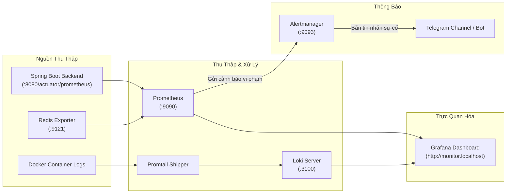

# Giám Sát & Cảnh Báo (Observability & Monitoring)

Thư mục cấu hình: `monitoring/`

Hệ thống Quiz VNUA được trang bị bộ giải pháp quan sát toàn diện (Observability Stack) cấp doanh nghiệp, bao gồm việc thu thập số liệu (Metrics), thu thập nhật ký (Logs), trực quan hóa (Dashboard) và phát hiện sự cố tự động (Alerting).

---

## 1. Các Thành Phần Giám Sát



---

## 2. Chi Tiết Từng Công Cụ

### 1. Spring Boot Actuator & Micrometer
- Kích hoạt endpoint `/actuator/prometheus` trên Backend.
- Expose các chỉ số:
  - Tải CPU của hệ thống & tiến trình JVM.
  - Bộ nhớ JVM Heap & Non-Heap.
  - Trạng thái kết nối database pool HikariCP (active connections, idle connections, pending threads).
  - Tần suất và độ trễ các HTTP requests (`http_server_requests_seconds`).

### 2. Prometheus
- Tự động cào dữ liệu metrics mỗi **10 giây** từ `backend:8080` và `redis-exporter:9121`.
- Cấu hình tại: `monitoring/prometheus/prometheus.yml`.
- Quy tắc phát hiện sự cố: `monitoring/prometheus/alert_rules.yml`.

### 3. Alertmanager (Cảnh Báo Tự Động)
- Nhận diện các sự cố nghiêm trọng và tự động gửi thông báo:
  - `BackendDown`: Backend ngừng phản hồi quá 1 phút.
  - `HighCpuUsage`: Tải CPU máy chủ vượt ngưỡng 85% trong 2 phút liên tục.
  - `HighJvmHeapUsage`: Bộ nhớ RAM JVM Heap chạm ngưỡng 90%.
  - `HighHttp5xxRate`: Tỷ lệ lỗi máy chủ (5xx) xuất hiện liên tục.
  - `DatabaseConnectionPoolDepleted`: Cạn kiệt kết nối vào database.
- Cấu hình tại: `monitoring/alertmanager/alertmanager.yml`.
- Mẫu thông báo: Đã định dạng HTML tiếng Việt hiển thị thông tin sự cố đẹp mắt trên Telegram.

### 4. Loki & Promtail (Quản Lý Log Tập Trung)
- **Promtail:** Chạy ngầm và tự động đọc log từ tất cả các Docker containers.
- **Loki:** Lưu trữ và lập chỉ mục log.
- **Lợi ích:** Quản trị viên và Lập trình viên có thể tìm kiếm lỗi, xem Stacktrace Exception của Backend ngay trên giao diện Grafana mà không cần phải SSH vào server hay gõ `docker logs`.

### 5. Grafana Dashboard
- Địa chỉ truy cập: **`http://monitor.localhost`** *(Tài khoản mặc định: `admin` / `admin`)*.
- Tự động nạp sẵn (Provisioning):
  - **Datasource:** Prometheus và Loki.
  - **Dashboard:** `Spring Boot 3 - Application Observability` (giám sát chi tiết JVM, DB, Requests) và `Redis Dashboard`.

---

## 3. Hướng Dẫn Cấu Hình Bắn Cảnh Báo Về Telegram

Để nhận tin nhắn sự cố vào nhóm Telegram của bạn:

1. Mở file [monitoring/alertmanager/alertmanager.yml](file:///D:/Workspace/Dmd/quiz/monitoring/alertmanager/alertmanager.yml).
2. Điền thông tin Bot và Chat ID:
   ```yaml
   receivers:
     - name: 'telegram-channel'
       telegram_configs:
         - bot_token: 'YOUR_TELEGRAM_BOT_TOKEN'
           chat_id: YOUR_CHAT_ID
           parse_mode: 'HTML'
           send_resolved: true
   ```
3. Khởi động lại hệ thống bằng lệnh `.\run.cmd monitor`. Khi có sự cố hoặc khi sự cố được khắc phục, Alertmanager sẽ tự động gửi tin nhắn kèm nhãn cảnh báo tức thời.
