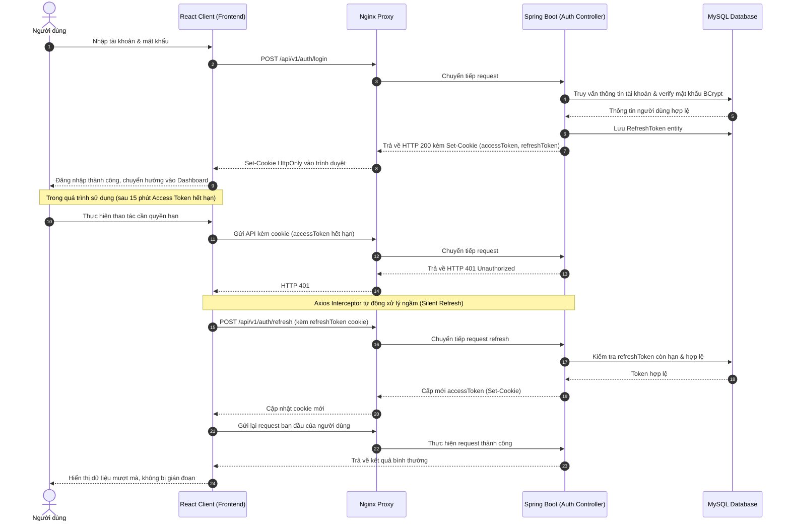
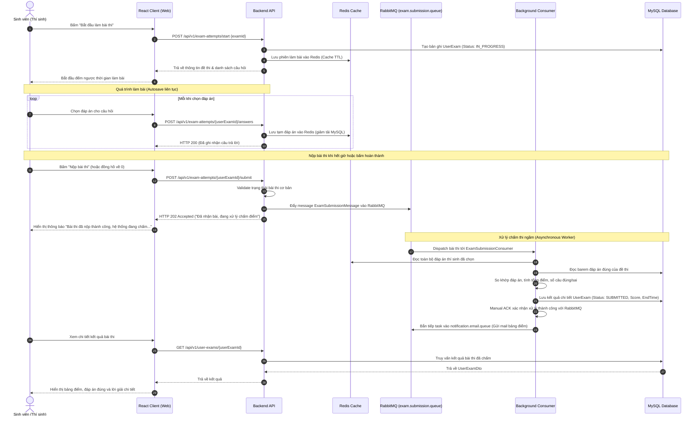
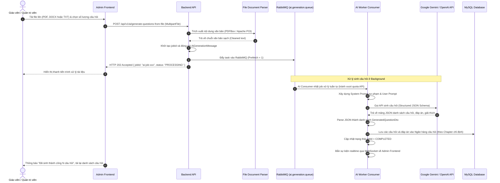
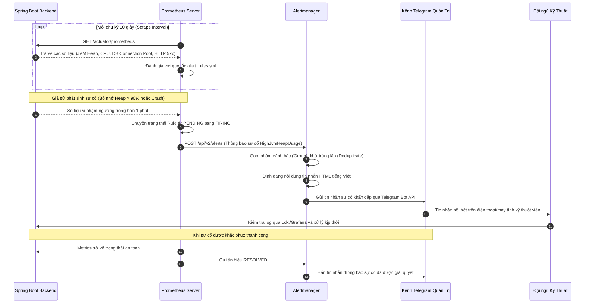

# Sơ Đồ Luồng Hoạt Động Các Chức Năng Chính (Workflows)

Tài liệu này mô tả chi tiết bằng sơ đồ tuần tự (Sequence Diagram) cho các nghiệp vụ trọng tâm trong hệ thống Quiz VNUA.

---

## 1. Luồng Xác Thực & Tự Động Làm Mới Token (Authentication & Auto Refresh)

Hệ thống sử dụng cơ chế bảo mật kép: Access Token có thời hạn ngắn (15 phút) và Refresh Token có thời hạn dài (7 ngày) lưu an toàn trong `HttpOnly Cookie`.

---

## 2. Luồng Làm Bài Thi & Nộp Bài Tải Cao Bất Đồng Bộ (Exam Taking & Async Submission)

Để giải quyết bài toán hàng trăm/hàng nghìn thí sinh nộp bài cùng lúc vào phút cuối của ca thi, hệ thống sử dụng hàng đợi RabbitMQ để phân tách việc tiếp nhận bài thi và tiến trình chấm điểm.

---

## 3. Luồng AI Sinh Câu Hỏi Trắc Nghiệm Từ Tài Liệu (Background AI Generation)

Tác vụ phân tích tài liệu và gọi mô hình ngôn ngữ lớn (Gemini / OpenAI) thường mất từ 10 - 30 giây. Do đó luồng được xử lý bất đồng bộ để tránh nghẽn thread pool của server.

---

## 4. Luồng Thu Thập Metrics & Tự Động Bắn Cảnh Báo (Monitoring & Alerting)

Bộ giải pháp Observability theo dõi liên tục trạng thái của Backend và phát hiện sự cố sớm:

